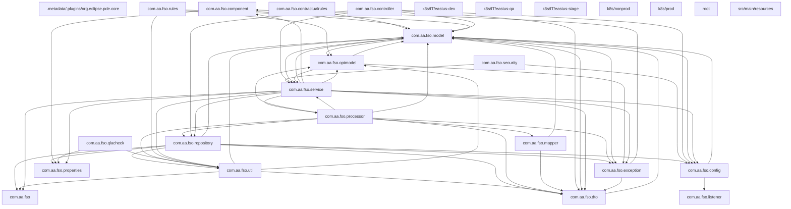
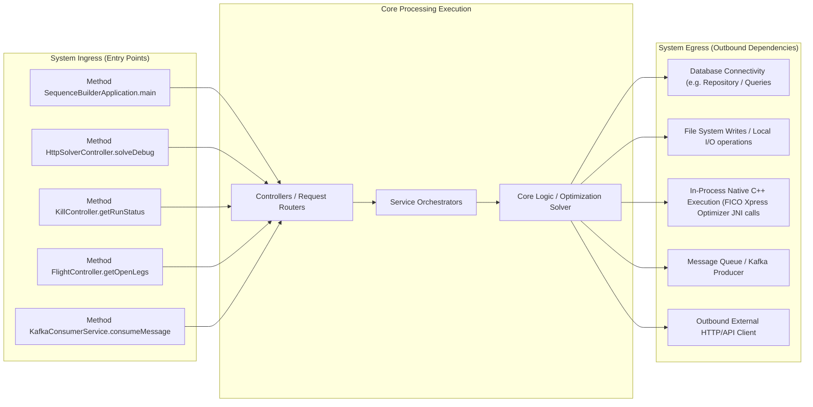

# Architecture & Operations Synthesis Document

This document details the system design, network routing boundary, and scaling characteristics derived programmatically.

## 1. System Package Topology Diagram

## 2. Ingress, Execution & Egress Boundary Flow

