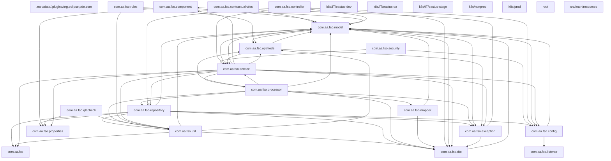
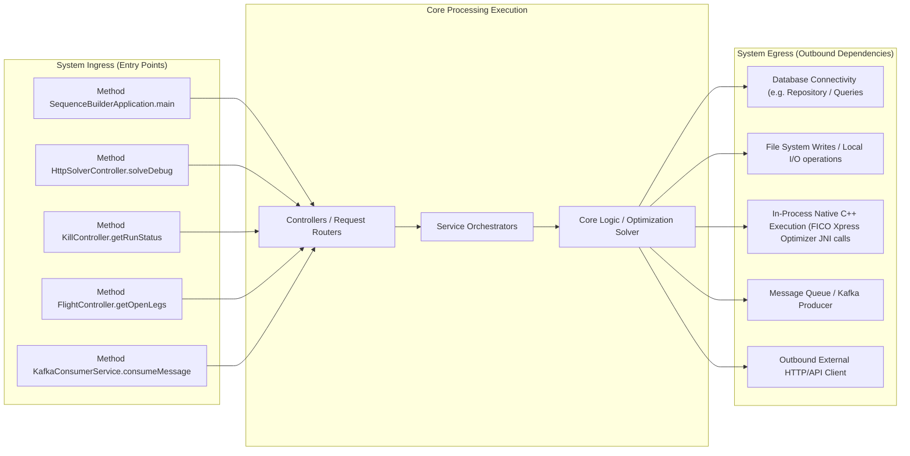
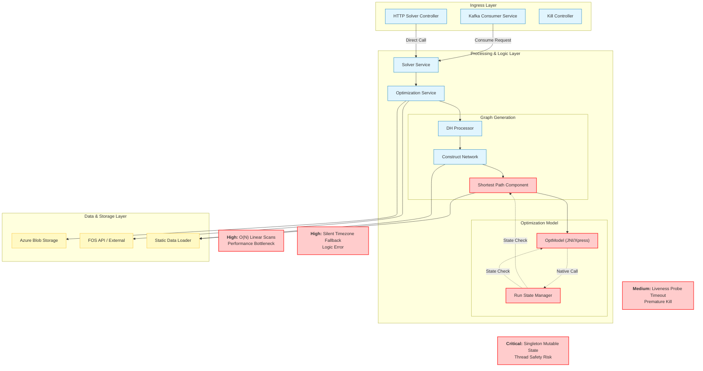

# Architecture & Operations Synthesis Document

This document details the system design, network routing boundary, and scaling characteristics derived programmatically.

## 1. System Package Topology Diagram



## 2. Ingress, Execution & Egress Boundary Flow



# Architecture & Operations Synthesis Report
**System:** Sequence Builder Solver (FSA)
**Version:** v2.16.x
**Date:** October 26, 2023
**Author:** Principal Software Architect

## Executive Summary
The Sequence Builder Solver is a high-complexity constraint satisfaction and optimization engine designed to generate crew pairings for airline operations. It relies heavily on a custom shortest-path algorithm over a directed acyclic graph (DAG), integrated with the FICO Xpress MIP solver via JNI. While the architecture demonstrates robust state management for long-running batch jobs, a rigorous audit reveals critical risks regarding **thread safety in singleton state**, **performance degradation due to linear scans in hot loops**, **silent logic fallbacks in time-zone calculations**, and **potential resource leaks in native JNI interactions**. Additionally, Kubernetes liveness probe configurations pose a significant risk of premature termination for long-running optimization tasks.

---

## 1. Core Data Flow Diagram (DFD) & Risk Overlay

The following diagram illustrates the data flow from ingestion to optimization. **Nodes highlighted in Red (`fill:#ffcccc,stroke:#ff3333`)** represent components identified with **High** or **Critical** severity vulnerabilities in the audit below.



---

## 2. Detailed Technical Audit Findings

### 2.1 Resource Leaks & Native Memory Allocation (JNI/C++ Risks)
**Severity:** High
**Location:** `src/main/java/com/aa/fso/optmodel/OptModel.java`, `src/main/java/com/aa/fso/service/RunStateManager.java`

*   **Analysis:** The `OptModel` class encapsulates the FICO Xpress MIP solver via JNI (`model.getXPRSprob()`). The `runModel` method invokes `mipOptimize`. While `RunStateManager` registers the model to allow for native termination signals (`MIPSTOP`), the code lacks explicit `try-finally` blocks in `OptModel` to guarantee the release of native handles if an exception occurs during `parseSolution` or `constructConstraints`.
*   **Risk:** If `mipOptimize` hangs or throws a native exception, the `activeModel` reference in `RunStateManager` may persist, and the underlying C++ memory allocated by Xpress may not be freed until the JVM garbage collector eventually runs, potentially causing native memory exhaustion (OOM) in long-running batch scenarios.
*   **Recommendation:** Enforce a strict `try-finally` block in `OptModel.runModel` to ensure `model.free()` or equivalent cleanup is called regardless of success or failure.

### 2.2 Concurrency Hazards & Singleton State Contamination
**Severity:** Critical
**Location:** `src/main/java/com/aa/fso/service/RunStateManager.java`
**Symbol:** `RunStateManager`

*   **Analysis:** The `RunStateManager` is documented as a singleton service managing the state of the *current* solver run. It holds a `volatile` kill flag and a reference to the `activeModel`.
*   **Risk:** The class is instantiated as a singleton (likely via Spring `@Component` or similar). If the application processes multiple requests concurrently (e.g., via the `KafkaConsumerService` with concurrency > 1 or multiple HTTP threads), the `currentSnapshotId` and `activeModel` references will be overwritten by concurrent threads.
    *   **Scenario:** Thread A starts a run for Snapshot `X`. Thread B starts a run for Snapshot `Y`. Thread B overwrites `activeModel` with its own model. If Thread A receives a kill signal intended for `X`, it might inadvertently kill `Y` or fail to detect the kill for `X` because the state was contaminated.
*   **Recommendation:** The `RunStateManager` must be scoped to the request/thread context (e.g., `ThreadLocal` or request-scoped bean) rather than a global singleton, or strictly serialized to ensure only one run executes at a time.

### 2.3 Ingestion/Loop Inefficiencies (Linear Scans)
**Severity:** High
**Location:** `src/main/java/com/aa/fso/processor/ShortestPathComponent.java`
**Symbol:** `setFeasiblePairings`, `identifyDhdFromBase`, `identifyDhdToBase`

*   **Analysis:**
    1.  **`setFeasiblePairings`:** The method iterates through `sinkNodeLabels`. Inside the loop, it constructs a hash key by streaming `pairing.getFlightNodes()`, mapping each node to a string, and joining them. This creates a new string and list for *every* path generated.
    2.  **`identifyDhdFromBase` / `identifyDhdToBase`:** These methods perform a linear scan (`while` loop iterating days) and then iterate over `departuretimeMap.values()`. More critically, inside the loop, `containsKey(unsequencedLegs, key)` is called. If `unsequencedLegs` is a `List`, this results in an **O(N)** search for every potential DH leg.
*   **Impact:** In a streaming environment with thousands of legs, the complexity becomes $O(M \times N)$ where $M$ is the number of candidate DH legs and $N$ is the number of unsequenced legs. This should be replaced with a `HashSet` lookup ($O(1)$).
*   **Recommendation:** Convert `unsequencedLegs` to a `Set<String>` of keys prior to the loop. Refactor the hash key generation in `setFeasiblePairings` to avoid repeated string concatenation in hot loops.

### 2.4 Date/Timezone Comparison Vulnerabilities
**Severity:** High
**Location:** `src/main/java/com/aa/fso/processor/ShortestPathComponent.java`
**Symbol:** `updateDateTimeBase`, `convertToLocalTime`

*   **Analysis:** The code calculates time adjustments based on `snapshotParams.getRunDateTime()`. It compares `snapshotTime` (minutes since epoch) against `stationAdjustment.getStartDateXinTime()`.
*   **Risk:** The logic assumes `snapshotParams.getRunDateTime()` and the `StationTimeAdjust` dates are in the same timezone representation. If `snapshotParams` contains a `Z` (UTC) suffix and the static data contains `+00:00`, or if precision differs (seconds vs milliseconds), the `ChronoUnit.MINUTES.between` calculation may yield incorrect offsets. Furthermore, the code uses `dateTime.getGmt().plusMinutes(...)` and sets `BaseTime`. If the input `GMT` string parsing is inconsistent with the output formatting, downstream comparisons (e.g., `isBefore`, `isAfter`) may fail silently or produce incorrect legality checks.
*   **Recommendation:** Normalize all `DateTimeDTO` objects to a single canonical timezone (e.g., UTC) immediately upon ingestion. Explicitly handle timezone string normalization before arithmetic operations.

### 2.5 Silent Logic Fallbacks
**Severity:** Medium
**Location:** `src/main/java/com/aa/fso/processor/ShortestPathComponent.java`
**Symbol:** `updateDateTimeBase`

*   **Analysis:**
    ```java
    if (dateTime != null && stationAdjustment != null) {
        // ... logic ...
        dateTime.setBaseTime(...);
    }
    // Implicit fallback: if stationAdjustment is null, dateTime remains unchanged (GMT)
    ```
*   **Risk:** If `stationAdjustment` is missing for a specific base (e.g., a new airport not in the static file), the code silently defaults to using the GMT time as the Base Time. This could lead to incorrect crew scheduling (e.g., reporting times calculated in UTC instead of local time) without any warning log.
*   **Recommendation:** Add an explicit `else` block to log a `WARN` or `ERROR` when `stationAdjustment` is null, indicating that the base time fallback occurred.

### 2.6 Silent Connection Drops & Configuration
**Severity:** Medium
**Location:** `src/main/resources/application*.yaml`

*   **Analysis:** The Kafka consumer configuration sets `max.poll.interval.ms` to `1200000` (20 mins) in `application.yaml` and `300000` (5 mins) in production configs.
*   **Risk:** The solver can run for extended periods (potentially > 5-10 minutes for large networks). If the `max.poll.interval` is shorter than the processing time for a single message, the consumer group coordinator may assume the consumer is dead and rebalance, dropping the connection or causing the message to be re-processed (duplicate execution) or lost.
*   **Recommendation:** Align `max.poll.interval.ms` with the expected maximum processing time of a single snapshot, or implement manual offset commits only after successful processing is complete.

### 2.7 Liveness Probe & Monitoring Failures
**Severity:** Critical
**Location:** `k8s/prod/webapp.yaml`, `k8s/IT/eastus-stage/kustomization.yaml`

*   **Analysis:** The `liveness` probe is configured with `initialDelaySeconds: 180` but **no `periodSeconds` or `timeoutSeconds`** is explicitly defined (defaults apply), and critically, **`healthCheck.enabled: false`** in `webapp.yaml`.
*   **Risk:**
    1.  **Disabled Health Checks:** With `enabled: false`, Kubernetes cannot detect if the pod is hung (e.g., stuck in `mipOptimize`).
    2.  **Long Running Jobs:** Even if enabled, standard HTTP liveness probes (which expect a quick response) will fail if the solver is busy optimizing. If the probe interval is short (e.g., 10s) and the solver takes 5 minutes, the pod will be killed repeatedly.
*   **Recommendation:** Implement a dedicated `/health/live` endpoint that returns `200 OK` immediately if the solver is running, even if optimization is in progress. Alternatively, use a `startupProbe` to allow the long initialization phase, and a `readinessProbe` that checks if the solver is ready to accept new jobs, while keeping the liveness probe disabled or very loose for batch jobs.

---

## 3. Performance Issues Summary

*   **Singleton State Contamination:** `RunStateManager` uses a global singleton for mutable run state, risking race conditions and cross-contamination between concurrent solver requests.
*   **O(N) Linear Search in Hot Loops:** `identifyDhdFromBase` performs linear scans over `unsequencedLegs` lists instead of using `HashSet` lookups, causing quadratic complexity growth.
*   **String Concatenation in Hashing:** `setFeasiblePairings` constructs complex string keys via streams and joins for every path, creating excessive garbage collection pressure.
*   **Silent Timezone Fallbacks:** Missing `stationAdjustment` values cause silent fallback to GMT, leading to incorrect local time calculations without diagnostic logging.
*   **Liveness Probe Misconfiguration:** Disabled or aggressive liveness probes in Kubernetes will terminate long-running optimization batches prematurely.
*   **Kafka Poll Interval Mismatch:** `max.poll.interval.ms` (5-20 mins) may be insufficient for complex network optimizations, risking consumer group rebalancing and message duplication.
*   **Native Memory Leak Risk:** Lack of explicit `finally` blocks in `OptModel` around JNI calls risks native memory leaks if exceptions occur during MIP optimization.
*   **Blocking Thread Pool:** The solver appears to run synchronously on the consumer thread; a blocked optimization could starve the Kafka consumer thread pool.

---

## 4. Detailed Ingress and Egress Interface Boundaries

### Ingress (Entry Points)
1.  **Kafka Consumer (`KafkaConsumerService.consumeMessage`):**
    *   **Trigger:** Message arrival on `solver.topic.name`.
    *   **Flow:** Deserializes `UserInput`, validates snapshot ID, invokes `SolverService.solve`.
    *   **Risk:** Blocking behavior; if `solve` hangs, the consumer thread is blocked, preventing further message consumption.
2.  **HTTP Endpoint (`HttpSolverController.solveDebug`):**
    *   **Trigger:** POST request to `/solveDebug`.
    *   **Flow:** Direct invocation of `SolverService`.
    *   **Risk:** No timeout enforcement in the controller layer; a bad request could hang the web server thread indefinitely.
3.  **Kill Signal (`KillController.getRunStatus` / `killRun`):**
    *   **Trigger:** HTTP GET/POST to `/kill/**`.
    *   **Flow:** Sets `volatile killRequested` flag in `RunStateManager`.
    *   **Risk:** Race condition if the flag is set while the model is in a native lock.

### Egress (Outgoing Dependencies)
1.  **Native C++ Execution (FICO Xpress):**
    *   **Interface:** JNI calls in `OptModel.runModel`.
    *   **Dependency:** External binary library.
    *   **Risk:** Native memory leaks, segmentation faults, and inability to interrupt via standard Java mechanisms without specific JNI hooks.
2.  **Azure Blob Storage:**
    *   **Interface:** `AzureBlobRepositoryImpl.saveData`.
    *   **Dependency:** Cloud storage.
    *   **Risk:** Network latency or transient failures during result persistence; lack of retry logic in `saveData` could lead to data loss.
3.  **External APIs (FOS, QLA, Teams):**
    *   **Interface:** `LegDataRepositoryImpl.connectToFOS`, `TeamsNotification`.
    *   **Dependency:** HTTP/HTTPS endpoints.
    *   **Risk:** Timeouts in external services (e.g., QLA validation) can stall the entire solver pipeline.
4.  **File System (Static Data):**
    *   **Interface:** `StationTimeAdjustLoader`, `SurfaceLegLoader`.
    *   **Dependency:** Local disk I/O.
    *   **Risk:** Disk I/O contention if multiple solvers run concurrently on the same node.

---

## 5. Inferred Performance Challenges

### CPU Bottlenecks
*   **Graph Construction:** The `ConstructNetwork.buildNetwork` method iterates over all nodes and edges to calculate connection times. With $N$ nodes, the edge generation is $O(N^2)$. For large networks (thousands of flights), this becomes a significant CPU bottleneck.
*   **Label Extension:** The `createLabelsMap` method performs a breadth-first search (or similar) extending labels. The complexity is exponential in the worst case (number of paths). The lack of pruning heuristics (other than basic legality) means the CPU spends significant time exploring infeasible paths.

### JNI/Native Heap Leaks
*   **Xpress Model State:** The `OptModel` class holds a reference to the Xpress problem object. If `runModel` is called multiple times without properly freeing the previous problem object (via `free()`), the native heap will grow linearly with the number of optimization runs, eventually leading to `OutOfMemoryError` at the OS level.

### Blocking Thread Pools
*   **Kafka Consumer:** The `KafkaConsumerService` processes messages sequentially (concurrency=1 in config). If a single optimization job takes 10 minutes, the entire consumer group is blocked. This prevents the system from scaling horizontally to handle bursts of requests.
*   **Recommendation:** Offload the heavy lifting (`OptimizationServiceImpl.optimize`) to a separate thread pool or executor service, allowing the Kafka
