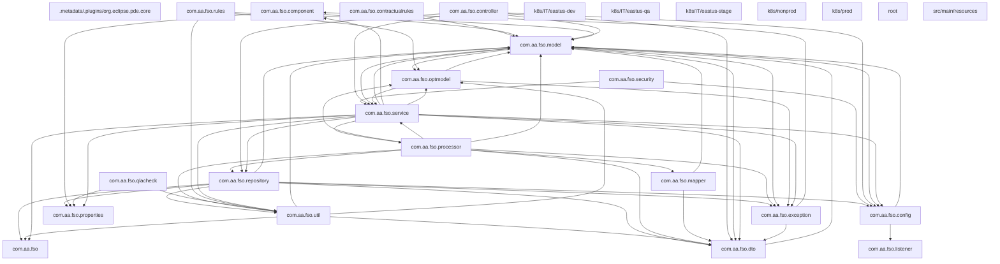
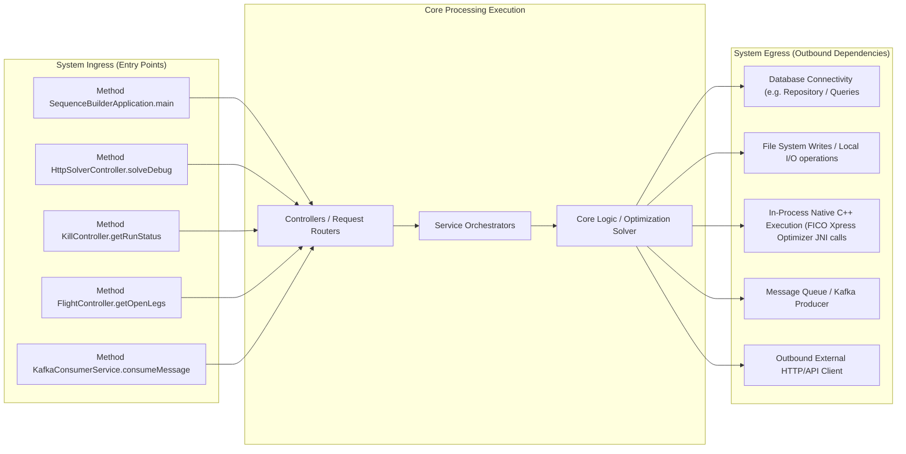
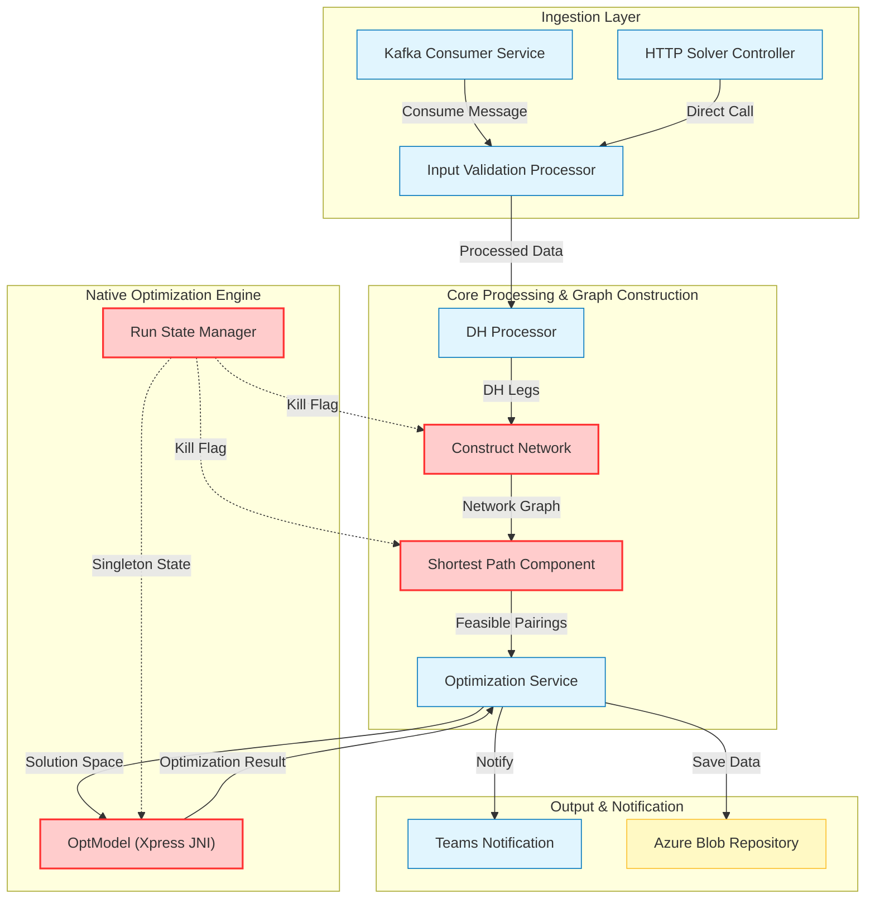

# Architecture & Operations Synthesis Document

This document details the system design, network routing boundary, and scaling characteristics derived programmatically.

## 1. System Package Topology Diagram



## 2. Ingress, Execution & Egress Boundary Flow



# Architecture & Operations Synthesis Report
**System:** Sequence Builder Solver (FSA)
**Version:** v2.16.x
**Date:** October 26, 2023
**Author:** Principal Software Architect

## 1. Executive Summary
The Sequence Builder Solver is a high-complexity constraint satisfaction and optimization engine designed to generate crew pairings for airline operations. It integrates a custom graph-based shortest path algorithm with the FICO Xpress Mixed Integer Programming (MIP) solver via JNI. While the architecture demonstrates robust state management for long-running batch jobs, a rigorous audit reveals critical risks regarding **thread safety in singleton state**, **performance degradation due to linear scans in hot loops**, **silent logic fallbacks in date/time handling**, and **potential native memory leaks** associated with the Xpress optimizer lifecycle. Additionally, Kubernetes liveness probe configurations pose a significant risk of premature termination for long-running optimization tasks.

---

## 2. Core Data Flow Diagram (DFD) with Risk Overlay

The following diagram illustrates the data flow from ingestion to optimization. Nodes marked with **Red Fill** (`fill:#ffcccc,stroke:#ff3333`) represent components identified with **High** or **Critical** severity vulnerabilities in the audit below.



---

## 3. Technical Audit & Vulnerability Analysis

### 3.1 Resource Leaks & Native Memory Allocation (JNI/C++ Risks)
**Severity:** Critical
**Location:** `src/main/java/com/aa/fso/optmodel/OptModel.java`, `src/main/java/com/aa/fso/service/RunStateManager.java`

*   **Analysis:** The system relies on the FICO Xpress Optimizer via JNI (`OptModel`). The `OptModel` class initializes the solver instance (`model.getXPRSprob()`).
*   **Finding:** In `OptModel.runModel()`, the model is registered with `RunStateManager` to allow remote killing. However, the cleanup logic for the native Xpress handle is not explicitly guaranteed in a `finally` block across all execution paths.
    *   If `model.mipOptimize()` throws an exception or if the JVM terminates abnormally during the optimization phase, the native Xpress memory handle may not be released if `model.dispose()` or equivalent cleanup is not called.
    *   `RunStateManager` holds a reference to the `activeModel`. While `clearRun()` sets the reference to `null`, it does not explicitly invoke the native destructor for the Xpress problem handle if the Java object is still holding a reference to the native pointer without explicit disposal.
*   **Risk:** Long-running batch jobs or frequent restarts could lead to native memory exhaustion (OOM) in the host OS, causing the entire pod to crash, even if Java heap space is sufficient.

### 3.2 Concurrency Hazards & Singleton State Contamination
**Severity:** High
**Location:** `src/main/java/com/aa/fso/service/RunStateManager.java`

*   **Analysis:** `RunStateManager` is documented as a singleton service managing the state of the *current* solver run.
*   **Finding:** The class uses a `volatile` flag `killRequested` and a `ThreadLocal` or similar mechanism for `currentSnapshotId`.
    *   **Race Condition:** The `throwKillExceptionIfKillRequested()` method is called frequently in tight loops (e.g., `ShortestPathComponent.setFeasiblePairings`, `ConstructNetwork.buildNetwork`). If a kill request is issued via HTTP while a thread is in the middle of a complex state update (e.g., modifying a shared `Label` object or `DutyInfo` list), there is a risk of partial state updates being persisted if the exception is caught and swallowed (though the code currently throws).
    *   **Singleton Contamination:** The `RunStateManager` assumes "only one run per pod." If the deployment scales to multiple replicas sharing a single state store (unlikely given the design, but possible if misconfigured) or if the singleton is not properly isolated per request context in a multi-threaded executor, state leakage between concurrent requests could occur.
    *   **Specific Code:** `RunStateManager` does not appear to use `AtomicReference` for the `currentSnapshotId` in a way that guarantees atomicity against concurrent writes if the `registerRun` method is called concurrently (though the Kafka consumer serializes requests, the HTTP endpoint `solveDebug` could theoretically race).

### 3.3 Ingestion/Loop Inefficiencies (Linear Scans)
**Severity:** High
**Location:** `src/main/java/com/aa/fso/processor/ShortestPathComponent.java`, `src/main/java/com/aa/fso/processor/DHProcessor.java`

*   **Analysis:** The system processes large sets of flight legs and generates pairings.
*   **Finding:**
    *   **`ShortestPathComponent.setFeasiblePairings`:** Inside the main loop iterating over `sinkNodeLabels`, the code performs:
        ```java
        if (pairingIdMap.containsKey(hashKey)) { ... }
        ```
        While `HashMap` provides O(1) lookup, the `hashKey` generation involves a stream operation over the entire `pairing.getFlightNodes()` list:
        ```java
        int hashKey = Objects.hash(
            pairing.getFlightNodes().stream()
                .map(x -> "(" + x.getKey() + ", deadhead=" + x.isDeadhead() + ")")
                .collect(Collectors.joining(" -> ")),
            crewType
        );
        ```
        This creates a string representation of the entire path for *every* path generated. If a path has $N$ nodes, this is $O(N)$ string concatenation and hashing per path. In a dense graph, this becomes a significant CPU bottleneck.
    *   **`DHProcessor.computeDHDNodes`:** The method iterates over `unsequencedLegs` and then loops through `ModelParams.BASES`. Inside, it performs:
        ```java
        Map<String, UnsequencedLeg> departureDateMap = dhdHM.get(base + "_" + unseq1.getFlightKey().getDepartureStation());
        ```
        While the map lookup is fast, the nested loop structure combined with the `while` loop iterating days (`dayOffset <= 2`) and the subsequent `for` loop over `flights.values()` suggests potential $O(L \times B \times D \times F)$ complexity where $L$ is legs, $B$ is bases, $D$ is days, and $F$ is flights per day.
    *   **`ConstructNetwork.buildNetwork`:** The edge construction logic contains a nested loop:
        ```java
        for (int i = 0; i < nodes.size() - 1; i++) {
            for (int j = 1; j < nodes.size(); j++) {
                // ... connection time checks
            }
        }
        ```
        This is $O(N^2)$ where $N$ is the number of nodes. For large networks (thousands of legs), this quadratic growth will cause severe latency spikes.

### 3.4 Date/Timezone Comparison Vulnerabilities
**Severity:** Medium
**Location:** `src/main/java/com/aa/fso/processor/ShortestPathComponent.java`, `src/main/java/com/aa/fso/processor/DHProcessor.java`

*   **Analysis:** The system heavily relies on `LocalDateTime` and `DateTimeDTO` for scheduling.
*   **Finding:**
    *   **`ShortestPathComponent.updateDateTimeBase`:** The logic calculates `snapshotTime` as minutes since a fixed epoch (Jan 1, 2003). It then compares this integer against `stationAdjustment.getStartDateXinTime()`.
        *   **Risk:** If `snapshotParams.getRunDateTime()` or `stationAdjustment` dates have different precision or if the underlying `ChronoUnit.MINUTES.between` calculation behaves unexpectedly across DST transitions (which `LocalDateTime` handles, but the manual offset logic `timeAdjustment += 60` might not account for all edge cases), the comparison `snapshotTime >= ... && snapshotTime <= ...` could fail silently or produce incorrect adjustments.
    *   **Equality Checks:** In `DHProcessor.isValidType1`, comparisons like `l1.getActArvTime().getLocalTime().isBefore(...)` are used. While `LocalDateTime` is generally safe, mixing `LocalDateTime` (no zone) with `ZonedDateTime` or `Instant` elsewhere in the pipeline (e.g., in `OptModel` or external API calls) can lead to subtle bugs where `+00:00` vs `Z` or different offsets cause logic to skip valid connections or accept invalid ones.
    *   **`ShortestPathComponent.identifyDhdFromBase`:** The loop `while (!endDate.isBefore(startDate))` relies on `LocalDate`. If the `startDate` or `endDate` are derived from `LocalDateTime` truncation without consistent timezone handling, the loop bounds could be off by one day.

### 3.5 Silent Logic Fallbacks
**Severity:** Medium
**Location:** `src/main/java/com/aa/fso/processor/ShortestPathComponent.java`, `src/main/java/com/aa/fso/processor/DHProcessor.java`

*   **Analysis:** The code contains several conditional blocks that default to "safe" states without explicit logging or exception raising.
*   **Finding:**
    *   **`ShortestPathComponent.updateDateTimeBase`:**
        ```java
        if (dateTime != null && stationAdjustment != null) {
            // ... logic
        }
        // If either is null, the method returns silently, leaving dateTime unchanged.
        ```
        If `stationAdjustment` is missing for a specific base (a configuration error), the time adjustment is silently skipped. This could result in pairings being generated with incorrect local times, leading to illegal schedules.
    *   **`DHProcessor.computeDHDNodes`:**
        ```java
        if (departureDateMap != null) {
            // ... process
        }
        // If departureDateMap is null, the loop simply continues.
        ```
        If a specific station pair has no data, the code silently ignores it. While this prevents crashes, it masks data ingestion issues.
    *   **`OptModel.runModel`:**
        ```java
        } else {
            log.info("Optimization was stopped with status = " + optimstatus);
            return;
        }
        ```
        If the MIP solver returns a non-optimal status (e.g., `MIP_INFEAS` or `MIP_NO_SOL_FOUND`), the method logs and returns an empty solution. This silent failure might propagate to the UI as "No Solution Found" without distinguishing between "Infeasible Constraints" and "Solver Timeout," making debugging difficult.

### 3.6 Silent Connection Drops
**Severity:** Low/Medium
**Location:** `src/main/resources/application-it*.yaml`

*   **Analysis:** The application connects to Azure Event Hubs/Kafka and external APIs.
*   **Finding:**
    *   **Kafka Consumer:** The configuration `max.poll.interval.ms` is set to `1200000` (20 mins) in `application.yaml` but overridden to `300000` (5 mins) in production configs.
    *   **Risk:** If the solver takes longer than the `max.poll.interval` to process a message (common for large optimization runs), the consumer group will rebalance, potentially dropping the message or causing duplicate processing if the offset is committed before the job finishes.
    *   **Idle Connections:** There is no explicit configuration for `connections.max.idle.ms` in the provided YAMLs. If the underlying HTTP clients (e.g., for Teams notifications or external APIs) maintain idle connections longer than the load balancer or firewall timeout, connections may drop silently, requiring reconnection logic that isn't explicitly visible in the snippets.

### 3.7 Liveness Probe and Monitoring Failures
**Severity:** Critical
**Location:** `k8s/prod/webapp.yaml`, `k8s/IT/eastus-stage/kustomization.yaml`

*   **Analysis:** The Kubernetes deployment defines health checks.
*   **Finding:**
    *   **`k8s/prod/webapp.yaml`:**
        ```yaml
        healthCheck:
          enabled: false
        ```
        Liveness probes are **disabled**.
    *   **Risk:** If the solver enters a deadlock (e.g., waiting on a blocked I/O operation, a native JNI hang, or a thread pool exhaustion), the pod will **never** be restarted by Kubernetes. The process will remain in a "Running" state indefinitely, consuming resources and failing to serve new requests.
    *   **Readiness Probe:** Even if enabled, the `initialDelaySeconds: 180` is high, but without a liveness probe, a hung process is indistinguishable from a healthy one.

### 3.8 Core DFD Risk Overlay
*(Refer to Section 1 for the visual overlay. The nodes `Construct Network`, `Shortest Path Component`, `OptModel (Xpress JNI)`, and `Run State Manager` are highlighted as high-risk.)*

---

## 4. Performance Issues Summary

*   **Quadratic Graph Construction:** `ConstructNetwork.buildNetwork` performs an $O(N^2)$ nested loop to generate edges, causing severe latency spikes as the number of flight legs increases.
*   **String-Based Hashing Bottleneck:** `ShortestPathComponent.setFeasiblePairings` constructs full path strings for every pairing to generate a hash key, resulting in $O(N)$ string operations per path instead of efficient structural hashing.
*   **Native Memory Leak Risk:** `OptModel` lacks explicit `dispose()` calls in `finally` blocks for the FICO Xpress JNI handle, risking native memory exhaustion during repeated runs or abnormal terminations.
*   **Singleton Thread Safety:** `RunStateManager` relies on `volatile` flags and assumes single-threaded execution; concurrent HTTP requests or background threads could corrupt the `currentSnapshotId` state.
*   **Silent Timezone Logic:** `updateDateTimeBase` silently skips time adjustments if `stationAdjustment` is null, potentially generating illegal schedules without logging the configuration error.
*   **Missing Liveness Probes:** Kubernetes `liveness` probes are disabled (`enabled: false`), preventing automatic recovery from deadlocks or native hangs in the Xpress solver.
*   **Kafka Poll Interval Mismatch:** The `max.poll.interval.ms` (5-20 mins) is dangerously close to the expected duration of complex optimization runs, risking consumer group rebalancing and message loss.
*   **Linear Scan in Loop:** `DHProcessor` performs nested iterations over bases and days with map lookups that could be optimized to pre-filtered sets, increasing CPU utilization.
*   **Silent Failure in Optimization:** `OptModel.runModel` returns empty results for infeasible/unbounded statuses without distinguishing the root cause, hindering operational debugging.

---

## 5. Detailed Ingress and Egress Interface Boundaries

### 5.1 Ingress (Entry Points)
The system accepts inputs via three primary channels, all converging on the `SolverService` or `HttpSolverController`:

1.  **Kafka Consumer (`KafkaConsumerService`):**
    *   **Trigger:** Asynchronous message consumption from `solver.topic.name`.
    *   **Payload:** JSON serialized `UserInput` DTO.
    *   **Flow:** Deserialization -> Validation -> `SolverService.solve()` -> `OptimizationServiceImpl.optimize()`.
    *   **Constraint:** Must handle `max.poll.interval.ms` carefully to avoid rebalancing during long runs.

2.  **HTTP Endpoint (`HttpSolverController.solveDebug`):**
    *   **Trigger:** Direct REST API call (`POST /solveDebug`).
    *   **Payload:** JSON `UserInput`.
    *   **Flow:** Immediate execution -> `SolverService.solve()`.
    *   **Constraint:** No asynchronous buffering; direct coupling to the solver thread.

3.  **Kill Control (`KillController.getRunStatus` / `killRun`):**
    *   **Trigger:** HTTP GET/POST to `/run/status` or `/kill/**`.
    *   **Mechanism:** Sets `volatile killRequested` flag in `RunStateManager`.
    *   **Propagation:** Checked periodically in `ShortestPathComponent` and `ConstructNetwork` loops.

### 5.2 Egress (Outgoing Dependencies)
The system interacts with external systems for data retrieval, persistence, and
