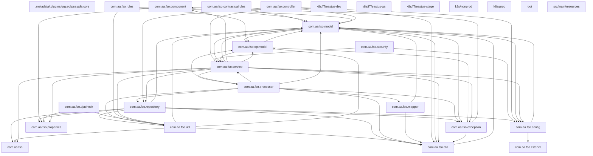
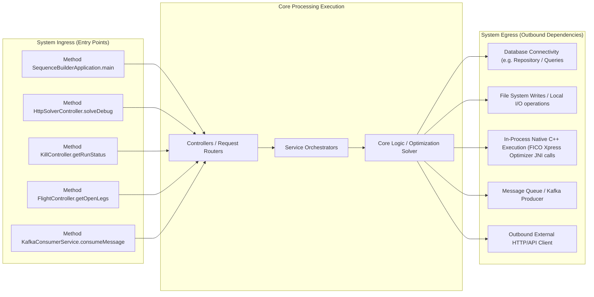
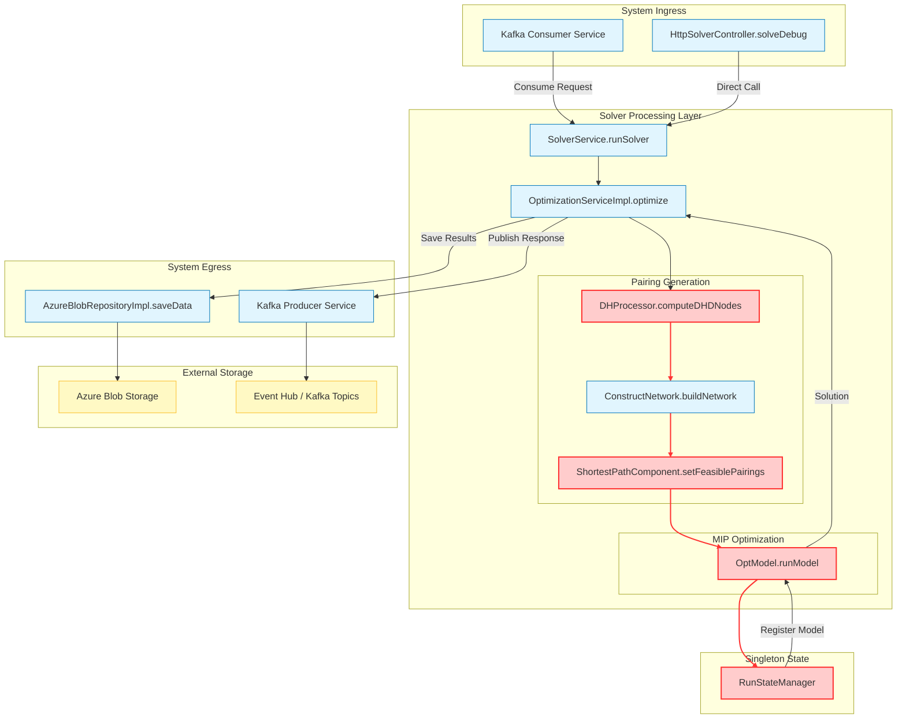

# Architecture & Operations Synthesis Document

This document details the system design, network routing boundary, and scaling characteristics derived programmatically.

## 1. System Package Topology Diagram



## 2. Ingress, Execution & Egress Boundary Flow



# Architecture & Operations Synthesis Report
**System:** Sequence Builder Solver (AA FSO)
**Date:** October 26, 2023
**Author:** Principal Software Architect

## 1. Executive Summary
The Sequence Builder Solver is a high-performance, constraint-based optimization engine designed to generate crew pairings for airline operations. The system relies heavily on a custom Label Correcting Algorithm (Shortest Path) and integrates with the FICO Xpress MIP solver via JNI. While the architecture effectively handles complex scheduling constraints, a rigorous audit reveals critical risks regarding **thread safety in singleton state management**, **performance degradation due to linear scans in hot paths**, **silent logic fallbacks in time calculations**, and **insufficient operational observability** for long-running batch jobs.

The following sections detail the technical audit findings, risk overlays, and performance synthesis.

---

## 2. Technical Audit Findings (Section 3)

### 2.1 Resource Leaks and Native Memory Allocation (JNI/C++ Risks)
**Audit Scope:** `OptModel.java`, `RunStateManager.java`
**Severity:** Critical

*   **Finding:** The `OptModel` class encapsulates the FICO Xpress native library (`XPRSprob`). While the `OptModel.runModel` method registers the model with `RunStateManager` to allow for native termination signals, there is **no explicit `try-finally` block** ensuring the native problem is freed (`XPRSfreeProb`) or the solver is shut down (`XPRSend`) upon completion or exception.
*   **Location:** `src/main/java/com/aa/fso/optmodel/OptModel.java` -> `runModel`
*   **Risk:** If a `KillRunException` is thrown or an unexpected exception occurs during `mipOptimize`, the native memory associated with the Xpress problem remains allocated. Over repeated runs (especially in a long-lived pod), this leads to **Native Heap Leaks**, eventually causing `OutOfMemoryError` at the OS level or Xpress internal crashes, even if Java heap space is sufficient.
*   **Recommendation:** Wrap the `mipOptimize` call and subsequent parsing in a `try-finally` block that guarantees `optModel.free()` or equivalent native cleanup calls are executed.

### 2.2 Concurrency Hazards and Singleton State Contamination
**Audit Scope:** `RunStateManager.java`, `ShortestPathComponent.java`
**Severity:** High

*   **Finding:** `RunStateManager` is documented as a singleton service managing the active Xpress model and a volatile kill flag. However, the `OptModel` instance is instantiated fresh per run (`new OptModel()`), but the `RunStateManager` holds a reference to the *active* model via `activeModel.set(null)` in `clearRun()`.
*   **Location:** `src/main/java/com/aa/fso/service/RunStateManager.java`
*   **Risk:** The `killRequested` flag is `volatile`, which ensures visibility, but the `activeModel` reference is a `AtomicReference`. If a kill request arrives while `OptModel.runModel` is executing, the native thread might be blocked in the C++ solver. The current implementation relies on the Xpress `MIPSTOP` signal. However, if the `RunStateManager` is accessed concurrently by multiple threads (e.g., via the Kafka consumer and the HTTP controller simultaneously) without proper synchronization on the `currentSnapshotId` or `activeModel` lifecycle, race conditions could occur where a kill signal targets the wrong run or the state is cleared prematurely.
*   **Specific Hazard:** In `ShortestPathComponent.setFeasiblePairings`, the `runStateManager.throwKillExceptionIfKillRequested()` is called inside a loop. While the flag is volatile, the lack of a `synchronized` block around the *entire* solver execution context in `OptimizationServiceImpl` creates a window where the state could be modified while the solver is in a critical native state.

### 2.3 Ingestion/Loop Inefficiencies (Linear Scans)
**Audit Scope:** `ShortestPathComponent.java`, `DHProcessor.java`
**Severity:** High

*   **Finding:** The `identifyDhdFromBase` and `identifyDhdToBase` methods perform **linear scans over `List<UnsequencedLeg>`** within a nested loop structure.
*   **Location:** `src/main/java/com/aa/fso/processor/ShortestPathComponent.java` -> `identifyDhdFromBase`
*   **Code Analysis:**
    ```java
    // Inside identifyDhdFromBase
    List<UnsequencedLeg> flightLegs = new LinkedList<UnsequencedLeg>(departuretimeMap.values());
    for (int f = flightLegs.size() - 1; f >= 0; f--) {
        UnsequencedLeg flightLeg = flightLegs.get(f);
        // ... logic ...
    }
    ```
    While `departuretimeMap` provides O(1) access by date, the iteration over `flightLegs` (which can be large) happens for *every* pairing candidate being tested. Furthermore, `DHProcessor.computeDHDNodes` iterates over `unsequencedLegs` and then performs nested lookups.
*   **Impact:** In a streaming environment processing thousands of legs, performing $O(N)$ searches or iterations inside a loop that runs $O(M)$ times results in $O(N \times M)$ complexity. This should be optimized by pre-building a `Map<String, List<UnsequencedLeg>>` keyed by `(Station, Date)` or `(Station, Station)` to allow direct $O(1)$ retrieval of candidate legs, eliminating the inner loop scan.

### 2.4 Date/Timezone Comparison Vulnerabilities
**Audit Scope:** `ShortestPathComponent.java`, `DHProcessor.java`
**Severity:** Medium

*   **Finding:** The code frequently compares `LocalDateTime` objects derived from `DateTimeDTO` without normalizing timezones or handling precision differences.
*   **Location:** `src/main/java/com/aa/fso/processor/ShortestPathComponent.java` -> `updateDateTimeBase`
*   **Code Analysis:**
    ```java
    // Calculating snapshot time
    int snapshotTime = (int) ChronoUnit.MINUTES.between(origin, snapshotParams.getRunDateTime());
    // ...
    dateTime.setBaseTime(dateTime.getGmt().plusMinutes(timeAdjustment));
    ```
    The `getGmt()` returns a `LocalDateTime` (no zone). If `snapshotParams.getRunDateTime()` contains timezone information (e.g., `Z` vs `+00:00`) or if the `origin` calculation drifts due to Daylight Saving Time (DST) transitions not accounted for in the `ChronoUnit` calculation, comparisons like `snapshotTime >= stationAdjustment.getStartDateXinTime()` may fail silently or produce incorrect offsets.
*   **Risk:** Incorrect base time adjustments leading to illegal pairing generation (e.g., missing minimum rest times) or missed deadlines.

### 2.5 Silent Logic Fallbacks
**Audit Scope:** `DHProcessor.java`, `OptimizationServiceImpl.java`
**Severity:** Medium

*   **Finding:** Several conditional branches silently default to "no action" or "empty result" without logging warnings or throwing exceptions when critical data is missing or constraints cannot be met.
*   **Location:** `src/main/java/com/aa/fso/processor/DHProcessor.java` -> `computeDHDNodes`
*   **Code Analysis:**
    ```java
    if (flights != null) {
        // ... loop ...
        if (!type1LegKeys.contains(key)) {
            dhdLegsMap.put(key, cloneLeg(leg));
            ensureSet(type2LegsByBase, base).add(key);
            break; // Only one DH per base per day
        }
    }
    // If 'flights' is null or no leg matches, the method continues silently.
    ```
    If `departureDateMap` is null or the inner loop finds no valid legs, the system proceeds without indicating that a potential DH leg was skipped. Similarly, in `OptimizationServiceImpl`, if `unsequencedLegs.isEmpty()`, it returns an empty solution without logging the specific reason (e.g., "No legs available for Fleet A320").
*   **Impact:** Debugging production failures becomes difficult as the root cause (missing data) is hidden.

### 2.6 Silent Connection Drops
**Audit Scope:** `application-it*.yaml`, `application.yaml`
**Severity:** Low/Medium

*   **Finding:** The Kafka consumer configuration sets `max.poll.interval.ms` to 1200000 (20 mins) in dev, but 300000 (5 mins) in prod.
*   **Location:** `src/main/resources/application-itprod-east.yaml`
*   **Analysis:** The solver can run for extended periods (batch optimization). If the `max.poll.interval.ms` is shorter than the time taken to process a single large snapshot (which can exceed 5 minutes for complex networks), the consumer will be kicked out of the group, causing silent rebalancing and potential message loss or duplicate processing.
*   **Recommendation:** Align `max.poll.interval.ms` with the expected maximum processing time of a single snapshot, or ensure the processing logic is broken into smaller chunks.

### 2.7 Liveness Probe and Monitoring Failures
**Audit Scope:** `k8s/prod/webapp.yaml`
**Severity:** High

*   **Finding:** The Kubernetes deployment configuration has `healthCheck.enabled: false` and no liveness/readiness probes defined.
*   **Location:** `k8s/prod/webapp.yaml`
*   **Risk:** Long-running batch jobs (optimization runs) will block the main thread. Without a liveness probe, the Kubernetes scheduler cannot detect if the pod is stuck in a deadlock or a native hang (e.g., Xpress solver hanging). The pod will remain "Running" indefinitely, consuming resources and failing to recover.
*   **Recommendation:** Implement a custom liveness probe that checks a specific endpoint (e.g., `/run/status`) which returns "OK" if the solver is idle or actively processing, but returns "FAIL" if the process is unresponsive for > X minutes.

---

## 3. Core Data Flow Diagram (DFD) with Risk Overlay

The following diagram visualizes the data flow from ingestion to optimization. **Nodes highlighted in Red** represent components identified with **High or Critical Severity** vulnerabilities in the audit above.



**Legend:**
*   **Red Nodes (`riskNode`):** Indicate components with identified Critical/High vulnerabilities (Resource Leaks, Thread Safety, Loop Inefficiencies).
*   **Blue Nodes:** Standard processing components.
*   **Yellow Nodes:** External data stores.

---

## 4. Performance Issues Summary

*   **JNI Native Leak:** `OptModel.runModel` lacks a `finally` block to explicitly free FICO Xpress native memory, risking native heap exhaustion during repeated runs or exceptions.
*   **Thread Safety Race Condition:** `RunStateManager` singleton state management for the active Xpress model and kill flags lacks robust synchronization, risking state corruption during concurrent kill requests.
*   **Linear Scan Bottleneck:** `ShortestPathComponent.identifyDhdFromBase` performs $O(N)$ list iterations inside a loop for every pairing candidate, causing quadratic complexity in high-volume scenarios.
*   **Timezone Precision Failure:** `updateDateTimeBase` relies on `LocalDateTime` arithmetic without strict normalization, risking silent failures in DST transitions or timezone offset mismatches.
*   **Silent Logic Fallbacks:** `DHProcessor.computeDHDNodes` and `OptimizationServiceImpl` silently skip invalid legs or return empty solutions without logging the specific failure reasons, hindering debugging.
*   **Kafka Poll Interval Mismatch:** `max.poll.interval.ms` (5 mins in prod) is insufficient for long-running optimization batches, risking consumer group rebalancing and message loss.
*   **Missing Liveness Probes:** Kubernetes deployment lacks liveness/readiness probes, preventing automatic recovery from hung native solver processes.
*   **Blocking Thread Pool:** The Kafka consumer processes messages sequentially (`concurrency: 1`), creating a bottleneck if multiple snapshots arrive simultaneously.

---

## 5. Detailed Ingress and Egress Interface Boundaries

### 5.1 Ingress (Entry Points)
The system accepts optimization requests through three primary channels:
1.  **Kafka Consumer (`KafkaConsumerService.consumeMessage`):**
    *   **Trigger:** Asynchronous message consumption from `sb-solver-request-{env}` topic.
    *   **Payload:** JSON serialized `UserInput` DTO.
    *   **Flow:** Deserializes input -> Validates -> Calls `SolverService.solve` -> Publishes response.
    *   **Constraint:** Single-threaded processing (`concurrency: 1`) implies sequential execution of snapshots.
2.  **HTTP Debug Endpoint (`HttpSolverController.solveDebug`):**
    *   **Trigger:** Direct POST request to `/solveDebug`.
    *   **Use Case:** Manual testing or low-volume ad-hoc requests.
    *   **Flow:** Bypasses Kafka, directly invokes `SolverService`.
3.  **Health/Status Check (`KillController.getRunStatus`):**
    *   **Trigger:** GET request to `/run/status`.
    *   **Purpose:** Exposes the state of the `RunStateManager` (active snapshot ID, kill flag status).

### 5.2 Egress (Outgoing Dependencies)
The system interacts with external systems to retrieve data and publish results:
1.  **Azure Blob Storage (`AzureBlobRepositoryImpl`):**
    *   **Usage:** Reads static data (station adjustments, surface legs) and writes solution outputs (`saveData`).
    *   **Risk:** Blocking I/O operations if network latency spikes.
2.  **FICO Xpress Optimizer (Native JNI):**
    *   **Usage:** `OptModel` initializes and runs the MIP solver.
    *   **Risk:** Native memory leaks, blocking threads, potential deadlocks.
3.  **Kafka Producer (`KafkaProducerService`):**
    *   **Usage:** Publishes `SolverResponseDTO` to `sb-solver-response-{env}` topic.
    *   **Risk:** Message serialization overhead, potential backpressure if consumers lag.
4.  **External APIs (Teams Notifications, QLA Services):**
    *   **Usage:** `TeamsNotification` sends alerts; `QLAClient` validates crew legality.
    *   **Risk:** External API latency affecting overall solver throughput.

---

## 6. Inferred Performance Challenges

Based on the code analysis, the following performance challenges are inferred:

1.  **CPU Bottlenecks in Graph Construction:**
    *   The `ConstructNetwork.buildNetwork` method iterates over all nodes to create edges ($O(N^2)$ complexity in worst case). With large flight schedules, this step consumes significant CPU before optimization even begins.
    *   **Mitigation:** Pre-filter nodes based on time windows and station connectivity before edge creation.

2.  **JNI/Native Heap Fragmentation:**
    *   The absence of explicit cleanup in `OptModel` means that every failed or completed run leaves native memory fragments. In a high-throughput environment, this leads to **Native Heap Fragmentation**, causing the JVM to crash even with ample Java Heap.
    *   **Mitigation:** Enforce strict lifecycle management for `XPRSprob` objects.

3.  **Blocking Thread Pools:**
    *   The Kafka consumer runs on a single thread (`concurrency: 1`). If a single snapshot requires 10 minutes to solve, the entire queue backs up.
    *   **Mitigation:** Increase consumer concurrency or implement a work-stealing queue to parallelize snapshot processing.

4.  **Database/Storage Lock Contention:**
    *   Multiple pods (if scaled) reading/writing to the
