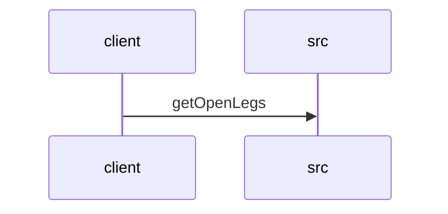

# Feature Walkthrough: Method `FlightController.getOpenLegs`

This document provides a detailed execution walk of the feature flow.

## 1. Sequence Execution Diagram

## 2. Walkthrough Explanation & Narrative

### Execution Trace Narration: FlightController.getOpenLegs

**Overview**
The execution begins at the `FlightController` entry point, specifically the `getOpenLegs` method located in `src/main/java/com/aa/fso/controller/FlightController.java`. This endpoint is mapped to the HTTP GET route `/openLegs` and serves as the interface for retrieving unsequenced flight legs based on a specified date range and filtering criteria.

**Execution Path and Data Mutations**
Upon receiving the request, the controller first logs an informational message indicating the initiation of the "Open Legs API" operation. The method then proceeds to parse the incoming string parameters into Java `LocalDate` objects. Specifically, the `sDate_start` and `sDate_end` parameters are converted from their string representations into `date_start` and `date_end` respectively using `LocalDate.parse()`. This transformation ensures that subsequent logic operates on standardized temporal data types rather than raw strings.

Simultaneously, the method accepts two list parameters, `positions` and `equipment`, which are passed directly without modification to maintain the integrity of the filter criteria provided by the client.

**Conditional Logic and Data Retrieval**
The core business logic resides within the repository layer. The controller delegates the query execution to `legDataRepository.getOpenLegs`, passing the parsed dates and the original lists of positions and equipment. While the specific internal conditional logic of the repository is not visible in this snippet, it is implied that this method filters the dataset to return only those legs that are currently open (unsequenced) and match the provided date range and attribute filters. No explicit `if/else` statements are present in the controller itself; the flow is linear, relying on the repository to handle complex filtering conditions.

**Final Return Output**
Once the repository returns the resulting `List<UnsequencedLeg>`, the controller constructs a `ResponseEntity`. This object wraps the retrieved list of legs and sets the HTTP status code to `OK` (200). The method concludes by returning this response object to the client, effectively delivering the filtered list of open flight legs in the response body.

**Citations**
*   Method definition and parameter parsing: `src/main/java/com/aa/fso/controller/FlightController.java:10-25`
*   Logging and Repository invocation: `src/main/java/com/aa/fso/controller/FlightController.java:12-23`
*   Response construction: `src/main/java/com/aa/fso/controller/FlightController.java:24-25`
