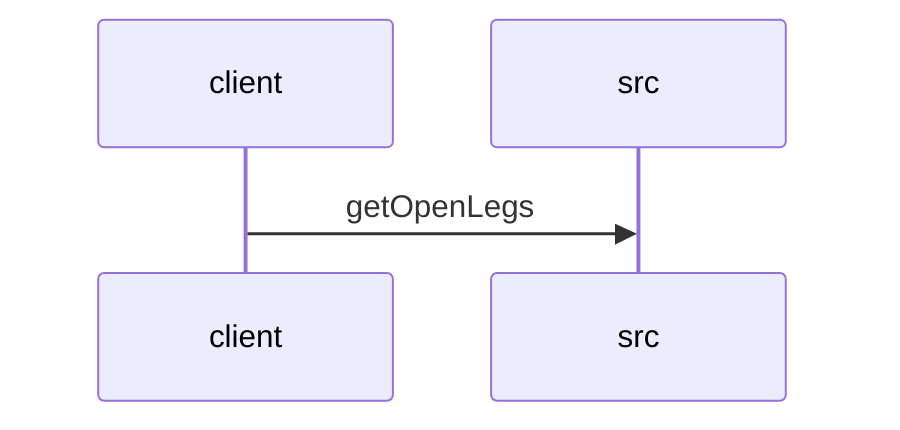

# Feature Walkthrough: Method `FlightController.getOpenLegs`

This document provides a detailed execution walk of the feature flow.

## 1. Sequence Execution Diagram

## 2. Walkthrough Explanation & Narrative

### Execution Trace Narration: FlightController.getOpenLegs

**Overview**
The execution begins at the entry point `FlightController.getOpenLegs`, located in `src/main/java/com/aa/fso/controller/FlightController.java`. This method serves as the RESTful endpoint handler for retrieving unsequenced flight legs based on specific temporal and operational criteria.

**Execution Path and Data Flow**

1.  **Request Reception and Logging**:
    Upon receiving an HTTP GET request to the `/openLegs` path, the controller initiates the process by logging an informational message indicating the start of the operation. This occurs at **[src/main/java/com/aa/fso/controller/FlightController.java:13]**. The log entry "Started Open Legs API" confirms the successful entry into the business logic flow.

2.  **Parameter Parsing and Validation**:
    The method accepts three primary query parameters: `sDate_start`, `sDate_end`, and two lists (`positions`, `equipment`).
    *   The string representations of the start and end dates (`sDate_start` and `sDate_end`) are parsed into `java.time.LocalDate` objects. This conversion is critical for ensuring type safety and enabling precise date-range comparisons within the repository layer. These operations are executed sequentially at **[src/main/java/com/aa/fso/controller/FlightController.java:14]** and **[src/main/java/com/aa/fso/controller/FlightController.java:15]**.
    *   The `positions` and `equipment` parameters are already deserialized as `List<String>` objects by the Spring framework, requiring no additional transformation before passing them to the service layer.

3.  **Repository Invocation**:
    With the parameters normalized, the controller delegates the core data retrieval logic to the `legDataRepository`. The method `getOpenLegs` is invoked with the parsed `date_start`, `date_end`, `positions`, and `equipment` arguments. This call, found at **[src/main/java/com/aa/fso/controller/FlightController.java:16]**, triggers the underlying database query to filter legs that are currently open (unsequenced) matching the specified date range and equipment constraints.

4.  **Response Construction and Return**:
    The result from the repository, a `List<UnsequencedLeg>`, is encapsulated within a `ResponseEntity`. This wrapper sets the HTTP status code to `200 OK`, signifying a successful retrieval. The final object is returned to the client at **[src/main/java/com/aa/fso/controller/FlightController.java:17]**. If the repository returns an empty list, the response will contain an empty collection rather than a null reference, adhering to REST best practices.

**Final Output**
The method concludes by returning a JSON payload containing the list of `UnsequencedLeg` objects. The HTTP response header includes a status code of `200 OK`, and the body contains the filtered dataset derived from the `legDataRepository` based on the input date range and equipment filters.
