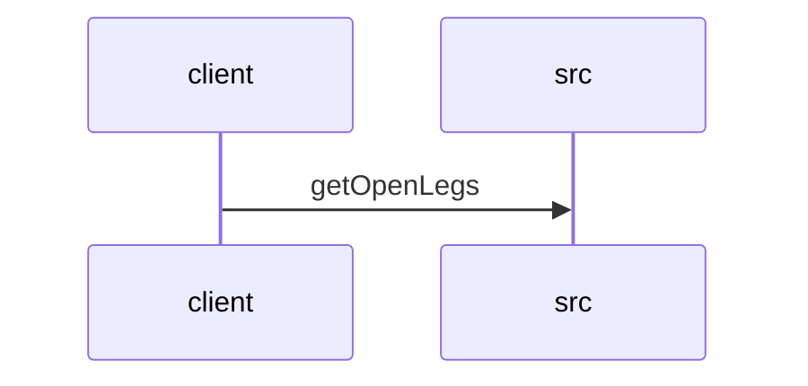

# Feature Walkthrough: Method `FlightController.getOpenLegs`

This document provides a detailed execution walk of the feature flow.

## 1. Sequence Execution Diagram

## 2. Walkthrough Explanation & Narrative

### Execution Trace Narration: `FlightController.getOpenLegs`

**Feature Overview**
The following narration details the execution flow of the `getOpenLegs` endpoint within the `FlightController`. This API serves as the entry point for retrieving a list of unsequenced flight legs based on specific temporal and operational criteria.

**Execution Path Analysis**

1.  **Request Reception and Initialization**
    The process initiates when the `FlightController` receives an HTTP GET request mapped to the `/openLegs` endpoint. The controller method `getOpenLegs` is invoked, accepting four query parameters: `sDate_start`, `sDate_end`, `positions`, and `equipment`. Upon entry, the system logs an informational message indicating the start of the operation.
    *   *Reference:* `src/main/java/com/aa/fso/controller/FlightController.java:10-13`

2.  **Data Parsing and Validation**
    The raw string inputs for the start and end dates (`sDate_start` and `sDate_end`) are immediately parsed into `LocalDate` objects. This conversion ensures that subsequent logic operates on standardized date types rather than raw strings, facilitating accurate temporal comparisons. The `positions` and `equipment` lists are passed through as-is, preserving their collection structure for filtering.
    *   *Reference:* `src/main/java/com/aa/fso/controller/FlightController.java:14-15`

3.  **Repository Invocation**
    The core business logic is delegated to the `legDataRepository`. The controller invokes `getOpenLegs`, passing the parsed `date_start`, `date_end`, and the filter lists (`positions`, `equipment`). This method acts as the gateway to the persistence layer, executing the necessary database queries to identify legs that match the specified open status and filters.
    *   *Reference:* `src/main/java/com/aa/fso/controller/FlightController.java:16`

4.  **Response Construction and Return**
    Upon successful retrieval of the data from the repository, the controller constructs a `ResponseEntity`. It wraps the resulting `List<UnsequencedLeg>` object and assigns it an HTTP status code of `OK` (200). This response is then returned to the client, concluding the execution trace. If any exceptions occur during parsing or repository access, they are propagated up as `IOException` per the method signature.
    *   *Reference:* `src/main/java/com/aa/fso/controller/FlightController.java:17`

**Summary of Data Flow**
*   **Input:** String dates, List of positions, List of equipment.
*   **Transformation:** Strings converted to `LocalDate`; Lists passed to repository.
*   **Output:** `ResponseEntity<List<UnsequencedLeg>>` with HTTP 200 OK.

**Citations**
*   `src/main/java/com/aa/fso/controller/FlightController.java:10-17`
