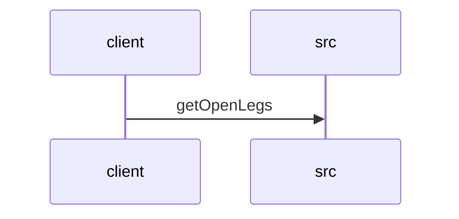

# Feature Walkthrough: Method `FlightController.getOpenLegs`

This document provides a detailed execution walk of the feature flow.

## 1. Sequence Execution Diagram

## 2. Walkthrough Explanation & Narrative

### Execution Trace Narration: FlightController.getOpenLegs

**Overview**
The execution begins at the `FlightController` entry point, specifically targeting the `getOpenLegs` method within the `src/main/java/com/aa/fso/controller/FlightController.java` file. This endpoint is designed to retrieve a list of unsequenced flight legs based on a specified date range and filtering criteria for positions and equipment.

**Execution Path and Data Flow**

1.  **Request Reception and Logging**:
    Upon receiving an HTTP GET request at the `/openLegs` path, the controller initiates the process by logging an informational message indicating the start of the operation. This ensures auditability and monitoring of the API's activity.
    *   *Reference*: `src/main/java/com/aa/fso/controller/FlightController.java:13`

2.  **Parameter Parsing and Validation**:
    The method accepts four request parameters: `sDate_start`, `sDate_end`, `positions`, and `equipment`.
    - The string inputs for the start and end dates (`sDate_start` and `sDate_end`) are immediately parsed into `LocalDate` objects using `LocalDate.parse()`. This conversion transforms raw string data into structured temporal objects suitable for database querying.
    - The `positions` and `equipment` parameters are already provided as `List<String>` objects, requiring no transformation.
    *   *Reference*: `src/main/java/com/aa/fso/controller/FlightController.java:14-15`

3.  **Service Layer Invocation**:
    With the parameters successfully converted and validated, the controller delegates the core business logic to the `legDataRepository`. It invokes the `getOpenLegs` method, passing the parsed `date_start`, `date_end`, and the lists of `positions` and `equipment`. This repository call filters the dataset to identify legs that are currently "open" (unsequenced) matching the provided constraints.
    *   *Reference*: `src/main/java/com/aa/fso/controller/FlightController.java:16`

4.  **Response Construction**:
    The result returned from the repository—a `List<UnsequencedLeg>`—is wrapped in a `ResponseEntity`. This wrapper sets the HTTP status code to `OK` (200), signaling a successful retrieval. The method then returns this response object to the client.
    *   *Reference*: `src/main/java/com/aa/fso/controller/FlightController.java:17`

**Final Output**
The function concludes by returning a `ResponseEntity` containing a JSON-serialized list of `UnsequencedLeg` objects. If the query yields results, the list contains the filtered flight legs; if no matches are found, an empty list is returned within the 200 OK response structure. No exceptions are thrown during this specific flow unless the date parsing fails or the repository encounters an internal error, which would propagate up to the global exception handler.
