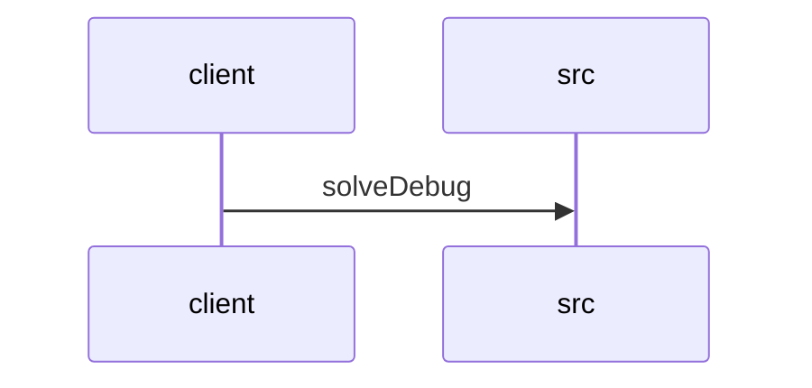

# Feature Walkthrough: Method `HttpSolverController.solveDebug`

This document provides a detailed execution walk of the feature flow.

## 1. Sequence Execution Diagram

## 2. Walkthrough Explanation & Narrative

### Execution Trace Narration: Debug Solver Endpoint

**Overview**
The execution begins at the entry point `HttpSolverController.solveDebug`, located in `src/main/java/com/aa/fso/controller/HttpSolverController.java`. This endpoint is designed to trigger the solver logic using manually provided `UserInput` data, mimicking the behavior of an event-driven solver invocation. The method is mapped to the POST path `/solveDebug` and is annotated with OpenAPI documentation to describe its purpose.

**Execution Path and Data Flow**
Upon receiving a request, the controller extracts the `UserInput` object from the request body. The flow immediately enters a `try` block to handle the core business logic. Inside this block, the controller delegates the solving process to the `solverService` by invoking the `solve` method with the provided `userInput` argument. This service call returns a `SolverResponseDTO` object, which encapsulates the solver's results.

**Conditionals and Mutations**
The code snippet provided does not contain explicit conditional logic (e.g., `if` statements) or complex branching within the visible scope. The primary mutation occurs during the service call, where the internal state of the solver is processed based on the input parameters. The result is then transformed into a list of `OutputData` objects via the `getSolutions()` method on the `SolverResponseDTO`.

A critical aspect of this execution is the `finally` block. Regardless of whether the `solve` operation succeeds or throws an exception, the `runStateManager.clearRun()` method is guaranteed to execute. This ensures that any transient runtime state associated with the current execution is cleaned up, preventing memory leaks or state contamination for subsequent requests.

**Final Return Output**
If the execution completes without unhandled exceptions, the method returns a `ResponseEntity` with an HTTP status code of 200 (OK). The body of this response contains the list of solutions extracted from the `SolverResponseDTO`.

**Code Reference**
The specific implementation details for this flow are found in:
[src/main/java/com/aa/fso/controller/HttpSolverController.java:34-46]
