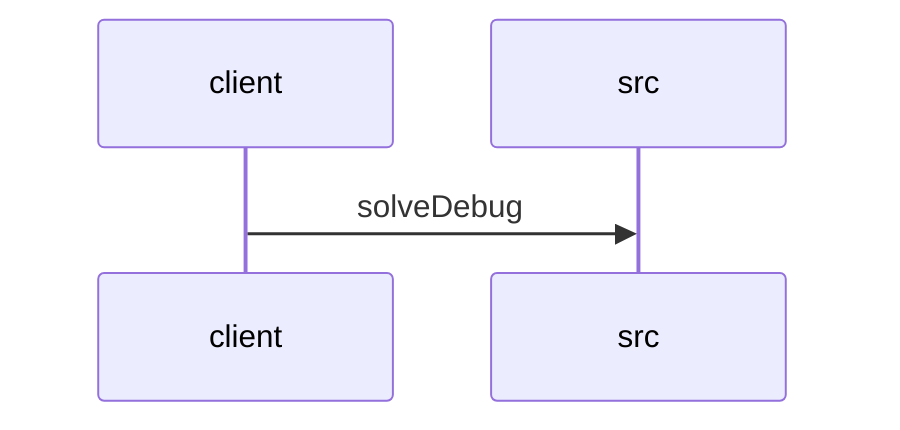

# Feature Walkthrough: Method `HttpSolverController.solveDebug`

This document provides a detailed execution walk of the feature flow.

## 1. Sequence Execution Diagram

## 2. Walkthrough Explanation & Narrative

### Execution Trace Narration: Debug Solver Endpoint

**Overview**
The execution begins at the `HttpSolverController` entry point, specifically the `solveDebug` method located in `src/main/java/com/aa/fso/controller/HttpSolverController.java`. This endpoint is designed to facilitate manual testing of the solver logic by accepting a `UserInput` payload directly via an HTTP POST request to the `/solveDebug` route. The operation is documented to mirror the standard solver execution flow triggered by event hubs, ensuring consistency between manual and automated test scenarios.

**Execution Path and Data Flow**
Upon receiving the request, the controller extracts the `UserInput` object from the request body. The control flow immediately delegates the core computational logic to the `solverService` layer. Specifically, the `solve` method is invoked with the provided user input, returning a `SolverResponseDTO` object that encapsulates the solver's results.

A commented-out line in the source code indicates an alternative execution path (`solveWithLocalJsonFile`) which allows the solver to operate against a local JSON file instead of the dynamic input; however, this path is currently inactive. The active path proceeds to extract the list of solutions from the `SolverResponseDTO` using the `getSolutions()` accessor method.

**State Management and Cleanup**
Crucially, the method employs a `try-finally` block to ensure robust state management. Regardless of whether the solver execution succeeds or throws an exception, the `finally` block guarantees the execution of `runStateManager.clearRun()`. This step is vital for resetting the internal run state of the application, preventing stale data from persisting across subsequent requests or test cycles.

**Return Output**
If the execution completes without interruption, the controller constructs and returns a `ResponseEntity` with an HTTP 200 OK status. The body of this response contains the `List<OutputData>` retrieved from the solver response, representing the computed solutions for the provided input.

**Source Reference**
The implementation details described above correspond to the following code segment:
[src/main/java/com/aa/fso/controller/HttpSolverController.java:10-25]
