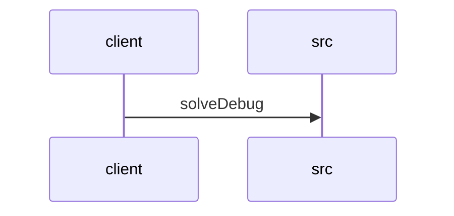

# Feature Walkthrough: Method `HttpSolverController.solveDebug`

This document provides a detailed execution walk of the feature flow.

## 1. Sequence Execution Diagram

## 2. Walkthrough Explanation & Narrative

### Execution Trace Narration: Debug Solver Endpoint

**Overview**
The execution begins at the entry point `HttpSolverController.solveDebug`, located in `src/main/java/com/aa/fso/controller/HttpSolverController.java`. This endpoint is designed to trigger the solver logic using manually provided `UserInput` data, simulating the behavior of an event-driven solver invocation. The method is mapped to the POST path `/solveDebug` and returns a list of solution objects wrapped in an HTTP 200 OK response.

**Execution Path and Data Flow**
Upon receiving a request, the controller extracts the `UserInput` object from the request body. The control flow immediately enters a `try` block to ensure robust error handling and resource cleanup. Inside this block, the primary business logic is delegated to `solverService.solve(userInput)` on line 14. This service call processes the input data, executes the solver algorithm, and constructs a `SolverResponseDTO` containing the results.

Following the successful service invocation, the controller extracts the specific solution data by calling `solverResponse.getSolutions()` on line 15. This list of `OutputData` objects is then returned as the payload of a `ResponseEntity` with a status code of 200 (OK). A commented-out line 16 indicates an alternative implementation path for local JSON file testing, which is currently inactive.

**State Management and Cleanup**
Crucially, the method utilizes a `finally` block spanning lines 17–19. Regardless of whether the solver execution succeeds or throws an exception, the code within this block is guaranteed to execute. Specifically, `runStateManager.clearRun()` is invoked to reset the internal state of the current solver run. This ensures that no residual state persists between sequential debug requests, maintaining system integrity.

**Final Output**
The function concludes by returning a `ResponseEntity<List<OutputData>>`. If the solver executes successfully, the response body contains the list of generated solutions. If an exception occurs during the service call, the exception propagates up to the global exception handler (implied by standard Spring Boot architecture), while the `finally` block still executes to clear the run state before the error response is sent.

**Relevant Code Reference**
[src/main/java/com/aa/fso/controller/HttpSolverController.java:10-25]
