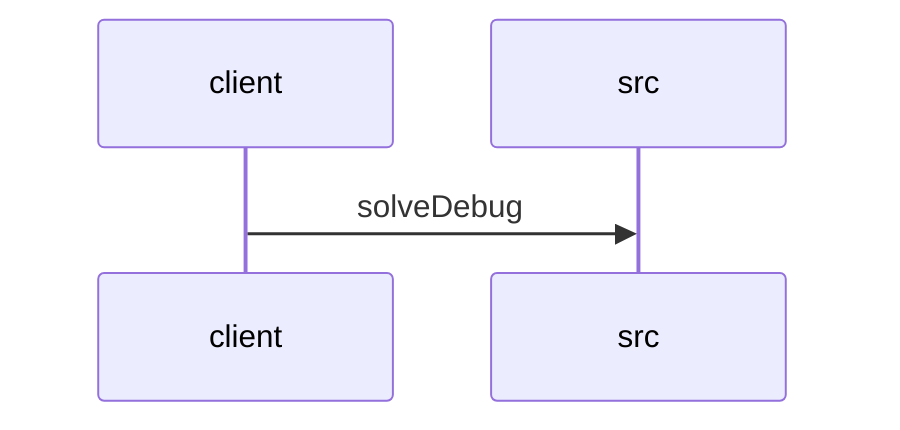

# Feature Walkthrough: Method `HttpSolverController.solveDebug`

This document provides a detailed execution walk of the feature flow.

## 1. Sequence Execution Diagram

## 2. Walkthrough Explanation & Narrative

### Execution Trace Narration: Debug Solver Endpoint

**Overview**
The execution begins at the entry point `HttpSolverController.solveDebug`, located in `src/main/java/com/aa/fso/controller/HttpSolverController.java`. This endpoint serves as a manual trigger for the solver engine, allowing developers or operators to submit a `UserInput` payload directly via HTTP POST to the `/solveDebug` route. The operation is designed to mirror the logic of the standard event-driven solver execution.

**Execution Path and Data Flow**
Upon receiving the request, the controller extracts the `UserInput` object from the request body. The control flow immediately delegates the core computational logic to the `solverService` by invoking the `solve` method. This service layer processes the input against the configured solver algorithms to generate a `SolverResponseDTO`.

Inside the `try` block, the controller retrieves the specific solution set from the response object using `solverResponse.getSolutions()`. This collection of `OutputData` objects represents the computed results intended for the client. The method then constructs and returns an HTTP 200 OK response containing this list of solutions.

**Conditionals and Error Handling**
The implementation utilizes a `try-finally` structure to ensure resource cleanup regardless of the outcome. While the provided snippet does not explicitly show a `catch` block, the `finally` block guarantees that the state management system is reset after the request processing completes. This ensures that any transient run states held by the application are cleared, preventing state leakage between sequential requests.

**Final Return Output**
The method concludes by returning a `ResponseEntity` wrapping the list of `OutputData` objects. If the solver executes successfully, the client receives the calculated solutions. Concurrently, the `runStateManager.clearRun()` method is invoked within the `finally` block to sanitize the internal state.

**Code Reference**
The critical logic described above is defined in the following section of the source code:
[src/main/java/com/aa/fso/controller/HttpSolverController.java:14-28]
