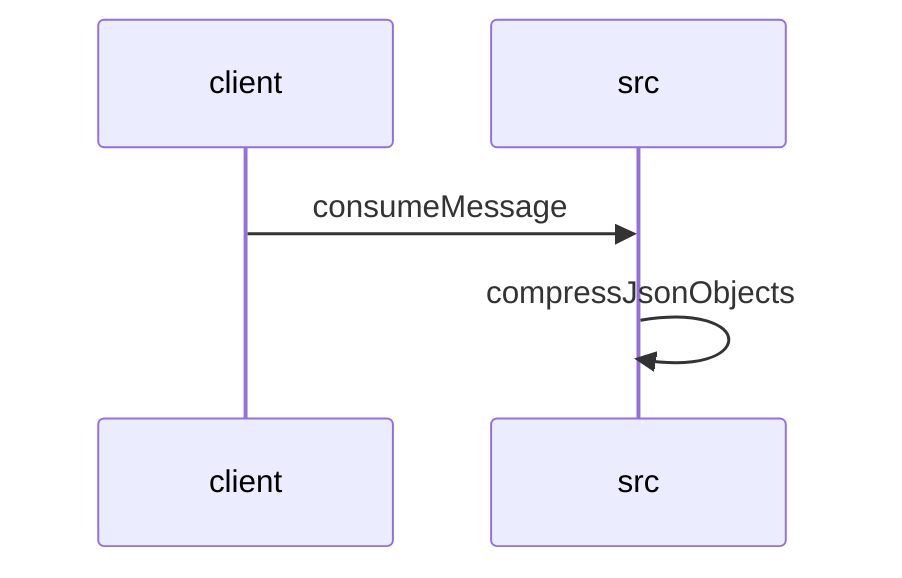

# Feature Walkthrough: Method `KafkaConsumerService.consumeMessage`

This document provides a detailed execution walk of the feature flow.

## 1. Sequence Execution Diagram

## 2. Walkthrough Explanation & Narrative

### Execution Trace Narration: Kafka Message Consumption and Solution Compression

The following analysis details the execution flow initiated by the `KafkaConsumerService` upon receiving a message, proceeding through business logic validation, solver invocation, and final data compression.

#### 1. Message Ingestion and Deserialization
The process begins at **`KafkaConsumerService.consumeMessage`** (`src/main/java/com/aa/fso/service/kafka/consumer/KafkaConsumerService.java:10-25`). Upon triggering the `@KafkaListener`, the service immediately acknowledges the incoming message via `ack.acknowledge()` to ensure at-least-once delivery semantics are handled correctly before processing. The raw payload (`record.value()`) is extracted and deserialized into a `UserInput` object using an `ObjectMapper`. A diagnostic log entry captures the topic name, the raw input, and the message key for audit purposes.

#### 2. Snapshot Validation and Business Logic
Immediately following deserialization, the service initializes a default `itSnapshotID` as `"[NONE]"`. The execution then enters a critical validation block within the `try` statement. The code checks if the `snapshotIds` list within the `UserInput` object is neither null nor empty.
*   **Condition Met**: If valid, the first element of the list is assigned to `itSnapshotID`.
*   **Condition Failed**: If the list is empty or null, an `InvalidUserInputException` is thrown with the message "SnapshotIds is empty," halting the standard flow and redirecting to the exception handler.

Assuming validation passes, the system logs the parsed `userInput` and invokes `solverService.solve(userInput)`. This method returns a `SolverResponseDTO` containing the computed results. The solutions are extracted into a mutable `ArrayList` named `solutions`, and a log entry records the count of generated solutions relative to the specific `itSnapshotID`.

#### 3. Data Compression and Event Publishing
Before publishing, the system prepares the response for efficient transmission. The `solutions` list is passed to `CompressUtil.compressJsonObjects` (`src/main/java/com/aa/fso/util/CompressUtil.java:10-25`). Inside this utility method:
1.  The list of objects is serialized into a single JSON string.
2.  A `ByteArrayOutputStream` is initialized to hold the compressed binary data.
3.  A `GZIPOutputStream` wraps the output stream, compressing the UTF-8 encoded JSON bytes.
4.  The resulting compressed byte array is returned.

Back in the consumer service, the length of this compressed payload is logged. Subsequently, `publishSolverByteResponseEvent` is called with the `itSnapshotID` and the compressed byte array to dispatch the result to downstream consumers. To optimize memory management and prepare the heap for Garbage Collection (GC), the temporary `solutions` list is explicitly cleared.

#### 4. Exception Handling and Cleanup
The execution path includes robust error handling:
*   **`KillRunException`**: If the solver run is forcibly terminated, the system logs the graceful exit for the specific `itSnapshotID` and triggers a notification via `teamsNotification.sendApplicationKilledNotification`.
*   **General Exceptions**: Any other runtime errors are caught, logged at the error level with full stack traces, and do not interrupt the cleanup phase.

Regardless of success or failure, the `finally` block ensures deterministic state management by calling `runStateManager.clearRun()`, resetting the internal run state to prevent leakage between messages.

### Final Output Summary
The feature successfully processes a Kafka message by validating user input, solving the problem, compressing the resulting JSON solutions using GZIP, and publishing the binary payload. The final return value of the `consumeMessage` method is `void`, as the operation relies on side effects (logging, event publishing, and state updates) rather than returning data to the caller.
