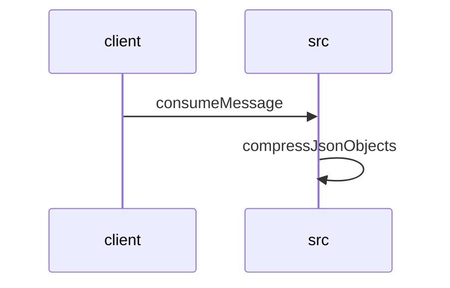

# Feature Walkthrough: Method `KafkaConsumerService.consumeMessage`

This document provides a detailed execution walk of the feature flow.

## 1. Sequence Execution Diagram

## 2. Walkthrough Explanation & Narrative

### Execution Trace Narration: `KafkaConsumerService.consumeMessage`

The following analysis details the execution flow, data transformations, and conditional logic observed within the `KafkaConsumerService` and its downstream utility calls.

#### 1. Message Ingestion and Initialization
The process initiates at **`KafkaConsumerService.consumeMessage`** (`src/main/java/com/aa/fso/service/kafka/consumer/KafkaConsumerService.java:L14-63`). Upon receiving a `ConsumerRecord`, the service immediately acknowledges the message via `ack.acknowledge()` to ensure at-least-once delivery semantics are handled correctly by the Kafka broker. The raw payload (`record.value()`) is extracted and logged with metadata including the topic name and message key.

A new `ObjectMapper` instance is instantiated to deserialize the incoming JSON string into a strongly typed `UserInput` object. A variable `itSnapshotID` is initialized to `"[NONE]"` as a default state before entering the processing block.

#### 2. Input Validation and Snapshot Extraction
Inside the `try` block, the system validates the integrity of the incoming request. It checks if `userInput.getSnapshotIds()` is neither null nor empty (`L27-L32`).
*   **Condition Met**: If valid, the first element of the list is assigned to `itSnapshotID`.
*   **Condition Failed**: If the list is empty or null, an `InvalidUserInputException` is thrown with the message "SnapshotIds is empty," triggering the exception handling flow.

Upon successful validation, the system logs the parsed `UserInput` and proceeds to invoke the core business logic via `solverService.solve(userInput)` (`L34`). This method returns a `SolverResponseDTO` containing the computed results.

#### 3. Solution Processing and Compression
The service retrieves the list of solutions from the response DTO and converts them into a mutable `ArrayList` (`L36`). A log entry records the count of generated solutions relative to the identified `itSnapshotID`.

The critical transformation occurs when `CompressUtil.compressJsonObjects` is invoked with the solutions list (`L39`). This delegates control to **`CompressUtil.java`** (`src/main/java/com/aa/fso/util/CompressUtil.java:L10-25`):
1.  **Serialization**: The list of objects is serialized into a single JSON string using `ObjectMapper.writeValueAsString`.
2.  **Compression**: A `ByteArrayOutputStream` wraps a `GZIPOutputStream`. The UTF-8 encoded bytes of the JSON string are written to this stream, effectively compressing the data.
3.  **Return**: The compressed byte array is returned to the caller.

Back in the consumer service, the length of this compressed payload is logged (`L40`), and the event is published via `publishSolverByteResponseEvent` (`L41`). To optimize memory management and prepare the heap for Garbage Collection, the temporary `solutions` list is explicitly cleared (`L43`).

#### 4. Exception Handling and Cleanup
The execution path includes robust error handling:
*   **`KillRunException`**: If the solver run is explicitly terminated, the system logs the graceful exit for the specific `itSnapshotID` and triggers a notification via `teamsNotification.sendApplicationKilledNotification` (`L45-L47`).
*   **General Exceptions**: Any other runtime exceptions are caught, logged at the error level with full stack traces, and do not interrupt the flow to the cleanup phase (`L49-L50`).

Regardless of success or failure, the `finally` block ensures deterministic cleanup by calling `runStateManager.clearRun()` (`L52`), resetting the internal state machine for the next incoming message.

#### Final Output Summary
The function does not return a value directly to the caller (it is a `void` method). Instead, the primary output is the side effect of publishing a compressed byte array representing the solver's solutions to the downstream event bus. The final state of the system is a cleared run manager and an acknowledged Kafka message.
