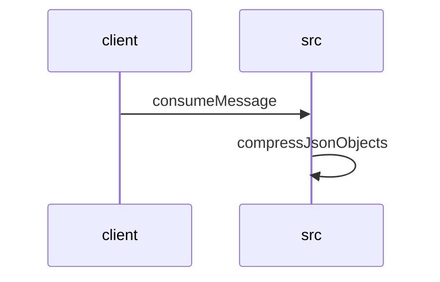

# Feature Walkthrough: Method `KafkaConsumerService.consumeMessage`

This document provides a detailed execution walk of the feature flow.

## 1. Sequence Execution Diagram

## 2. Walkthrough Explanation & Narrative

### Execution Trace Narration: `KafkaConsumerService.consumeMessage`

The following narrative details the execution flow, data transformations, and conditional logic observed within the `KafkaConsumerService` and its dependent utility classes.

#### 1. Message Ingestion and Initialization
The execution begins at **`src/main/java/com/aa/fso/service/kafka/consumer/KafkaConsumerService.java:10-15`**, where the `consumeMessage` method is triggered by the Kafka listener. Upon entry, the system immediately acknowledges the message via `ack.acknowledge()` to ensure at-least-once delivery semantics are handled correctly before processing begins. The raw payload (`record.value()`) is extracted and logged alongside the topic name and message key for audit purposes.

#### 2. Deserialization and Input Validation
At **`src/main/java/com/aa/fso/service/kafka/consumer/KafkaConsumerService.java:17-20`**, an `ObjectMapper` instance is instantiated to deserialize the incoming JSON string into a strongly typed `UserInput` object.

The logic then proceeds to validate the presence of snapshot identifiers (**`src/main/java/com/aa/fso/service/kafka/consumer/KafkaConsumerService.java:23-29`**):
*   **Condition Check**: The code verifies if `userInput.getSnapshotIds()` is neither null nor empty.
*   **Success Path**: If valid, the first element of the list is assigned to the variable `itSnapshotID`.
*   **Failure Path**: If the list is empty or null, an `InvalidUserInputException` is thrown with the specific error message "SnapshotIds is empty". This exception would propagate to the catch block below, preventing further solver execution.

#### 3. Solver Execution and Response Handling
Assuming validation passes, the system logs the parsed user input (**`src/main/java/com/aa/fso/service/kafka/consumer/KafkaConsumerService.java:31`**) and invokes the core business logic via `solverService.solve(userInput)` at **`src/main/java/com/aa/fso/service/kafka/consumer/KafkaConsumerService.java:32`**.

The resulting `SolverResponseDTO` is processed as follows:
*   The solutions list is copied into a mutable `ArrayList` named `solutions` (**`src/main/java/com/aa/fso/service/kafka/consumer/KafkaConsumerService.java:34`**).
*   A log entry records the count of generated solutions relative to the `itSnapshotID` (**`src/main/java/com/aa/fso/service/kafka/consumer/KafkaConsumerService.java:36`**).

#### 4. Compression and Event Publishing
Before publishing, the system optimizes memory usage by compressing the solution data.
*   **Compression Logic**: The `CompressUtil.compressJsonObjects` method is called at **`src/main/java/com/aa/fso/service/kafka/consumer/KafkaConsumerService.java:38`**.
    *   Inside **`src/main/java/com/aa/fso/util/CompressUtil.java:6-12`**, the list of objects is serialized to a JSON string.
    *   This string is then compressed using GZIP compression via a `GZIPOutputStream` wrapping a `ByteArrayOutputStream` (**`src/main/java/com/aa/fso/util/CompressUtil.java:13-16`**).
    *   The method returns the resulting `byte[]` array.
*   **Logging**: The length of the compressed byte array is logged (**`src/main/java/com/aa/fso/service/kafka/consumer/KafkaConsumerService.java:39`**).
*   **Publishing**: The compressed data and the snapshot ID are passed to `publishSolverByteResponseEvent` to trigger downstream events (**`src/main/java/com/aa/fso/service/kafka/consumer/KafkaConsumerService.java:40`**).

#### 5. Memory Management and Exception Handling
To facilitate Garbage Collection (GC), the temporary `solutions` list is explicitly cleared at **`src/main/java/com/aa/fso/service/kafka/consumer/KafkaConsumerService.java:42`**.

The execution flow includes robust error handling:
*   **`KillRunException`**: If a run is forcibly terminated, the system logs the event and sends a notification via `teamsNotification.sendApplicationKilledNotification` (**`src/main/java/com/aa/fso/service/kafka/consumer/KafkaConsumerService.java:44-47`**).
*   **General Exceptions**: Any other unexpected errors are caught, logged with full stack traces, and do not interrupt the flow (**`src/main/java/com/aa/fso/service/kafka/consumer/KafkaConsumerService.java:49-50`**).

#### 6. Finalization
Regardless of success or failure, the `finally` block ensures cleanup operations are performed. At **`src/main/java/com/aa/fso/service/kafka/consumer/KafkaConsumerService.java:52`**, `runStateManager.clearRun()` is invoked to reset the state of the current run, ensuring no residual data persists for subsequent messages.

### Summary of Outputs
*   **Primary Output**: A compressed GZIP byte array containing the solver solutions, published via `publishSolverByteResponseEvent`.
*   **Side Effects**:
    *   Kafka message acknowledgment.
    *   Comprehensive logging of input, solution counts, and compression metrics.
    *   Potential team notifications if a run is killed.
    *   State cleanup in `runStateManager`.
