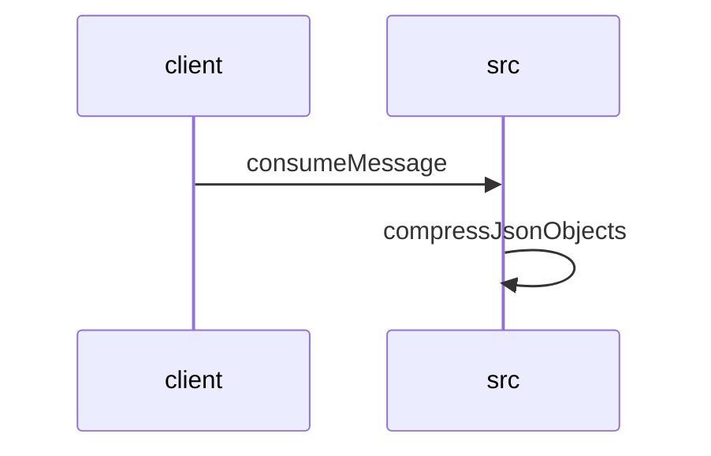

# Feature Walkthrough: Method `KafkaConsumerService.consumeMessage`

This document provides a detailed execution walk of the feature flow.

## 1. Sequence Execution Diagram

## 2. Walkthrough Explanation & Narrative

### Execution Trace Narration: Kafka Message Consumption and Solution Compression

The following analysis details the execution flow initiated by the `KafkaConsumerService` upon receiving a message, covering data deserialization, business logic validation, compression, and error handling mechanisms.

#### 1. Message Ingestion and Deserialization
The process begins at **`src/main/java/com/aa/fso/service/kafka/consumer/KafkaConsumerService.java:14-23`**. The `consumeMessage` method is triggered by the Kafka listener, immediately acknowledging the message via `ack.acknowledge()` to ensure at-least-once delivery semantics are managed correctly. The raw payload (`record.value()`) is extracted and logged for audit purposes.

Subsequently, an `ObjectMapper` instance is instantiated to deserialize the incoming JSON string into a strongly typed `UserInput` object. This step transforms the unstructured Kafka payload into a structured domain model ready for processing.

#### 2. Input Validation and Snapshot Extraction
At **`src/main/java/com/aa/fso/service/kafka/consumer/KafkaConsumerService.java:25-32`**, the system validates the integrity of the user input. It specifically checks the `snapshotIds` collection within the `UserInput` object.
*   **Condition Check**: If `snapshotIds` is null or empty, the execution halts immediately. An `InvalidUserInputException` is thrown with the specific message "SnapshotIds is empty," preventing downstream processing of invalid requests.
*   **Data Mutation**: If the check passes, the first element of the `snapshotIds` list is assigned to the local variable `itSnapshotID`. This identifier serves as the correlation key for subsequent logging and event publishing.

#### 3. Solver Execution and Response Handling
Once validation succeeds, the flow proceeds to **`src/main/java/com/aa/fso/service/kafka/consumer/KafkaConsumerService.java:34-40`**. The `solverService.solve()` method is invoked with the validated `userInput`.
*   The service returns a `SolverResponseDTO` containing a list of potential solutions.
*   This list is copied into a new `ArrayList` named `solutions` to facilitate further manipulation.
*   A log entry records the count of generated solutions alongside the `itSnapshotID` for performance monitoring.

#### 4. Data Compression and Event Publishing
The core transformation occurs in **`src/main/java/com/aa/fso/service/kafka/consumer/KafkaConsumerService.java:42-46`** and the subsequent utility call.
*   The `CompressUtil.compressJsonObjects` method is called with the list of solutions.
*   Inside the utility class (**`src/main/java/com/aa/fso/util/CompressUtil.java:10-22`**), the list of objects is serialized back into a JSON string using `ObjectMapper`.
*   This JSON string is then compressed using the GZIP algorithm. The process involves wrapping a `ByteArrayOutputStream` with a `GZIPOutputStream`, writing the UTF-8 encoded bytes of the JSON string, and finally returning the resulting byte array.
*   The compressed byte array is passed to `publishSolverByteResponseEvent`, which transmits the optimized payload to the downstream consumer, utilizing the `itSnapshotID` as the event key.

#### 5. Resource Management and Error Handling
The execution path includes robust error handling and resource cleanup:
*   **Graceful Termination**: If a `KillRunException` is caught (**`src/main/java/com/aa/fso/service/kafka/consumer/KafkaConsumerService.java:48-51`**), the system logs the termination reason and triggers a notification via `teamsNotification` before proceeding to cleanup.
*   **General Errors**: Any other unexpected exceptions are logged at the error level without interrupting the flow, ensuring the system remains stable.
*   **Garbage Collection Optimization**: Before the `finally` block executes, the `solutions` list is explicitly cleared (**`src/main/java/com/aa/fso/service/kafka/consumer/KafkaConsumerService.java:47`**) to free up memory references, aiding the Garbage Collector.
*   **Final Cleanup**: Regardless of success or failure, the `finally` block ensures `runStateManager.clearRun()` is executed, resetting the state machine for the next incoming message.

### Final Output Summary
The feature successfully consumes a Kafka message, validates the presence of a snapshot ID, processes the request through the solver engine, compresses the resulting solution set using GZIP, and publishes the binary payload. The system ensures data integrity through strict validation and maintains stability via comprehensive exception handling and explicit resource clearing.
