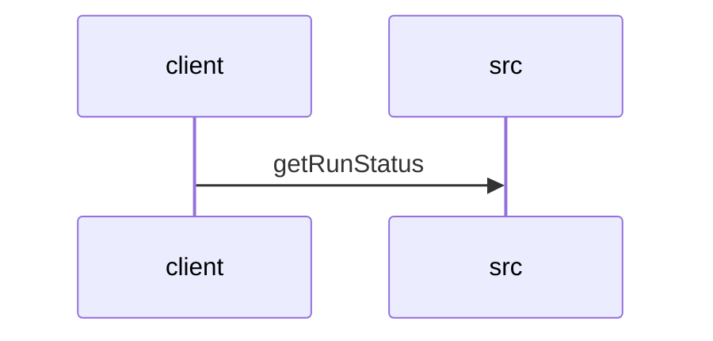

# Feature Walkthrough: Method `KillController.getRunStatus`

This document provides a detailed execution walk of the feature flow.

## 1. Sequence Execution Diagram

## 2. Walkthrough Explanation & Narrative

### Execution Trace Narration: `KillController.getRunStatus`

**Overview**
The execution begins at the entry point `KillController.getRunStatus`, located in `src/main/java/com/aa/fso/controller/KillController.java`. This endpoint is mapped to the HTTP GET path `/run/status` and serves as the primary interface for retrieving the current state of the active solver run. The method's logic hinges on the existence of a current snapshot ID within the `runStateManager`.

**Execution Path & Data Flow**
Upon invocation, the controller first queries the `runStateManager` to retrieve the identifier of the currently active snapshot via the call `runStateManager.getCurrentSnapshotId()` [KillController.java:14]. This value is assigned to the local variable `currentId`.

The control flow then proceeds to a conditional check to determine if a run is currently active:
1.  **Condition Evaluation**: The system evaluates `if (currentId != null)` [KillController.java:15].
2.  **Branch A (Active Run)**: If `currentId` holds a valid string reference, the system assumes an active solver instance exists. It immediately constructs a response string concatenating the active ID with the result of `runStateManager.isKillRequested()`. This boolean check determines if a termination signal has been issued for the current run. The method returns an HTTP 200 OK response containing this composite status message [KillController.java:16].
3.  **Branch B (No Active Run)**: If `currentId` is `null`, indicating no solver is currently running, the conditional block is skipped. The execution falls through to the subsequent return statement, which generates a standard response indicating "No active run" [KillController.java:18].

**Final Return Outputs**
The method concludes by returning a `ResponseEntity<String>` with an HTTP status code of 200 in both scenarios. The payload content varies based on the state of the `runStateManager`:
*   **Scenario 1**: `"Active run: <snapshot_id>, Kill requested: <true|false>"`
*   **Scenario 2**: `"No active run"`

This ensures the client receives a definitive status regarding both the presence of a run and any pending kill instructions.
