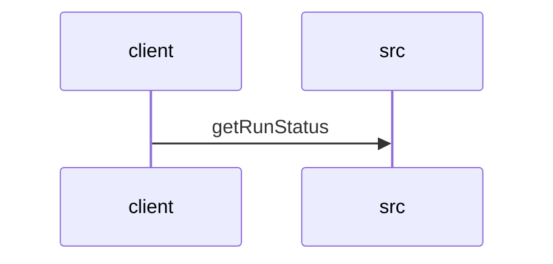

# Feature Walkthrough: Method `KillController.getRunStatus`

This document provides a detailed execution walk of the feature flow.

## 1. Sequence Execution Diagram

## 2. Walkthrough Explanation & Narrative

### Execution Trace Narration: `KillController.getRunStatus`

**Overview**
The execution begins at the entry point `KillController.getRunStatus`, located in `src/main/java/com/aa/fso/controller/KillController.java`. This endpoint is mapped to the HTTP GET path `/run/status` and serves as the primary interface for retrieving the real-time state of the active solver run. The method's logic is designed to determine if a solver instance is currently active and whether a termination signal has been issued.

**Execution Path & Data Flow**
Upon invocation, the controller first delegates to the `runStateManager` component to retrieve the identifier of the currently active snapshot. This is executed via the call `runStateManager.getCurrentSnapshotId()` within the method body [KillController.java:13]. The result of this operation is assigned to the local variable `currentId`.

**Conditional Logic & Branching**
The control flow immediately evaluates the validity of `currentId` using a null-check conditional statement [KillController.java:14]. This branch determines the subsequent execution path:

1.  **Active Run Scenario**: If `currentId` is not null, the system confirms an active session exists. The logic proceeds to evaluate the kill status by invoking `runStateManager.isKillRequested()` [KillController.java:15]. The method constructs a response string concatenating the active snapshot ID with the boolean state of the kill request. A successful HTTP 200 response is returned containing this composite status message [KillController.java:16].
2.  **Inactive Run Scenario**: If `currentId` evaluates to null, indicating no active solver instance is running, the conditional block is skipped. The execution flows directly to the fallback return statement [KillController.java:18], which returns an HTTP 200 response with the message "No active run".

**Final Output**
The method concludes by returning a `ResponseEntity<String>` object. The payload of this entity is dynamically generated based on the runtime state of the `runStateManager`:
*   **Format A**: `"Active run: <snapshot_id>, Kill requested: <true/false>"` when a run is active.
*   **Format B**: `"No active run"` when no run is detected.

This ensures the client receives a deterministic status update regarding both the existence of a run and any pending termination instructions.
