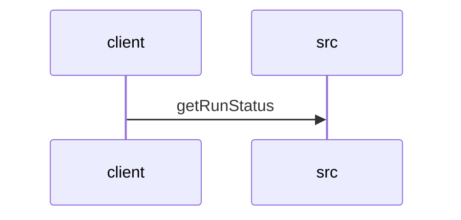

# Feature Walkthrough: Method `KillController.getRunStatus`

This document provides a detailed execution walk of the feature flow.

## 1. Sequence Execution Diagram

## 2. Walkthrough Explanation & Narrative

### Execution Trace Narration: `KillController.getRunStatus`

**Overview**
The execution begins at the entry point `KillController.getRunStatus`, located in `src/main/java/com/aa/fso/controller/KillController.java`. This endpoint is mapped to the HTTP GET request `/run/status` and serves as the primary interface for retrieving the current state of the active solver run. The method's logic hinges on the existence of a valid snapshot ID within the `runStateManager`.

**Execution Path & Data Flow**
Upon invocation, the controller first queries the `runStateManager` to retrieve the identifier of the currently active snapshot via the call `runStateManager.getCurrentSnapshotId()` [KillController.java:16]. This value is assigned to the local variable `currentId`.

The system then evaluates a conditional check to determine if `currentId` is non-null [KillController.java:17]. This branch dictates the subsequent data mutation and response generation:

1.  **Active Run Scenario (`currentId != null`)**:
    If a valid snapshot ID exists, the system proceeds to construct a status string. It concatenates the retrieved `currentId` with the result of `runStateManager.isKillRequested()`, which indicates whether a termination signal has been issued for the current run [KillController.java:18]. The resulting string follows the format: `"Active run: <ID>, Kill requested: <Boolean>"`. This payload is wrapped in a `ResponseEntity` with an HTTP 200 OK status and returned immediately.

2.  **Inactive Run Scenario (`currentId == null`)**:
    If the `currentId` is null, indicating no solver is currently running, the conditional block is bypassed. The execution flow falls through to the default return statement [KillController.java:20], which generates a simple confirmation message: `"No active run"`. This message is also returned within a `ResponseEntity` with an HTTP 200 OK status.

**Final Return Outputs**
The method concludes by returning a `ResponseEntity<String>` containing one of two distinct messages based on the runtime state:
*   **Success with Active Run**: Returns the specific snapshot ID and the kill request status (e.g., `Active run: snap_123, Kill requested: true`).
*   **Success with No Run**: Returns a generic notification stating `No active run`.

Both outcomes result in a successful HTTP 200 response, ensuring the client receives clear visibility into the solver's lifecycle status.
