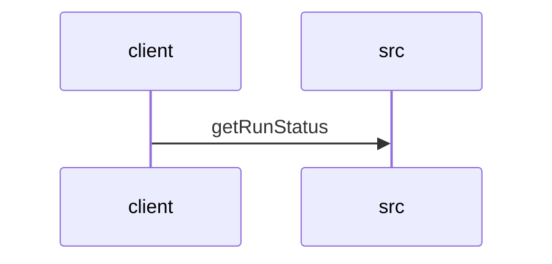

# Feature Walkthrough: Method `KillController.getRunStatus`

This document provides a detailed execution walk of the feature flow.

## 1. Sequence Execution Diagram

## 2. Walkthrough Explanation & Narrative

### Execution Trace Narration: `KillController.getRunStatus`

**Overview**
The execution begins at the entry point `KillController.getRunStatus`, located in `src/main/java/com/aa/fso/controller/KillController.java`. This endpoint is designed to expose the current state of the active solver run via a `GET` request to `/run/status`. The method orchestrates a conditional flow based on the existence of an active snapshot ID, ultimately returning a formatted status string or a specific message indicating inactivity.

**Execution Path & Data Flow**

1.  **Invocation and State Retrieval**:
    Upon receiving the HTTP request, the controller invokes `runStateManager.getCurrentSnapshotId()` to determine if a solver run is currently active. This call retrieves the unique identifier associated with the latest execution snapshot. The result is assigned to the local variable `currentId`.

2.  **Conditional Logic Evaluation**:
    The method proceeds to evaluate the null-check condition: `if (currentId != null)`.
    *   **Scenario A (Active Run)**: If `currentId` holds a valid string value, the system confirms an active run exists. It then immediately queries `runStateManager.isKillRequested()` to check the kill flag status. These two pieces of data—the snapshot ID and the kill status—are concatenated into a descriptive response string: `"Active run: {id}, Kill requested: {status}"`.
    *   **Scenario B (Inactive Run)**: If `currentId` is `null`, the condition evaluates to false. The execution bypasses the inner block and proceeds directly to the fallback logic.

3.  **Response Construction**:
    *   In the active scenario, the method constructs a `ResponseEntity` with an HTTP 200 OK status and the formatted status string as the body.
    *   In the inactive scenario, the method returns a `ResponseEntity` with an HTTP 200 OK status and the static string `"No active run"`.

**Final Return Output**
The method concludes by returning a `ResponseEntity<String>` containing either the detailed status of the active run or a confirmation of no active session. The specific output depends entirely on the state of the `runStateManager` at the time of invocation.

**Source Reference**
[src/main/java/com/aa/fso/controller/KillController.java:10-25]
