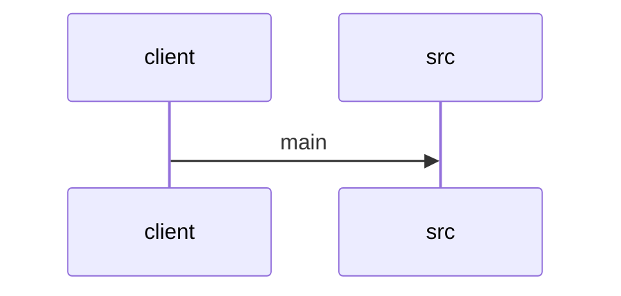

# Feature Walkthrough: Method `SequenceBuilderApplication.main`

This document provides a detailed execution walk of the feature flow.

## 1. Sequence Execution Diagram

## 2. Walkthrough Explanation & Narrative

### Execution Trace Narration: `SequenceBuilderApplication` Initialization

**Overview**
The execution flow initiates at the standard Java entry point, `SequenceBuilderApplication.main`. This method serves as the bootstrap handler for the Spring Boot application, delegating the core initialization logic to the Spring framework's runtime engine.

**Execution Path Analysis**
1.  **Invocation**: The JVM invokes the `main` method defined in `src/main/java/com/aa/fso/SequenceBuilderApplication.java`.
2.  **Delegation**: Inside the method body, the static method `SpringApplication.run()` is called. This invocation passes the application's primary configuration class (`SequenceBuilderApplication.class`) and the command-line arguments (`args`) as parameters.
3.  **Framework Handoff**: At this specific line of code, the application logic within `main` concludes its direct responsibility. Control is transferred to the Spring Boot auto-configuration mechanism. The framework proceeds to:
    *   Create an `ApplicationContext`.
    *   Scan for component classes and configuration metadata.
    *   Initialize the embedded web server (if applicable).
    *   Execute the application lifecycle events.

**Data Mutations & Conditionals**
*   **Mutations**: No local variables are mutated within the scope of the provided `main` method snippet. The `args` array is passed by reference but not modified locally; any parsing or binding of these arguments occurs internally within the `SpringApplication.run()` implementation.
*   **Conditionals**: There are no explicit conditional statements (e.g., `if`, `switch`) present in this specific code block. The branching logic required for environment detection and bean selection is encapsulated entirely within the `SpringApplication` library.

**Final Return Output**
The `main` method itself returns `void`. However, the `SpringApplication.run()` call returns a `ConfigurableApplicationContext` object. In a standard Spring Boot application, this context remains active for the duration of the application's lifecycle, managing the running state until the process is terminated or the context is closed gracefully.

**Reference**
*   `src/main/java/com/aa/fso/SequenceBuilderApplication.java:4-7`
