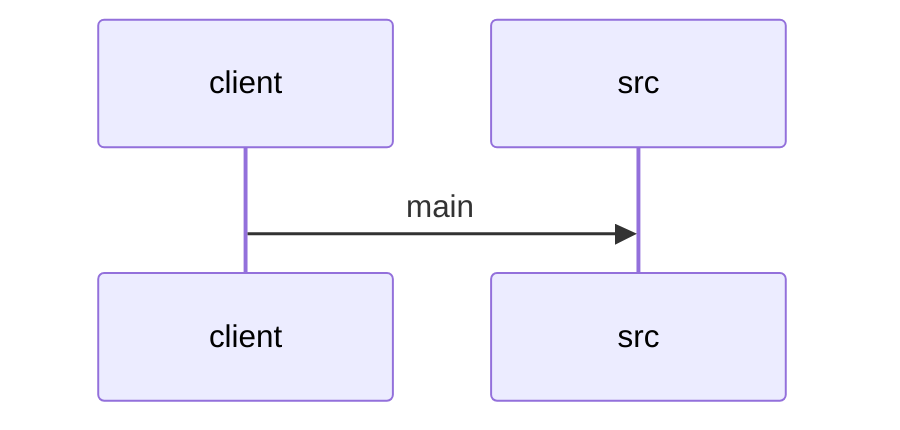

# Feature Walkthrough: Method `SequenceBuilderApplication.main`

This document provides a detailed execution walk of the feature flow.

## 1. Sequence Execution Diagram



## 2. Walkthrough Explanation & Narrative

### Execution Trace Narration: SequenceBuilderApplication Initialization

**Overview**
The execution flow initiates at the standard Java entry point, `SequenceBuilderApplication.main`, located within the Spring Boot application's primary class. This method serves as the bootstrap mechanism to launch the Spring application context.

**Execution Path & Logic Analysis**
Upon invocation of the `main` method, the control flow immediately delegates to the `SpringApplication` utility class. Specifically, the static method `run` is invoked with two critical arguments:
1.  **Target Class**: `SequenceBuilderApplication.class`, which identifies the specific configuration and component scan root for the application.
2.  **Arguments**: The `String[] args` array, passed directly from the JVM to allow command-line argument propagation into the Spring context.

This single line of code triggers the comprehensive Spring Boot startup lifecycle, including:
*   Context initialization.
*   Component scanning for beans.
*   Auto-configuration of the application environment.
*   Startup of embedded servers (if applicable).

No explicit conditional logic or data mutation occurs within this specific snippet; the operation is a direct delegation to the framework's core engine.

**Final Output**
The method does not return a value to the caller in the traditional sense. Instead, it blocks the main thread until the Spring application context is fully initialized and the application is ready to serve requests, or until the application is explicitly shut down. The process effectively transitions the system state from a standalone Java process to a running Spring Boot application.

**Code Reference**
[SequenceBuilderApplication.java:6-9]
```java
public static void main(String[] args) {
    SpringApplication.run(SequenceBuilderApplication.class, args);
}
```
