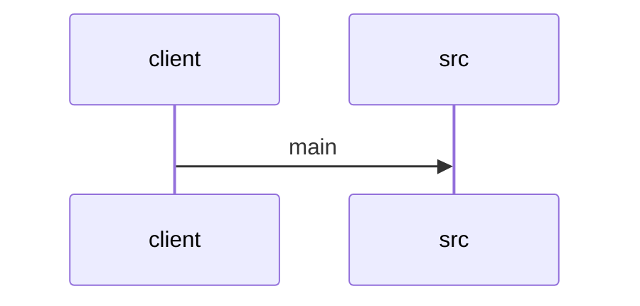

# Feature Walkthrough: Method `SequenceBuilderApplication.main`

This document provides a detailed execution walk of the feature flow.

## 1. Sequence Execution Diagram

## 2. Walkthrough Explanation & Narrative

### Execution Trace Narration: `SequenceBuilderApplication` Initialization

**Overview**
The execution flow initiates at the standard Java entry point, `main`, within the `SequenceBuilderApplication` class. This method serves as the bootstrap mechanism for the Spring Boot application, delegating the core initialization logic to the Spring framework's runtime environment.

**Execution Path Analysis**
1.  **Invocation**: The JVM invokes `SequenceBuilderApplication.main(String[] args)` as defined in the source file.
2.  **Delegation**: Inside the method body, the code immediately calls `SpringApplication.run()`. This is a static convenience method provided by the Spring Boot library.
3.  **Parameter Passing**: The method passes two critical arguments:
    *   `SequenceBuilderApplication.class`: This explicitly identifies the primary configuration class (the "starter" class) containing the application context definition.
    *   `args`: The command-line arguments passed to the application, which may contain flags for configuration overrides or profile selection.
4.  **Context Bootstrap**: Upon invocation of `run()`, the Spring Boot framework begins the following internal sequence:
    *   It creates a `ConfigurableApplicationContext`.
    *   It scans the classpath for component scanning, auto-configuration, and bean definitions based on the provided class.
    *   It initializes the embedded web server (if applicable) and registers the application context.
5.  **Termination**: The `main` method itself does not perform further logic; it blocks until the Spring container is fully initialized and the application lifecycle is managed. The return value of `SpringApplication.run()` (typically the `ApplicationContext`) is implicitly handled by the framework to manage the application's lifecycle state.

**Data Mutations & Conditionals**
*   **Mutations**: No explicit local variable mutations occur within the `main` method snippet provided. All state changes are encapsulated within the `SpringApplication` instance and the resulting `ApplicationContext`.
*   **Conditionals**: There are no conditional statements (`if`, `switch`) visible in this specific entry point. Control flow is strictly linear, relying on the internal logic of `SpringApplication.run()` to handle conditional bootstrapping based on the `args` and classpath content.

**Final Output**
The method returns control to the JVM once the Spring application context is successfully created and the application is running. In a standard deployment, this results in the application starting up, binding to a port (e.g., 8080), and remaining active to handle incoming requests. If the context fails to initialize due to configuration errors, `SpringApplication.run()` will throw an exception, causing the `main` method to terminate with a non-zero exit code.

**Source Reference**
[SequenceBuilderApplication.java:10-14]
