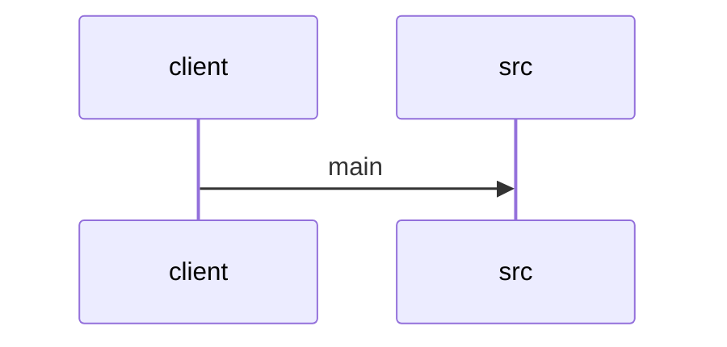

# Feature Walkthrough: Method `SequenceBuilderApplication.main`

This document provides a detailed execution walk of the feature flow.

## 1. Sequence Execution Diagram



## 2. Walkthrough Explanation & Narrative

### Execution Trace Narration: `SequenceBuilderApplication` Initialization

**Overview**
The execution flow initiates at the standard Java entry point, `main`, within the `SequenceBuilderApplication` class. This method serves as the bootstrap mechanism for the Spring Boot application, delegating the core initialization logic to the Spring framework's runtime engine.

**Detailed Execution Path**

1.  **Entry Point Invocation**:
    The JVM locates and invokes the `main` method defined in `src/main/java/com/aa/fso/SequenceBuilderApplication.java`. This method accepts the standard command-line arguments (`String[] args`), which may contain configuration flags or profiles passed by the user.

2.  **Spring Context Bootstrapping**:
    Inside the `main` method, the execution immediately delegates to `SpringApplication.run()`. This is a high-level utility method provided by the Spring Boot library. Its responsibilities include:
    *   Creating a new `ApplicationContext` instance.
    *   Scanning the classpath for component classes (e.g., `@Component`, `@Service`, `@Controller`).
    *   Instantiating beans and resolving dependencies based on the application context configuration.
    *   Starting embedded web servers (if applicable) or initializing background tasks.

3.  **Control Flow**:
    The `main` method does not perform any custom logic prior to this delegation. It acts purely as a conduit, passing the application class reference and the raw arguments directly to the Spring container. Consequently, the control flow transfers out of the `SequenceBuilderApplication` class into the internal lifecycle of the `SpringApplication` class, where the actual application startup sequence begins.

**Data Mutations and Conditionals**
*   **Mutations**: No explicit variable assignments or state mutations occur within the visible scope of the `main` method itself. The primary mutation happens internally within `SpringApplication.run()`, where the application context is constructed and populated with bean definitions.
*   **Conditionals**: There are no conditional statements (`if`, `switch`) or loops present in this specific snippet. The execution path is linear and deterministic.

**Final Return Output**
The `main` method returns `void`. The application remains active as long as the Spring `ApplicationContext` is running. The process terminates only when the application context is closed or the JVM receives a shutdown signal.

**Source Reference**
*   `src/main/java/com/aa/fso/SequenceBuilderApplication.java:10-14`
    ```java
    public static void main(String[] args) {
      SpringApplication.run(SequenceBuilderApplication.class, args);
    }
    ```
