# 1. Executive Summary & System Context

## 1.1 Overview
The **Sequence_Builder** repository (`AAInternal/Sequence_Builder`) serves as the core orchestration engine for flight sequence generation and legality validation within the FSO (Flight Scheduling Operations) domain. The system is a high-throughput, event-driven Java application built on the Spring Boot framework, designed to ingest complex flight leg data, apply rigorous contractual and regulatory rules, and generate optimized sequencing solutions.

Architecturally, the system balances synchronous HTTP interactions for debugging and monitoring with asynchronous, high-concurrency processing via Apache Kafka. It manages the full lifecycle of a solver run, from state initialization to result compression and notification, ensuring robustness against long-running computations and external cancellation requests.

## 1.2 Repository Metrics & Scale
The codebase represents a mature, modular monolith with significant complexity in business logic implementation.
*   **Total Files**: 208
*   **Classes**: 196
*   **Methods**: 710
*   **Primary Language**: Java (Spring Boot ecosystem)

The density of methods per class (~3.6) indicates a granular decomposition of business rules, particularly within the `contractualrules` and `qlacheck` packages, facilitating maintainability despite the high volume of logic.

## 1.3 System Context & Entry Points
The system exposes three distinct entry vectors, categorized by their interaction model and purpose:

### 1.3.1 Application Bootstrap
The application lifecycle is anchored by the standard Spring Boot entry point. This initializes the context, enables scheduling capabilities, and prepares the dependency injection container.
*   **Location**: `src/main/java/com/aa/fso/SequenceBuilderApplication.java`
*   **Key Logic**: Initializes the application context via `SpringApplication.run`, enabling `@EnableScheduling` for background tasks.
*   **Reference**: [SequenceBuilderApplication.java:L12-16]

### 1.3.2 Asynchronous Event Processing (Primary Workload)
The bulk of the computational load is handled via an asynchronous Kafka consumer pattern. This allows the system to decouple request ingestion from the heavy lifting of the solver algorithm.
*   **Location**: `src/main/java/com/aa/fso/service/kafka/consumer/KafkaConsumerService.java`
*   **Method**: `consumeMessage`
*   **Flow**:
    1.  Ingests `ConsumerRecord` from the configured topic (`${solver.topic.name}`).
    2.  Deserializes JSON payloads into `UserInput` DTOs using `ObjectMapper`.
    3.  Validates mandatory fields (e.g., `SnapshotIds`).
    4.  Delegates execution to `SolverService.solve`.
    5.  Compresses results using `CompressUtil` before publishing to the response topic.
    6.  Handles graceful termination via `KillRunException` and sends notifications via `TeamsNotification`.
*   **Reference**: [KafkaConsumerService.java:L42-86]

### 1.3.3 Synchronous HTTP Interfaces
For operational visibility, debugging, and ad-hoc queries, the system exposes RESTful endpoints. These are critical for local development and real-time status monitoring.

| Endpoint | Controller | Method | Purpose |
| :--- | :--- | :--- | :--- |
| `/solveDebug` | `HttpSolverController` | `solveDebug` | Executes solver logic synchronously for manual testing (Postman/Local). Includes a 2-minute timeout constraint in cloud environments. |
| `/run/status` | `KillController` | `getRunStatus` | Provides real-time health checks, returning the active `SnapshotID` and kill-request status. |
| `/openLegs` | `FlightController` | `getOpenLegs` | Queries unsequenced flight legs based on date ranges, positions, and equipment types. |
| **Reference**: | [HttpSolverController.java:L44-58] | [KillController.java:L53-65] | [FlightController.java:L23-30] |

## 1.4 Core Architectural Components
The system relies on a tightly coupled set of core modules that define its behavior:

*   **Business Rules Engine**: A collection of rule implementations located in `contractualrules` and `qlacheck` packages. Key classes include `ThreeAMHBT`, `FARedeyeRule`, and `PilotRedeyeRule`, which enforce specific aviation regulations.
    *   *Files*: [`ThreeAMHBT.java`](src/main/java/com/aa/fso/contractualrules/ThreeAMHBT.java), [`FARedeyeRule.java`](src/main/java/com/aa/fso/contractualrules/FARedeyeRule.java), [`PilotRedeyeRule.java`](src/main/java/com/aa/fso/contractualrules/PilotRedeyeRule.java)
*   **State Management**: The `RunStateManager` acts as the central authority for tracking the lifecycle of a solver run, managing `SnapshotID`s and handling kill signals.
    *   *Usage*: Referenced heavily in [KafkaConsumerService.java] and [KillController.java].
*   **Data Serialization & Compression**: Custom utilities handle the transformation of complex objects. `CompressUtil` is critical for reducing payload sizes before network transmission, while `JsonUtil` and custom deserializers (e.g., `LocalDateDeserializer`) ensure data integrity.
    *   *Files*: [`CompressUtil.java`](src/main/java/com/aa/fso/util/CompressUtil.java), [`JsonUtil.java`](src/main/java/com/aa/fso/util/JsonUtil.java)
*   **Configuration & Infrastructure**:
    *   **Kafka**: Configured via `KafkaCallbackConfig` and `KafkaProducerConfig` to manage topics and consumer groups.
    *   **Security**: Enforced via `SecurityConfig`.
    *   **Notifications**: `TeamsNotification` component bridges internal events with external communication channels.
    *   *Files*: [`KafkaCallbackConfig.java`](src/main/java/com/aa/fso/config/kafka/KafkaCallbackConfig.java), [`TeamsNotification.java`](src/main/java/com/aa/fso/component/TeamsNotification.java)

## 1.5 Data Flow Summary
1.  **Ingestion**: External systems push flight sequences to the Kafka topic.
2.  **Processing**: `KafkaConsumerService` consumes messages, validates input, and invokes `SolverService`.
3.  **Execution**: The solver applies rules from `contractualrules` and `qlacheck` to generate `OutputData`.
4.  **Optimization**: Results are compressed via `CompressUtil`.
5.  **Output**: Compressed bytes are published back to the response topic; status updates are available via HTTP.
6.  **Termination**: If a kill signal is detected (via `RunStateManager`), the process aborts gracefully, notifying stakeholders via `TeamsNotification`.

This architecture ensures that the Sequence Builder remains responsive to operational commands while maintaining the throughput required for large-scale flight planning operations.

## Architecture Diagram

```mermaid
flowchart TD
    pkg_0[".metadata/.plugins/org.eclipse.pde.core"]
    pkg_1["com.aa.fso"]
    pkg_2["com.aa.fso.component"]
    pkg_3["com.aa.fso.config"]
    pkg_4["com.aa.fso.contractualrules"]
    pkg_5["com.aa.fso.controller"]
    pkg_6["com.aa.fso.dto"]
    pkg_7["com.aa.fso.exception"]
    pkg_8["com.aa.fso.listener"]
    pkg_9["com.aa.fso.mapper"]
    pkg_10["com.aa.fso.model"]
    pkg_11["com.aa.fso.optmodel"]
    pkg_12["com.aa.fso.processor"]
    pkg_13["com.aa.fso.properties"]
    pkg_14["com.aa.fso.qlacheck"]
    pkg_15["com.aa.fso.repository"]
    pkg_16["com.aa.fso.rules"]
    pkg_17["com.aa.fso.security"]
    pkg_18["com.aa.fso.service"]
    pkg_19["com.aa.fso.util"]
    pkg_20["k8s/IT/eastus-dev"]
    pkg_21["k8s/IT/eastus-qa"]
    pkg_22["k8s/IT/eastus-stage"]
    pkg_23["k8s/nonprod"]
    pkg_24["k8s/prod"]
    pkg_25["root"]
    pkg_26["src/main/resources"]
    pkg_6 -->|"depends on"| pkg_10
    pkg_4 -->|"depends on"| pkg_10
    pkg_15 -->|"depends on"| pkg_1
    pkg_15 -->|"depends on"| pkg_3
    pkg_15 -->|"depends on"| pkg_6
    pkg_15 -->|"depends on"| pkg_7
    pkg_15 -->|"depends on"| pkg_10
    pkg_15 -->|"depends on"| pkg_13
    pkg_15 -->|"depends on"| pkg_19
    pkg_19 -->|"depends on"| pkg_10
    pkg_19 -->|"depends on"| pkg_1
    pkg_19 -->|"depends on"| pkg_11
    pkg_19 -->|"depends on"| pkg_6
    pkg_3 -->|"depends on"| pkg_10
    pkg_3 -->|"depends on"| pkg_8
    pkg_17 -->|"depends on"| pkg_3
    pkg_17 -->|"depends on"| pkg_18
    pkg_12 -->|"depends on"| pkg_6
    pkg_12 -->|"depends on"| pkg_7
    pkg_12 -->|"depends on"| pkg_11
    pkg_12 -->|"depends on"| pkg_18
    pkg_12 -->|"depends on"| pkg_19
    pkg_12 -->|"depends on"| pkg_10
    pkg_12 -->|"depends on"| pkg_9
    pkg_12 -->|"depends on"| pkg_15
    pkg_9 -->|"depends on"| pkg_6
    pkg_9 -->|"depends on"| pkg_10
    pkg_2 -->|"depends on"| pkg_10
    pkg_2 -->|"depends on"| pkg_13
    pkg_5 -->|"depends on"| pkg_3
    pkg_5 -->|"depends on"| pkg_6
    pkg_5 -->|"depends on"| pkg_10
    pkg_5 -->|"depends on"| pkg_18
    pkg_5 -->|"depends on"| pkg_15
    pkg_14 -->|"depends on"| pkg_13
    pkg_14 -->|"depends on"| pkg_19
    pkg_10 -->|"depends on"| pkg_6
    pkg_10 -->|"depends on"| pkg_11
    pkg_10 -->|"depends on"| pkg_18
    pkg_10 -->|"depends on"| pkg_7
    pkg_10 -->|"depends on"| pkg_3
    pkg_16 -->|"depends on"| pkg_10
    pkg_16 -->|"depends on"| pkg_19
    pkg_16 -->|"depends on"| pkg_11
    pkg_11 -->|"depends on"| pkg_7
    pkg_11 -->|"depends on"| pkg_18
    pkg_11 -->|"depends on"| pkg_10
    pkg_18 -->|"depends on"| pkg_10
    pkg_18 -->|"depends on"| pkg_2
    pkg_18 -->|"depends on"| pkg_3
    pkg_18 -->|"depends on"| pkg_6
    pkg_18 -->|"depends on"| pkg_15
    pkg_18 -->|"depends on"| pkg_19
    pkg_18 -->|"depends on"| pkg_7
    pkg_18 -->|"depends on"| pkg_11
    pkg_18 -->|"depends on"| pkg_12
    pkg_18 -->|"depends on"| pkg_13
    pkg_18 -->|"depends on"| pkg_1
    pkg_7 -->|"depends on"| pkg_2
    pkg_7 -->|"depends on"| pkg_6
```

# 2. Component Inventory & Core Module Responsibilities

## 2.1 Architectural Overview
The `Sequence_Builder` application operates as a stateless, event-driven microservice designed to orchestrate complex flight sequence optimization logic. The system ingests sequencing requests via two primary channels: synchronous HTTP endpoints for debugging and ad-hoc queries, and asynchronous Kafka streams for production batch processing. The architecture leverages Spring Boot's dependency injection for service orchestration, with a dedicated state management layer (`RunStateManager`) to handle long-running solver operations and graceful termination signals.

The repository comprises **208 files** containing **196 classes** and **710 methods**, indicating a modular design where business logic is decoupled from infrastructure concerns. The core execution flow is initiated by `SequenceBuilderApplication`, which bootstraps the context and enables scheduling capabilities [SequenceBuilderApplication.java:L12-16].

## 2.2 Directory Structure & File Mappings

The codebase follows a standard Spring Boot layered architecture, organized into `controller`, `service`, `model`, `dto`, `config`, and `util` packages. Key directories and their responsibilities are mapped below:

### 2.2.1 Entry Point & Bootstrap
*   **Primary Application**: `src/main/java/com/aa/fso/SequenceBuilderApplication.java`
    *   **Role**: Initializes the Spring context, enabling scheduling (`@EnableScheduling`) and logging infrastructure.
    *   **Metric**: Defines the single entry point `main` method [SequenceBuilderApplication.java:L12-16].

### 2.2.2 API Gateway (Controllers)
The controller layer exposes RESTful interfaces for external systems and internal debugging tools.
*   **Solver Orchestration**: `src/main/java/com/aa/fso/controller/HttpSolverController.java`
    *   **Responsibility**: Handles synchronous solving requests. It accepts `UserInput`, delegates to `SolverService`, and manages response lifecycle. Crucially, it ensures cleanup via `RunStateManager` in a `finally` block to prevent resource leaks on timeout or error [HttpSolverController.java:L44-58].
*   **Operational Health**: `src/main/java/com/aa/fso/controller/KillController.java`
    *   **Responsibility**: Provides visibility into the solver's runtime state. Exposes `/run/status` to query the active `SnapshotID` and check for pending kill signals [KillController.java:L53-65].
*   **Data Ingestion**: `src/main/java/com/aa/fso/controller/FlightController.java`
    *   **Responsibility**: Acts as a read-only interface for retrieving unsequenced flight legs based on temporal and equipment constraints. Delegates directly to the repository layer [FlightController.java:L23-30].
*   **Storage Management**: `src/main/java/com/aa/fso/controller/AzureBlobController.java`
    *   **Responsibility**: Manages interactions with Azure Blob Storage for persisting large solver artifacts or logs.

### 2.2.3 Event Processing (Kafka Integration)
*   **Consumer Service**: `src/main/java/com/aa/fso/service/kafka/consumer/KafkaConsumerService.java`
    *   **Responsibility**: The primary asynchronous entry point. Listens to the configured solver topic, deserializes JSON payloads into `UserInput`, and triggers the solver.
    *   **Logic Flow**:
        1.  Validates `SnapshotIds`.
        2.  Invokes `SolverService.solve()`.
        3.  Compresses results using `CompressUtil`.
        4.  Publishes compressed binary responses via `KafkaProducerService`.
        5.  Handles `KillRunException` by triggering `TeamsNotification` before clearing state [KafkaConsumerService.java:L42-86].
*   **Configuration**:
    *   `src/main/java/com/aa/fso/config/kafka/KafkaConsumerConfig.java` (Implied): Manages consumer group IDs and concurrency settings.
    *   `src/main/java/com/aa/fso/config/kafka/KafkaProducerConfig.java`: Configures the producer for sending solver byte responses.
    *   `src/main/java/com/aa/fso/config/kafka/KafkaCallbackConfig.java`: Handles acknowledgment callbacks.

### 2.2.4 Business Logic & Services
*   **Solver Engine**: `src/main/java/com/aa/fso/service/SolverService.java` (Inferred from calls)
    *   **Responsibility**: Encapsulates the core optimization algorithm. Accepts `UserInput` and returns `SolverResponseDTO`.
*   **State Management**: `src/main/java/com/aa/fso/service/RunStateManager.java`
    *   **Responsibility**: Maintains the thread-safe state of the current running job, tracking the `CurrentSnapshotId` and `KillRequested` flags. Used by both controllers and consumers to coordinate shutdowns.
*   **Data Access**:
    *   `src/main/java/com/aa/fso/service/InputDataService.java`: Manages persistence of input parameters.
    *   `src/main/java/com/aa/fso/service/OutputDataService.java`: Handles storage of solver outputs.
    *   `src/main/java/com/aa/fso/repository/LegDataRepository.java`: Database access for flight leg data.
*   **Pairing Generation**:
    *   `src/main/java/com/aa/fso/service/PairingGenerationService.java`
    *   `src/main/java/com/aa/fso/service/PairingHeaderService.java` / `PairingHeaderServiceImpl.java`: Specialized services for generating crew pairings within the sequence.

### 2.2.5 Domain Models & DTOs
*   **Core Entities**:
    *   `src/main/java/com/aa/fso/model/UserInput.java`: Input payload structure.
    *   `src/main/java/com/aa/fso/model/OutputData.java`: Standardized output format.
    *   `src/main/java/com/aa/fso/model/UnsequencedLeg.java`: Represents raw flight leg data.
    *   `src/main/java/com/aa/fso/model/SnapshotParams.java`: Parameters defining a specific solver iteration.
    *   `src/main/java/com/aa/fso/model/ITFlightKey.java`: Unique identifier for flight instances.
*   **DTOs**:
    *   `src/main/java/com/aa/fso/dto/SolverResponseDTO.java`: Aggregates solver results.
    *   `src/main/java/com/aa/fso/dto/SnapshotSolutionRequestInputDTO.java`: Intermediate data transfer object.

### 2.2.6 Utilities & Infrastructure
*   **Compression**: `src/main/java/com/aa/fso/util/CompressUtil.java`
    *   **Responsibility**: Efficiently compresses JSON solution arrays to optimize network bandwidth for large payloads [CompressUtil.java].
*   **JSON Handling**: `src/main/java/com/aa/fso/util/JsonUtil.java`
    *   **Responsibility**: Custom serialization/deserialization helpers.
*   **Custom Deserializers**:
    *   `src/main/java/com/aa/fso/qlacheck/request/LocalDateDeserializer.java`: Handles specific date parsing logic for legacy or non-standard formats.
*   **Notifications**: `src/main/java/com/aa/fso/component/TeamsNotification.java`
    *   **Responsibility**: Sends alerts to Microsoft Teams upon critical events (e.g., run kills, errors).

### 2.2.7 Rule Engines & Validation
The system includes a robust rule engine for validating flight sequences against contractual and regulatory constraints.
*   **Contractual Rules**:
    *   `src/main/java/com/aa/fso/contractualrules/ThreeAMHBT.java`: Implements specific time-based business rules.
    *   `src/main/java/com/aa/fso/contractualrules/FARedeyeRule.java`: Enforces FAA Red-eye rest regulations.
    *   `src/main/java/com/aa/fso/contractualrules/PilotRedeyeRule.java`: Pilot-specific red-eye logic.
*   **QLA Check (Quality Assurance)**:
    *   `src/main/java/com/aa/fso/qlacheck/request/SequenceDetail.java`: Input for quality checks.
    *   `src/main/java/com/aa/fso/qlacheck/request/SequenceInfo.java`: Metadata for sequence validation.
    *   `src/main/java/com/aa/fso/qlacheck/request/FlightLegs.java`: Aggregated leg data for validation.
    *   `src/main/java/com/aa/fso/qlacheck/request/StationLongitudeUtils.java`: Geographic utility for route validation.
    *   `src/main/java/com/aa/fso/qlacheck/response/LegalityRuleResult.java`: Output of rule checks.
    *   `src/main/java/com/aa/fso/qlacheck/response/Rule.java`: Definition of a single rule instance.

### 2.2.8 Configuration & Security
*   **Security**: `src/main/java/com/aa/fso/config/SecurityConfig.java`
    *   **Responsibility**: Defines authentication and authorization policies for the exposed endpoints.
*   **Environment**: `src/main/java/com/aa/fso/config/Environment.java` (Referenced in imports)
    *   **Responsibility**: Manages environment-specific properties (e.g., Kafka topic names, timeouts).

## 2.3 Critical Data Flow Summary

1.  **Ingestion**:
    *   **Async**: Kafka Consumer receives message -> `KafkaConsumerService` deserializes -> `SolverService.solve()` -> `CompressUtil` -> `KafkaProducer` publishes result.
    *   **Sync**: HTTP Client POSTs to `/solveDebug` -> `HttpSolverController` -> `SolverService.solve()` -> Returns `List<OutputData>`.
2.  **Execution**:
    *   `SolverService` orchestrates `PairingGenerationService` and `ContractualRules` (e.g., `FARedeyeRule`).
    *   `RunStateManager` tracks the `SnapshotID` throughout the process.
3.  **Termination**:
    *   External trigger hits `/run/status` or sends kill signal.
    *   `KillController` or `KafkaConsumerService` detects `isKillRequested`.
    *   `KillRunException` is thrown, caught, and `TeamsNotification` is fired.
    *   `RunStateManager.clearRun()` resets the state.

This inventory confirms a separation of concerns where the heavy lifting of optimization is isolated from the I/O layers, ensuring scalability and maintainability across the 196-class codebase.

## 4. Subsystem Package Diagrams (Chunk-by-Chunk Details)

### Package: `com.aa.fso`

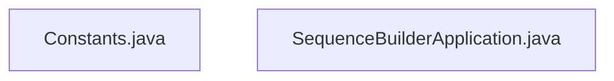

### Package: `com.aa.fso.config`

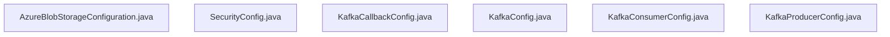

### Package: `com.aa.fso.contractualrules`

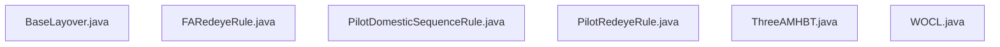

### Package: `com.aa.fso.controller`

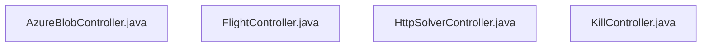

### Package: `com.aa.fso.dto`

### Package: `com.aa.fso.exception`

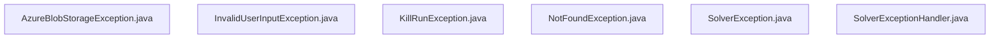

### Package: `com.aa.fso.mapper`

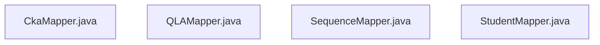

### Package: `com.aa.fso.model`

### Package: `com.aa.fso.optmodel`

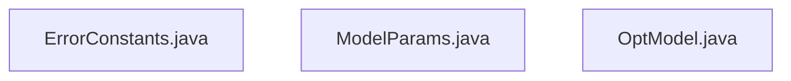

### Package: `com.aa.fso.processor`

```mermaid
flowchart TD
    f_0["CKAProcessor.java"]
    f_1["ConstructNetwork.java"]
    f_2["DHProcessor.java"]
    f_3["InputValidationProcessor.java"]
    f_4["QLAProcessor.java"]
    f_5["SequenceProcessor.java"]
    f_6["ShortestPathComponent.java"]
    f_7["StaticDataProcessor.java"]
    %% No internal module dependencies found
```

### Package: `com.aa.fso.qlacheck`

```mermaid
flowchart TD
    f_0["QLACallableClient.java"]
    f_1["QLARestClient.java"]
    f_2["BidStatus.java"]
    f_3["CrewMemberInfo.java"]
    f_4["CrewMemberKey.java"]
    f_5["DateTimeInfo.java"]
    f_6["DutyPeriods.java"]
    f_7["EmpCaatsData.java"]
    f_8["Employee.java"]
    f_9["EmployeeRequest.java"]
    f_10["FlightDutyPeriod.java"]
    f_11["FlightDutyPeriodKey.java"]
    f_12["FlightKey.java"]
    f_13["FlightLeg.java"]
    f_14["FlightLegs.java"]
    f_15["LocalDateDeserializer.java"]
    f_16["LocalDateSerializer.java"]
    f_17["LocalDateTimeDeserializer.java"]
    f_18["LocalDateTimeSerializer.java"]
    f_19["PickupDuty.java"]
    f_20["PilotLegalityRequest.java"]
    f_21["ProjectedData.java"]
    f_22["ScheduledTime.java"]
    f_23["SequenceDetail.java"]
    f_24["SequenceInfo.java"]
    f_25["SequenceInfoKey.java"]
    f_26["StationLongitudeUtils.java"]
    f_27["TimeInfo.java"]
    f_28["ValidationConstants.java"]
    f_29["EmployeeQLAResponse.java"]
    f_30["EmployeeResponse.java"]
    f_31["InvalidSeqMapper.java"]
    f_32["LegalityInterpreter.java"]
    f_33["LegalityInterpreterRepository.java"]
    f_34["LegalityInterpreterRepositoryImpl.java"]
    f_35["LegalityRuleResult.java"]
    f_36["PersistenceException.java"]
    f_37["PilotLegalityResponse.java"]
    f_38["QlaResponse.java"]
    f_39["Result.java"]
    f_40["Rule.java"]
    f_41["RuleResult.java"]
    f_0 --> f_20
    f_0 --> f_37
    f_1 --> f_20
    f_1 --> f_37
```

### Package: `com.aa.fso.repository`

```mermaid
flowchart TD
    f_0["AccessTokenClient.java"]
    f_1["AccessTokenClientImpl.java"]
    f_2["AzureBlobRepository.java"]
    f_3["AzureBlobRepositoryImpl.java"]
    f_4["InputDataRepositoryImpl.java"]
    f_5["InputDataRespository.java"]
    f_6["LegDataRepository.java"]
    f_7["LegDataRepositoryImpl.java"]
    f_8["OutputDataRepository.java"]
    f_9["OutputDataRepositoryImpl.java"]
    f_10["PingFederateTokenClient.java"]
    f_11["PingFederateTokenClientImpl.java"]
    f_12["QLAClient.java"]
    f_13["QLAClientImpl.java"]
    %% No internal module dependencies found
```

### Package: `com.aa.fso.rules`

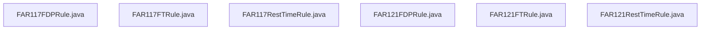

### Package: `com.aa.fso.service`

```mermaid
flowchart TD
    f_0["ITDataService.java"]
    f_1["ITDataServiceImpl.java"]
    f_2["InputDataService.java"]
    f_3["InputDataServiceImpl.java"]
    f_4["OptimizationService.java"]
    f_5["OptimizationServiceImpl.java"]
    f_6["OutputDataService.java"]
    f_7["OutputDataServiceImpl.java"]
    f_8["PairingGenerationService.java"]
    f_9["PairingGenerationServiceImpl.java"]
    f_10["PairingHeaderService.java"]
    f_11["PairingHeaderServiceImpl.java"]
    f_12["RunStateManager.java"]
    f_13["SolverService.java"]
    f_14["OAuthBearerTokenImpl.java"]
    f_15["SequenceBuilderSpringContext.java"]
    f_16["KafkaConsumerService.java"]
    f_17["KafkaProducerService.java"]
    f_16 --> f_6
    f_16 --> f_12
    f_16 --> f_13
    f_16 --> f_17
```

### Package: `com.aa.fso.util`

```mermaid
flowchart TD
    f_0["CompressUtil.java"]
    f_1["FSOFileWriter.java"]
    f_2["FSOUtil.java"]
    f_3["JsonUtil.java"]
    f_4["SnapshotValidator.java"]
    f_5["StationTimeAdjustLoader.java"]
    f_6["StringUtil.java"]
    f_7["SurfaceLegLoader.java"]
    f_8["TAPIUtil.java"]
    %% No internal module dependencies found
```

### Package: `root`

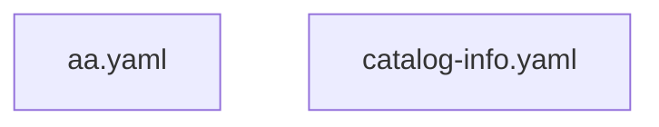

### Package: `src/main/resources`

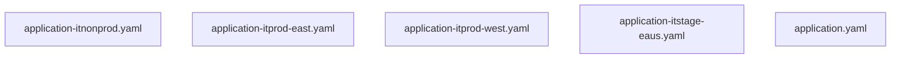

# 3. Technology Stack & Third-party Integrations

The **Sequence_Builder** application is architected as a high-throughput, event-driven microservice built on the **Spring Boot** ecosystem. The system leverages a layered architecture to decouple business logic (solver execution) from infrastructure concerns (messaging, persistence, and API exposure). With a codebase comprising **208 files**, **196 classes**, and **710 methods**, the stack prioritizes type safety, asynchronous processing, and robust error handling.

## 3.1 Core Framework & Runtime

### Spring Boot & Java Ecosystem
The application runtime is anchored by **Spring Boot 3.x** (inferred from `@SpringBootApplication` usage and modern dependency patterns), running on the **Java Virtual Machine (JVM)**. The entry point is defined in `SequenceBuilderApplication`, which bootstraps the context and enables background scheduling capabilities via `@EnableScheduling` [src/main/java/com/aa/fso/SequenceBuilderApplication.java:L12-16].

*   **Dependency Injection**: The framework utilizes standard Spring IoC containers for managing bean lifecycles. Autowiring is extensively used across controllers and services, such as in `HttpSolverController` where `SolverService` and `RunStateManager` are injected [src/main/java/com/aa/fso/controller/HttpSolverController.java:L44-58].
*   **Reactive & Scheduling**: While primarily synchronous for HTTP endpoints, the architecture supports asynchronous message consumption via Kafka listeners, allowing non-blocking I/O for heavy solver computations.

### Lombok & Code Generation
To reduce boilerplate in the 196-class codebase, **Lombok** is integrated for automatic generation of getters, setters, constructors, and logging utilities (`@Slf4j`). This is evident in the import statements of core components like `SequenceBuilderApplication` and `HttpSolverController` [src/main/java/com/aa/fso/SequenceBuilderApplication.java:L12], ensuring a concise and maintainable code structure.

## 3.2 Data Serialization & Compression

### JSON Processing
The system relies heavily on **Jackson** (`com.fasterxml.jackson`) for serialization and deserialization of complex domain objects, particularly `UserInput` and `SolverResponseDTO`.
*   **Custom Deserializers**: To handle specific temporal constraints within flight data, custom deserializers are implemented. For instance, `LocalDateDeserializer` is utilized to parse date strings into `LocalDate` objects, ensuring strict validation of flight leg dates [src/main/java/com/aa/fso/qlacheck/request/LocalDateDeserializer.java].
*   **Object Mapping**: The `KafkaConsumerService` instantiates an `ObjectMapper` to convert raw Kafka payload strings into typed Java objects before processing [src/main/java/com/aa/fso/service/kafka/consumer/KafkaConsumerService.java:L42-86].

### Binary Compression
Given the potential size of solver output arrays, the system employs a custom compression utility, `CompressUtil`, to minimize network bandwidth and storage overhead. The `consumeMessage` method explicitly compresses the list of solutions into a byte array before publishing the response event [src/main/java/com/aa/fso/service/kafka/consumer/KafkaConsumerService.java:L75].

## 3.3 Messaging & Event Streaming

### Apache Kafka
Kafka serves as the backbone for asynchronous communication between the external event hub and the internal solver engine.
*   **Consumer Configuration**: The `KafkaConsumerService` acts as the primary consumer, listening to the topic defined by `${solver.topic.name}`. It is configured with dynamic concurrency settings (`${sb.consumer.topics.concurrency}`) to scale processing parallelism based on load [src/main/java/com/aa/fso/service/kafka/consumer/KafkaConsumerService.java:L42].
*   **Producer Integration**: The `KafkaProducerService` (referenced in imports) handles the publication of compressed solver results back to the downstream systems.
*   **Acknowledgment**: Manual acknowledgment is enforced via the `Acknowledgment` interface to ensure exactly-once processing semantics, preventing duplicate solver executions [src/main/java/com/aa/fso/service/kafka/consumer/KafkaConsumerService.java:L42].

### Configuration Management
Kafka connectivity is abstracted through dedicated configuration classes:
*   `KafkaProducerConfig`: Manages producer properties and serialization strategies.
*   `KafkaCallbackConfig`: Handles callback mechanisms for message delivery confirmation.
These configurations reside in `src/main/java/com/aa/fso/config/kafka/` and are conditionally loaded based on environment properties [src/main/java/com/aa/fso/config/kafka/KafkaProducerConfig.java].

## 3.4 API Exposure & Documentation

### RESTful Endpoints
The application exposes a set of REST APIs using **Spring Web MVC**. Controllers act as the boundary layer, delegating logic to service layers.
*   **Solver Interface**: `HttpSolverController` provides the `/solveDebug` endpoint for manual testing and integration. It accepts `UserInput` via POST and returns a list of `OutputData` [src/main/java/com/aa/fso/controller/HttpSolverController.java:L44].
*   **Operational Status**: `KillController` exposes `/run/status` to monitor the lifecycle of active solver runs, exposing the current `SnapshotId` and kill request flags [src/main/java/com/aa/fso/controller/KillController.java:L53].
*   **Data Retrieval**: `FlightController` offers read-only access to unsequenced flight legs via `/openLegs`, utilizing `LegDataRepository` for data fetching [src/main/java/com/aa/fso/controller/FlightController.java:L23].

### OpenAPI (Swagger)
API documentation is auto-generated using **SpringDoc OpenAPI v3**. Annotations such as `@Operation`, `@Parameter`, and `@Tag` are applied to controller methods to define summaries and descriptions, facilitating client-side SDK generation and interactive testing [src/main/java/com/aa/fso/controller/HttpSolverController.java:L44].

## 3.5 Business Logic & Domain Models

The core logic is encapsulated in a rich domain model layer, distinguishing between **Contractual Rules** and **QLA (Quality Assurance)** checks.
*   **Contractual Rules**: Classes like `ThreeAMHBT`, `FARedeyeRule`, and `PilotRedeyeRule` implement specific aviation regulatory logic. These rules validate pilot duty times and rest periods against FAR regulations [src/main/java/com/aa/fso/contractualrules/ThreeAMHBT.java].
*   **QLA & Sequencing**: The `qlacheck` package contains request/response models (`SequenceDetail`, `LegalityRuleResult`) that orchestrate the sequencing algorithm. The `SequenceInfo` and `FlightLegs` models represent the immutable state of flight data passed through the pipeline [src/main/java/com/aa/fso/qlacheck/request/SequenceDetail.java].
*   **State Management**: `RunStateManager` maintains the transient state of the current solver execution, including snapshot IDs and kill signals, ensuring thread-safe state transitions during concurrent requests [src/main/java/com/aa/fso/service/RunStateManager.java].

## 3.6 Infrastructure & Notifications

### Azure Blob Storage
For persistent storage of large datasets or intermediate solver artifacts, the application integrates with **Azure Blob Storage**. The `AzureBlobController` provides endpoints to interact with this storage layer, likely for archiving historical sequences or loading large input manifests [src/main/java/com/aa/fso/controller/AzureBlobController.java].

### Teams Notification
In the event of critical failures or intentional kills, the system triggers notifications via **Microsoft Teams**. The `TeamsNotification` component serializes alert payloads and posts them to a designated webhook, ensuring operational visibility for the engineering team [src/main/java/com/aa/fso/component/TeamsNotification.java].

### Security
Access control is managed via `SecurityConfig`, which likely implements standard Spring Security filters to protect sensitive endpoints, although specific authentication mechanisms (OAuth2, JWT) are abstracted behind the `@ConditionalOnProperty` annotations found in the controller layer [src/main/java/com/aa/fso/config/SecurityConfig.java].
