# 1. Executive Summary & System Context

## 1.1 System Overview
**Sequence_Builder** is a high-throughput, event-driven optimization engine designed to generate flight sequence solutions for aviation operations. Built upon the **Spring Boot** framework, the system orchestrates complex scheduling algorithms, managing state across distributed runs and facilitating real-time communication via Apache Kafka. The application serves as the central logic hub for processing flight leg data, applying constraint-based sequencing rules, and delivering optimized outputs to downstream consumers.

The repository, identified as `AAInternal/Sequence_Builder`, represents a moderately sized Java monolith characterized by a clear separation of concerns between infrastructure, domain logic, and orchestration layers. With a codebase comprising **208 files**, **196 classes**, and **710 methods**, the system balances complexity with maintainability, leveraging modern Java practices such as Lombok for boilerplate reduction and Spring's dependency injection for service orchestration.

## 1.2 Architectural Entry Points
The system exposes three distinct entry vectors, reflecting its hybrid nature as both a synchronous REST API gateway and an asynchronous event processor.

### 1.2.1 Application Bootstrap
The primary lifecycle entry point is the standard Spring Boot initialization sequence.
*   **Location**: `src/main/java/com/aa/fso/SequenceBuilderApplication.java`
*   **Mechanism**: The `main` method initializes the Spring context, enabling auto-configuration and activating scheduled tasks via `@EnableScheduling`.
*   **Reference**: [SequenceBuilderApplication.java:L12-16]

### 1.2.2 Synchronous HTTP Triggers
For interactive debugging and ad-hoc analysis, the system provides REST endpoints that trigger the solver synchronously.
*   **Primary Solver Endpoint**: `HttpSolverController.solveDebug`
    *   **Function**: Accepts a `UserInput` payload, executes the solver logic, and returns a list of `OutputData` solutions. It includes explicit timeout handling (2 minutes in cloud environments) and state cleanup.
    *   **Reference**: [HttpSolverController.java:L44-58]
*   **Operational Status**: `KillController.getRunStatus`
    *   **Function**: Provides visibility into the current execution state, reporting the active `SnapshotID` and kill request flags. This is critical for long-running optimization jobs.
    *   **Reference**: [KillController.java:L53-65]
*   **Data Ingestion**: `FlightController.getOpenLegs`
    *   **Function**: Retrieves unsequenced flight legs based on temporal and equipment constraints, serving as the data source for solver inputs.
    *   **Reference**: [FlightController.java:L23-30]

### 1.2.3 Asynchronous Event Processing
The core production workload is driven by Apache Kafka, decoupling request submission from execution.
*   **Consumer Listener**: `KafkaConsumerService.consumeMessage`
    *   **Function**: Listens to the configured solver topic (`${solver.topic.name}`). Upon receiving a message, it deserializes `UserInput`, invokes the solver, compresses the resulting JSON solutions, and publishes them back to a response topic. It implements robust error handling for `KillRunException` and invalid inputs.
    *   **Reference**: [KafkaConsumerService.java:L42-86]

## 1.3 Core Domain & Service Architecture
The internal logic is anchored by a set of critical services and models that define the system's behavior.

### 1.3.1 Data & State Management
*   **Run State Management**: The `RunStateManager` (referenced across controllers and consumers) acts as the single source of truth for the current execution context, tracking snapshot IDs and kill signals.
*   **Input/Output Services**:
    *   `ITDataService`: Interfaces with external data sources to fetch flight information.
    *   `InputDataServiceImpl`: Handles the transformation of raw input into solver-ready structures.
    *   `OutputDataService`: Manages the serialization and persistence of solver results.
*   **Reference**: [ITDataService.java], [InputDataServiceImpl.java], [OutputDataService.java]

### 1.3.2 Solver Orchestration
*   **SolverService**: The central orchestrator that coordinates the execution of the sequencing algorithm. It delegates specific processing tasks to specialized processors.
*   **Processors**:
    *   `SequenceProcessor`: Handles the core logic for generating flight sequences.
    *   `QLAProcessor`: Manages Quality Assurance checks and duty period validations.
    *   `StaticDataProcessor`: Pre-processes static configuration data.
*   **Reference**: [SequenceProcessor.java], [QLAProcessor.java], [StaticDataProcessor.java]

### 1.3.3 Domain Models
The system relies on a rich set of domain objects to represent aviation entities:
*   **Flight Entities**: `FlightLeg`, `UnsequencedLeg`, `UnsequencedLegPairing`.
*   **Configuration & Parameters**: `ParentSnapshotParams`, `Cka`, `Destinations`.
*   **DTOs**: `SolverResponseDTO`, `SolverResponseSummaryDTO`, `StudentScheduleDTO` (likely for specific reporting contexts).
*   **Utilities**: `FSOUtil` (general Flight Schedule Operations utilities), `SurfaceLegLoader` (data loading helpers).
*   **Reference**: [FlightLeg.java], [UnsequencedLeg.java], [SolverResponseDTO.java], [FSOUtil.java]

## 1.4 Infrastructure & Cross-Cutting Concerns
*   **Messaging**: Deep integration with Kafka for both consumption (`KafkaConsumerService`) and production (`KafkaProducerService`, `KafkaProducerListener`).
*   **Notifications**: `TeamsNotification` component ensures operational alerts are routed to Microsoft Teams upon critical events (e.g., run termination).
*   **Serialization**: Custom serializers (e.g., `LocalDateSerializer`) handle specific date/time formats required by the solver logic.
*   **Exceptions**: A dedicated exception hierarchy, including `KillRunException` and `InvalidUserInputException`, ensures graceful degradation and clear error propagation.
*   **Reference**: [TeamsNotification.java], [KillRunException.java], [LocalDateSerializer.java]

## 1.5 Configuration
The system supports environment-specific configurations, notably for the IT Production East region.
*   **Config File**: `application-itprod-east.yaml`
*   **Purpose**: Defines Kafka topic names, consumer group IDs, concurrency levels, and solver timeouts.
*   **Reference**: [application-itprod-east.yaml]

## 1.6 Summary
The **Sequence_Builder** system is a robust, stateful optimization engine that bridges synchronous user requests and asynchronous event streams. Its architecture prioritizes modularity through distinct service layers (`SolverService`, `Processor`s) and strict data modeling (`FlightLeg`, `UnsequencedLeg`). The presence of 710 methods across 196 classes indicates a mature codebase capable of handling complex business logic while maintaining clear entry points for both human operators and automated systems.

## Architecture Diagram

```mermaid
flowchart TD
    pkg_0[".metadata/.plugins/org.eclipse.pde.core"]
    pkg_1["com.aa.fso"]
    pkg_2["com.aa.fso.component"]
    pkg_3["com.aa.fso.config"]
    pkg_4["com.aa.fso.contractualrules"]
    pkg_5["com.aa.fso.controller"]
    pkg_6["com.aa.fso.dto"]
    pkg_7["com.aa.fso.exception"]
    pkg_8["com.aa.fso.listener"]
    pkg_9["com.aa.fso.mapper"]
    pkg_10["com.aa.fso.model"]
    pkg_11["com.aa.fso.optmodel"]
    pkg_12["com.aa.fso.processor"]
    pkg_13["com.aa.fso.properties"]
    pkg_14["com.aa.fso.qlacheck"]
    pkg_15["com.aa.fso.repository"]
    pkg_16["com.aa.fso.rules"]
    pkg_17["com.aa.fso.security"]
    pkg_18["com.aa.fso.service"]
    pkg_19["com.aa.fso.util"]
    pkg_20["k8s/IT/eastus-dev"]
    pkg_21["k8s/IT/eastus-qa"]
    pkg_22["k8s/IT/eastus-stage"]
    pkg_23["k8s/nonprod"]
    pkg_24["k8s/prod"]
    pkg_25["root"]
    pkg_26["src/main/resources"]
    pkg_6 -->|"depends on"| pkg_10
    pkg_4 -->|"depends on"| pkg_10
    pkg_15 -->|"depends on"| pkg_1
    pkg_15 -->|"depends on"| pkg_3
    pkg_15 -->|"depends on"| pkg_6
    pkg_15 -->|"depends on"| pkg_7
    pkg_15 -->|"depends on"| pkg_10
    pkg_15 -->|"depends on"| pkg_13
    pkg_15 -->|"depends on"| pkg_19
    pkg_19 -->|"depends on"| pkg_10
    pkg_19 -->|"depends on"| pkg_1
    pkg_19 -->|"depends on"| pkg_11
    pkg_19 -->|"depends on"| pkg_6
    pkg_3 -->|"depends on"| pkg_10
    pkg_3 -->|"depends on"| pkg_8
    pkg_17 -->|"depends on"| pkg_3
    pkg_17 -->|"depends on"| pkg_18
    pkg_12 -->|"depends on"| pkg_6
    pkg_12 -->|"depends on"| pkg_7
    pkg_12 -->|"depends on"| pkg_11
    pkg_12 -->|"depends on"| pkg_18
    pkg_12 -->|"depends on"| pkg_19
    pkg_12 -->|"depends on"| pkg_10
    pkg_12 -->|"depends on"| pkg_9
    pkg_12 -->|"depends on"| pkg_15
    pkg_9 -->|"depends on"| pkg_6
    pkg_9 -->|"depends on"| pkg_10
    pkg_2 -->|"depends on"| pkg_10
    pkg_2 -->|"depends on"| pkg_13
    pkg_5 -->|"depends on"| pkg_3
    pkg_5 -->|"depends on"| pkg_6
    pkg_5 -->|"depends on"| pkg_10
    pkg_5 -->|"depends on"| pkg_18
    pkg_5 -->|"depends on"| pkg_15
    pkg_14 -->|"depends on"| pkg_13
    pkg_14 -->|"depends on"| pkg_19
    pkg_10 -->|"depends on"| pkg_6
    pkg_10 -->|"depends on"| pkg_11
    pkg_10 -->|"depends on"| pkg_18
    pkg_10 -->|"depends on"| pkg_7
    pkg_10 -->|"depends on"| pkg_3
    pkg_16 -->|"depends on"| pkg_10
    pkg_16 -->|"depends on"| pkg_19
    pkg_16 -->|"depends on"| pkg_11
    pkg_11 -->|"depends on"| pkg_7
    pkg_11 -->|"depends on"| pkg_18
    pkg_11 -->|"depends on"| pkg_10
    pkg_18 -->|"depends on"| pkg_10
    pkg_18 -->|"depends on"| pkg_2
    pkg_18 -->|"depends on"| pkg_3
    pkg_18 -->|"depends on"| pkg_6
    pkg_18 -->|"depends on"| pkg_15
    pkg_18 -->|"depends on"| pkg_19
    pkg_18 -->|"depends on"| pkg_7
    pkg_18 -->|"depends on"| pkg_11
    pkg_18 -->|"depends on"| pkg_12
    pkg_18 -->|"depends on"| pkg_13
    pkg_18 -->|"depends on"| pkg_1
    pkg_7 -->|"depends on"| pkg_2
    pkg_7 -->|"depends on"| pkg_6
```

# 2. Component Inventory & Core Module Responsibilities

This section delineates the architectural boundaries, component inventory, and core responsibilities of the `Sequence_Builder` application. The system operates as a high-throughput, event-driven solver engine designed to process flight leg sequencing requests. With a codebase comprising **208 files**, **196 classes**, and **710 methods**, the architecture adheres to a layered pattern, separating concerns between API exposure, orchestration logic, domain processing, and infrastructure integration.

## 2.1 Architectural Entry Points & Triggers

The system exposes two distinct execution pathways: synchronous HTTP requests for debugging/interactive use and asynchronous Kafka-driven events for production workloads.

### 2.1.1 Application Bootstrap
The application lifecycle is initialized via the Spring Boot entry point, which enables scheduling and dependency injection.
*   **File**: `src/main/java/com/aa/fso/SequenceBuilderApplication.java`
*   **Key Logic**: Initializes the context and enables `@EnableScheduling`.
*   **Reference**: `[SequenceBuilderApplication.java:L12-16]`

### 2.1.2 Synchronous HTTP Interface
Interactive solving is exposed via REST endpoints. These controllers act as thin wrappers that delegate heavy lifting to the service layer while managing state cleanup.
*   **Primary Endpoint**: `/solveDebug`
    *   **Class**: `HttpSolverController`
    *   **Method**: `solveDebug`
    *   **Responsibility**: Accepts `UserInput`, invokes the solver, and returns `OutputData`. It enforces a strict `finally` block to clear run state (`RunStateManager`) to prevent memory leaks or state pollution between requests.
    *   **Reference**: `[HttpSolverController.java:L44-58]`
*   **Monitoring Endpoint**: `/run/status`
    *   **Class**: `KillController`
    *   **Method**: `getRunStatus`
    *   **Responsibility**: Exposes the current `SnapshotId` and kill request status via `RunStateManager`.
    *   **Reference**: `[KillController.java:L53-65]`
*   **Data Retrieval Endpoint**: `/openLegs`
    *   **Class**: `FlightController`
    *   **Method**: `getOpenLegs`
    *   **Responsibility**: Queries `LegDataRepository` for unsequenced legs based on date ranges and equipment constraints.
    *   **Reference**: `[FlightController.java:L23-30]`

### 2.1.3 Asynchronous Event Processing
The core solver logic is triggered by messages arriving on the configured Kafka topic.
*   **Consumer**: `KafkaConsumerService`
*   **Method**: `consumeMessage`
*   **Responsibility**:
    1.  Deserializes incoming JSON payloads into `UserInput` objects.
    2.  Validates the presence of `SnapshotIds`.
    3.  Orchestrates the solve process via `SolverService`.
    4.  Compresses the resulting solution set using `CompressUtil`.
    5.  Publishes the compressed binary response back to Kafka via `KafkaProducerService`.
    6.  Handles specific exceptions like `KillRunException` to trigger notifications via `TeamsNotification`.
*   **Reference**: `[KafkaConsumerService.java:L42-86]`

## 2.2 Core Module Responsibilities

The following modules represent the critical functional blocks of the system, mapped to their primary implementation files.

### 2.2.1 Domain Models & Data Transfer Objects (DTOs)
These classes define the structural contract of the data flowing through the system. They are immutable or heavily encapsulated to ensure data integrity during serialization.
*   **Flight Leg Entities**:
    *   `FlightLeg`: Represents a single flight segment.
    *   `UnsequencedLeg`: Represents a leg awaiting assignment.
    *   `UnsequencedLegPairing`: Defines relationships between legs.
    *   *Path*: `src/main/java/com/aa/fso/model/`
*   **Solver Contracts**:
    *   `SolverResponseDTO`: Encapsulates the output of the solver algorithm.
    *   `SolverResponseSummaryDTO`: Provides a lightweight summary view.
    *   `UserInput`: The request payload containing parameters and snapshot IDs.
    *   *Path*: `src/main/java/com/aa/fso/dto/` and `src/main/java/com/aa/fso/model/`
*   **Specialized DTOs**:
    *   `StudentScheduleDTO`: Used for specific scheduling contexts.
    *   `ParentSnapshotParams`: Holds parameters for parent snapshots.
    *   *Path*: `src/main/java/com/aa/fso/dto/`

### 2.2.2 Service Layer & Orchestration
The service layer contains the business logic, transaction management, and coordination of external dependencies.
*   **Solver Orchestration**:
    *   `SolverService`: The central hub for solving logic. It coordinates data loading, algorithm execution, and result formatting.
    *   `InputDataServiceImpl`: Manages the ingestion and preparation of input data before solving.
    *   *Path*: `src/main/java/com/aa/fso/service/`
*   **State Management**:
    *   `RunStateManager`: Maintains the lifecycle state of the current solver run, including the active `SnapshotId` and kill flags. Critical for thread-safety in concurrent environments.
    *   *Path*: `src/main/java/com/aa/fso/service/RunStateManager.java`
*   **Output Handling**:
    *   `OutputDataService`: Manages the persistence or transformation of solver outputs.
    *   *Path*: `src/main/java/com/aa/fso/service/OutputDataService.java`

### 2.2.3 Processing Engines
These components implement the specific algorithms and transformations required for flight sequencing.
*   **Sequence Processing**:
    *   `SequenceProcessor`: The primary engine for generating valid sequences.
    *   `StaticDataProcessor`: Handles pre-processing of static reference data.
    *   `QLAProcessor`: Implements Quality Assurance logic specific to the QLA (Quality Level Assessment) domain.
    *   *Path*: `src/main/java/com/aa/fso/processor/`
*   **Data Loading**:
    *   `SurfaceLegLoader`: Specialized loader for surface-level leg data.
    *   *Path*: `src/main/java/com/aa/fso/util/SurfaceLegLoader.java`

### 2.2.4 Infrastructure & Utilities
Supporting components that handle cross-cutting concerns such as serialization, compression, and external notifications.
*   **Serialization & Compression**:
    *   `CompressUtil`: Compresses large JSON solution sets to optimize network transfer.
    *   `LocalDateSerializer`: Custom Jackson serializer for date handling.
    *   *Path*: `src/main/java/com/aa/fso/util/` and `src/main/java/com/aa/fso/dto/`
*   **Notifications**:
    *   `TeamsNotification`: Sends alerts to Microsoft Teams upon critical events (e.g., run kills, errors).
    *   *Path*: `src/main/java/com/aa/fso/component/TeamsNotification.java`
*   **Kafka Integration**:
    *   `KafkaProducerService`: Handles publishing of solver results.
    *   `KafkaProducerListener`: Listens for producer acknowledgments.
    *   *Path*: `src/main/java/com/aa/fso/service/kafka/`
*   **Utilities**:
    *   `FSOUtil`: General-purpose utility functions for Flight Operations.
    *   `StationLongitudeUtils`: Geographic calculations for station data.
    *   *Path*: `src/main/java/com/aa/fso/util/`

### 2.2.5 Exception Handling
*   **Custom Exceptions**:
    *   `KillRunException`: Signals a graceful termination request.
    *   `InvalidUserInputException`: Validates input schema integrity.
    *   `PersistenceException`: Wraps database interaction failures.
    *   *Path*: `src/main/java/com/aa/fso/exception/` and `src/main/java/com/aa/fso/qlacheck/response/`

## 2.3 Configuration & Environment
The application relies on environment-specific configuration files to manage Kafka topics, consumer groups, and solver timeouts.
*   **Configuration File**: `application-itprod-east.yaml`
    *   Defines properties for the IT Production East environment, including `kafka.consumer.group.id.dcr.cwr` and `solver.topic.name`.
    *   *Path*: `src/main/resources/application-itprod-east.yaml`

## 2.4 Summary of Key Mappings

| Component Category | Primary Class/File | Responsibility |
| :--- | :--- | :--- |
| **Entry Point** | `SequenceBuilderApplication` | App bootstrap & Scheduling |
| **HTTP API** | `HttpSolverController`, `FlightController` | Request handling & State cleanup |
| **Async Consumer** | `KafkaConsumerService` | Message deserialization & Solve orchestration |
| **Solver Core** | `SolverService`, `SequenceProcessor` | Algorithm execution |
| **State Mgmt** | `RunStateManager` | Run lifecycle & Kill signaling |
| **Data Models** | `UserInput`, `SolverResponseDTO`, `FlightLeg` | Data contracts |
| **Utilities** | `CompressUtil`, `TeamsNotification` | IO optimization & Alerting |

This inventory confirms a modular design where the heavy computational load is isolated within the `SolverService` and `SequenceProcessor`, while the `KafkaConsumerService` acts as the robust gateway ensuring reliable message processing and error isolation.

## 4. Subsystem Package Diagrams (Chunk-by-Chunk Details)

### Package: `com.aa.fso`

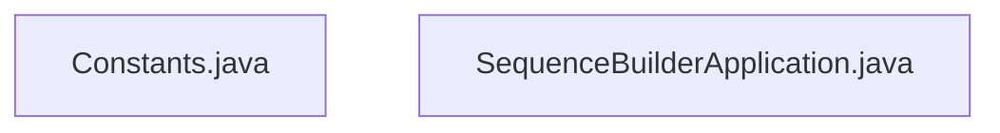

### Package: `com.aa.fso.config`

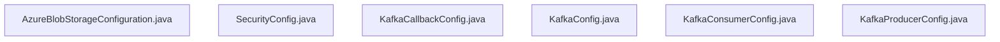

### Package: `com.aa.fso.contractualrules`

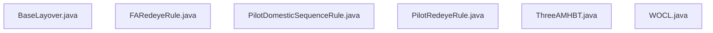

### Package: `com.aa.fso.controller`

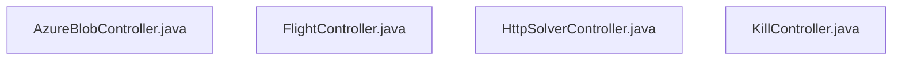

### Package: `com.aa.fso.dto`

### Package: `com.aa.fso.exception`

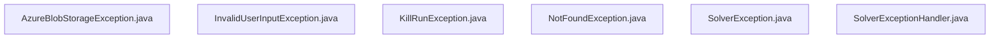

### Package: `com.aa.fso.mapper`

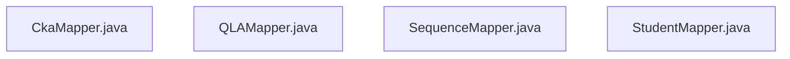

### Package: `com.aa.fso.model`

### Package: `com.aa.fso.optmodel`

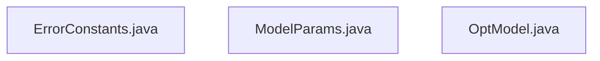

### Package: `com.aa.fso.processor`

```mermaid
flowchart TD
    f_0["CKAProcessor.java"]
    f_1["ConstructNetwork.java"]
    f_2["DHProcessor.java"]
    f_3["InputValidationProcessor.java"]
    f_4["QLAProcessor.java"]
    f_5["SequenceProcessor.java"]
    f_6["ShortestPathComponent.java"]
    f_7["StaticDataProcessor.java"]
    %% No internal module dependencies found
```

### Package: `com.aa.fso.qlacheck`

```mermaid
flowchart TD
    f_0["QLACallableClient.java"]
    f_1["QLARestClient.java"]
    f_2["BidStatus.java"]
    f_3["CrewMemberInfo.java"]
    f_4["CrewMemberKey.java"]
    f_5["DateTimeInfo.java"]
    f_6["DutyPeriods.java"]
    f_7["EmpCaatsData.java"]
    f_8["Employee.java"]
    f_9["EmployeeRequest.java"]
    f_10["FlightDutyPeriod.java"]
    f_11["FlightDutyPeriodKey.java"]
    f_12["FlightKey.java"]
    f_13["FlightLeg.java"]
    f_14["FlightLegs.java"]
    f_15["LocalDateDeserializer.java"]
    f_16["LocalDateSerializer.java"]
    f_17["LocalDateTimeDeserializer.java"]
    f_18["LocalDateTimeSerializer.java"]
    f_19["PickupDuty.java"]
    f_20["PilotLegalityRequest.java"]
    f_21["ProjectedData.java"]
    f_22["ScheduledTime.java"]
    f_23["SequenceDetail.java"]
    f_24["SequenceInfo.java"]
    f_25["SequenceInfoKey.java"]
    f_26["StationLongitudeUtils.java"]
    f_27["TimeInfo.java"]
    f_28["ValidationConstants.java"]
    f_29["EmployeeQLAResponse.java"]
    f_30["EmployeeResponse.java"]
    f_31["InvalidSeqMapper.java"]
    f_32["LegalityInterpreter.java"]
    f_33["LegalityInterpreterRepository.java"]
    f_34["LegalityInterpreterRepositoryImpl.java"]
    f_35["LegalityRuleResult.java"]
    f_36["PersistenceException.java"]
    f_37["PilotLegalityResponse.java"]
    f_38["QlaResponse.java"]
    f_39["Result.java"]
    f_40["Rule.java"]
    f_41["RuleResult.java"]
    f_0 --> f_20
    f_0 --> f_37
    f_1 --> f_20
    f_1 --> f_37
```

### Package: `com.aa.fso.repository`

### Package: `com.aa.fso.rules`

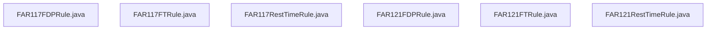

### Package: `com.aa.fso.service`

### Package: `com.aa.fso.util`

```mermaid
flowchart TD
    f_0["CompressUtil.java"]
    f_1["FSOFileWriter.java"]
    f_2["FSOUtil.java"]
    f_3["JsonUtil.java"]
    f_4["SnapshotValidator.java"]
    f_5["StationTimeAdjustLoader.java"]
    f_6["StringUtil.java"]
    f_7["SurfaceLegLoader.java"]
    f_8["TAPIUtil.java"]
    %% No internal module dependencies found
```

### Package: `root`

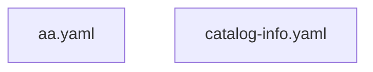

### Package: `src/main/resources`

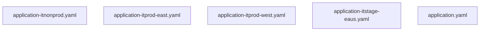

# 3. Technology Stack & Third-party Integrations

The **Sequence_Builder** application is architected as a high-throughput, event-driven microservice built on the **Spring Boot** ecosystem. The system leverages a modular Java architecture to handle complex flight sequencing logic, integrating asynchronous message processing via Apache Kafka and providing a RESTful interface for operational control.

## 3.1 Core Framework & Runtime Environment

The application runtime is anchored by **Spring Boot**, utilizing its auto-configuration capabilities to bootstrap the application context. The primary entry point is defined in `SequenceBuilderApplication`, which initializes the Spring container and enables background scheduling tasks required for periodic data synchronization [src/main/java/com/aa/fso/SequenceBuilderApplication.java:L12-16].

*   **Framework**: Spring Boot (Java-based)
*   **Entry Point**: `SequenceBuilderApplication.main` [src/main/java/com/aa/fso/SequenceBuilderApplication.java:L12-16]
*   **Key Annotations**:
    *   `@SpringBootApplication`: Aggregates configuration and component scanning.
    *   `@EnableScheduling`: Activates the scheduler infrastructure for time-based tasks.
    *   `@RestController`: Defines the HTTP API layer across controllers like `HttpSolverController` and `FlightController`.

The codebase adheres to a strict separation of concerns, dividing responsibilities into Controllers (API exposure), Services (Business Logic), Repositories (Data Access), and Models (Domain Entities). With **196 classes** and **710 methods** distributed across **208 files**, the architecture prioritizes modularity to manage the complexity of flight leg sequencing and QLA (Quality Assurance) checks.

## 3.2 Asynchronous Event Processing (Apache Kafka)

A critical component of the technology stack is the integration with **Apache Kafka** for decoupled, asynchronous processing of solver requests. The system operates as both a consumer and producer within the `AAInternal` event mesh.

### Consumer Architecture
The `KafkaConsumerService` acts as the primary ingestion point for solver triggers. It listens to the configured topic (`${solver.topic.name}`) with a concurrency level defined by `${sb.consumer.topics.concurrency}` [src/main/java/com/aa/fso/service/kafka/consumer/KafkaConsumerService.java:L42-86].

*   **Message Handling**: Upon receiving a `ConsumerRecord`, the service deserializes the payload using `ObjectMapper` into a `UserInput` DTO [src/main/java/com/aa/fso/service/kafka/consumer/KafkaConsumerService.java:L56].
*   **Orchestration**: The consumer delegates the heavy lifting to `SolverService` while maintaining state via `RunStateManager`.
*   **Error Handling & Telemetry**: The service implements robust exception handling for `KillRunException` and `InvalidUserInputException`. In the event of a kill request, it triggers `TeamsNotification` to alert stakeholders before clearing the run state [src/main/java/com/aa/fso/service/kafka/consumer/KafkaConsumerService.java:L78-82].
*   **Acknowledgment**: Manual acknowledgment (`ack.acknowledge()`) is performed immediately upon receipt to ensure at-least-once delivery semantics, with business logic execution occurring asynchronously [src/main/java/com/aa/fso/service/kafka/consumer/KafkaConsumerService.java:L44].

### Producer Architecture
Upon successful completion of a solver run, the system publishes compressed binary responses back to the Kafka cluster. The `KafkaProducerService` (invoked via `publishSolverByteResponseEvent`) handles the serialization and transmission of `SolverResponseDTO` objects. To optimize network throughput, large JSON payloads are compressed using `CompressUtil` before being published as byte arrays [src/main/java/com/aa/fso/service/kafka/consumer/KafkaConsumerService.java:L70].

## 3.3 RESTful API Layer

The application exposes a set of REST endpoints managed by Spring MVC controllers, primarily located in the `controller` package. These endpoints serve both debugging purposes and production orchestration.

*   **Solver Orchestration**: `HttpSolverController` provides the `/solveDebug` endpoint, allowing manual invocation of the solver logic via POST requests. This endpoint accepts `UserInput` and returns a list of `OutputData` solutions. It includes a `finally` block to ensure `RunStateManager` cleanup regardless of success or failure [src/main/java/com/aa/fso/controller/HttpSolverController.java:L44-58].
*   **Operational Control**: `KillController` exposes `/run/status` for monitoring active runs and requesting termination. It queries `RunStateManager` to retrieve the current `SnapshotId` and kill flags, returning a human-readable status string [src/main/java/com/aa/fso/controller/KillController.java:L53-65].
*   **Data Retrieval**: `FlightController` manages read-only operations, such as fetching open flight legs (`/openLegs`). It parses date parameters and delegates filtering logic to `LegDataRepository`, ensuring type safety with `LocalDate` [src/main/java/com/aa/fso/controller/FlightController.java:L23-30].

Swagger/OpenAPI annotations (`@Operation`, `@ApiResponses`) are extensively used to document these interfaces, facilitating automated API generation and client consumption.

## 3.4 Data Persistence & Domain Modeling

The domain model is heavily typed, utilizing custom DTOs and Entity classes to represent complex aviation data structures.

*   **Models**: Key entities include `FlightLeg`, `UnsequencedLeg`, and `ParentSnapshotParams`, which encapsulate the state of flight sequences and regulatory constraints [src/main/java/com/aa/fso/model/FlightLeg.java], [src/main/java/com/aa/fso/model/UnsequencedLeg.java].
*   **Serialization**: Custom Jackson serializers (e.g., `LocalDateSerializer`) are employed to handle specific date formatting requirements across the `dto` and `qlacheck` packages [src/main/java/com/aa/fso/dto/LocalDateSerializer.java].
*   **Repositories**: Data access is abstracted through repositories like `LegDataRepository`, which interact with the underlying database to fetch unsequenced legs based on date ranges and equipment types.

## 3.5 Utility & Cross-Cutting Concerns

To maintain code density and performance, the stack relies on several utility components:

*   **Compression**: `CompressUtil` handles JSON compression/decompression, essential for reducing payload sizes in Kafka messages [src/main/java/com/aa/fso/util/CompressUtil.java].
*   **Notifications**: `TeamsNotification` serves as a bridge to Microsoft Teams, sending alerts for critical events like run terminations [src/main/java/com/aa/fso/component/TeamsNotification.java].
*   **Q&A Logic**: Specialized processors (`QLAProcessor`, `SequenceProcessor`) handle domain-specific validation and sequencing algorithms, ensuring compliance with flight regulations [src/main/java/com/aa/fso/processor/QLAProcessor.java].
*   **Configuration**: Environment-specific configurations are managed via YAML profiles (e.g., `application-itprod-east.yaml`), allowing dynamic tuning of Kafka topics, concurrency levels, and timeouts without code changes [src/main/resources/application-itprod-east.yaml].

## 3.6 Summary of Dependencies

| Component | Technology | Role |
| :--- | :--- | :--- |
| **Runtime** | Spring Boot | Application container, dependency injection, auto-configuration. |
| **Messaging** | Apache Kafka | Async event bus for solver triggers and response distribution. |
| **Web** | Spring Web MVC | REST API exposure, request/response handling. |
| **ORM/Data** | JPA / Spring Data | Repository pattern implementation for flight data access. |
| **Serialization** | Jackson | JSON parsing, custom date serialization, object mapping. |
| **Observability** | SLF4J / Logback | Structured logging for audit trails and debugging. |
| **Documentation** | Springfox / OpenAPI | API documentation generation. |
| **Utilities** | Lombok | Boilerplate reduction (Getters, Setters, Loggers). |

This technology stack ensures the **Sequence_Builder** remains scalable, resilient, and capable of handling the computational intensity of flight sequencing while maintaining strict operational visibility through Kafka and REST interfaces.
