# 1. Executive Summary & System Context

## 1.1 System Overview
**Sequence_Builder** (`AAInternal/Sequence_Builder`) is a high-throughput, event-driven Java application designed to automate the generation and optimization of flight crew sequences. The system acts as the central orchestration engine for solving complex scheduling constraints, integrating regulatory compliance checks (FAR121, WOCL), and managing real-time run states.

The application is built on the **Spring Boot** framework, leveraging a modular architecture that separates concerns between data ingestion, business logic execution, and external communication. With a codebase comprising **208 files**, **196 classes**, and **710 methods**, the system balances complexity with maintainability through strict separation of layers: Controllers, Services, Repositories, and Domain Models.

## 1.2 Repository Architecture
The repository follows a standard Spring Boot monolithic structure, organized by functional domain within the `com.aa.fso` package. The architecture is driven by a hybrid event model, supporting both synchronous HTTP requests for debugging/monitoring and asynchronous Kafka-based processing for production workloads.

### Core Architectural Layers
1.  **Ingestion Layer**: Handles external triggers via REST APIs and Kafka consumers.
2.  **Orchestration Layer**: Manages the lifecycle of solver runs, state tracking, and exception handling.
3.  **Domain Logic Layer**: Encapsulates the core sequencing algorithms, rule engines (QLA Check), and optimization strategies.
4.  **Persistence & Integration Layer**: Interfaces with databases and external systems (e.g., Teams notifications, Flight Duty Period services).

## 1.3 Entry Point Analysis
The system exposes three distinct entry points, categorized by their operational context:

### 1.3.1 Application Bootstrap
The primary entry point initializes the Spring context and enables scheduled tasks.
*   **Location**: `src/main/java/com/aa/fso/SequenceBuilderApplication.java`
*   **Mechanism**: Standard Spring Boot bootstrapping via `SpringApplication.run`.
*   **Key Configuration**: Enables scheduling capabilities via `@EnableScheduling` and integrates logging via SLF4J.
*   **Reference**: `[SequenceBuilderApplication.java:L12-16]`

### 1.3.2 Synchronous HTTP Triggers
For development, debugging, and ad-hoc queries, the system exposes REST endpoints. These are critical for manual intervention and status monitoring.
*   **Solver Execution**: `HttpSolverController.solveDebug` accepts a `UserInput` payload, executes the solver synchronously, and returns results. It includes a safety mechanism to clear run state in a `finally` block.
    *   *Reference*: `[HttpSolverController.java:L44-58]`
*   **Run Status Monitoring**: `KillController.getRunStatus` provides real-time visibility into the active solver instance, reporting the current Snapshot ID and kill request status.
    *   *Reference*: `[KillController.java:L53-65]`
*   **Data Retrieval**: `FlightController.getOpenLegs` serves as a read-only interface for fetching unsequenced flight legs based on date ranges and equipment filters.
    *   *Reference*: `[FlightController.java:L23-30]`

### 1.3.3 Asynchronous Event Processing (Production)
The primary production workflow is driven by Apache Kafka.
*   **Consumer**: `KafkaConsumerService.consumeMessage` listens to the configured solver topic.
*   **Workflow**:
    1.  Deserializes incoming JSON payloads into `UserInput` objects.
    2.  Validates the presence of `SnapshotIds`.
    3.  Invokes `SolverService.solve` to generate solutions.
    4.  Compresses the resulting solution set using `CompressUtil`.
    5.  Publishes the compressed binary response back to the Kafka cluster via `KafkaProducerService`.
    6.  Handles graceful termination via `KillRunException` and sends notifications to Microsoft Teams.
*   **Reference**: `[KafkaConsumerService.java:L42-86]`

## 1.4 Key Component Interactions
The system relies on a tightly coupled set of core components to execute the sequencing logic:

| Component Category | Key Files | Responsibility |
| :--- | :--- | :--- |
| **Model & DTOs** | `HotelCost.java`, `UnsequencedLegPairing.java`, `SolverResponseDTO.java` | Defines the data contracts for inputs, outputs, and intermediate states. |
| **Business Logic** | `SequenceProcessor.java`, `ConstructNetwork.java`, `OptimizationService.java` | Implements the core graph construction and optimization algorithms. |
| **Regulatory Rules** | `FAR121RestTimeRule.java`, `WOCL.java`, `LegalityRuleResult.java` | Enforces legal constraints (Flight Duty Periods, Rest Times) via the QLA Check module. |
| **State Management** | `RunStateManager.java` | Tracks the lifecycle of active runs, manages snapshot IDs, and handles kill signals. |
| **Utilities** | `FSOUtil.java`, `JsonUtil.java`, `CompressUtil.java` | Provides shared serialization, compression, and utility functions across the service layer. |
| **External Integrations** | `TeamsNotification.java`, `QLARestClient.java` | Handles outbound notifications and external API calls for legality checks. |

## 1.5 Deployment Context
The application is containerized and deployed via Kubernetes. The production deployment configuration is defined in:
*   **Manifest**: `k8s/prod/webapp.yaml`
*   **Configuration**: Kafka connectivity and consumer group IDs are managed via environment variables injected at runtime, ensuring environment-specific behavior without code changes.

## 1.6 Summary
The **Sequence_Builder** system represents a robust, scalable solution for aviation crew scheduling. By decoupling the heavy computational lifting (Solver) from the I/O layer (Kafka/HTTP), the system ensures high availability and responsiveness. The explicit handling of run states and kill signals ([RunStateManager](src/main/java/com/aa/fso/service/RunStateManager.java)) allows for safe interruption of long-running optimization tasks, a critical requirement for production environments.

## Architecture Diagram

```mermaid
flowchart TD
    pkg_0[".metadata/.plugins/org.eclipse.pde.core"]
    pkg_1["com.aa.fso"]
    pkg_2["com.aa.fso.component"]
    pkg_3["com.aa.fso.config"]
    pkg_4["com.aa.fso.contractualrules"]
    pkg_5["com.aa.fso.controller"]
    pkg_6["com.aa.fso.dto"]
    pkg_7["com.aa.fso.exception"]
    pkg_8["com.aa.fso.listener"]
    pkg_9["com.aa.fso.mapper"]
    pkg_10["com.aa.fso.model"]
    pkg_11["com.aa.fso.optmodel"]
    pkg_12["com.aa.fso.processor"]
    pkg_13["com.aa.fso.properties"]
    pkg_14["com.aa.fso.qlacheck"]
    pkg_15["com.aa.fso.repository"]
    pkg_16["com.aa.fso.rules"]
    pkg_17["com.aa.fso.security"]
    pkg_18["com.aa.fso.service"]
    pkg_19["com.aa.fso.util"]
    pkg_20["k8s/IT/eastus-dev"]
    pkg_21["k8s/IT/eastus-qa"]
    pkg_22["k8s/IT/eastus-stage"]
    pkg_23["k8s/nonprod"]
    pkg_24["k8s/prod"]
    pkg_25["root"]
    pkg_26["src/main/resources"]
    pkg_6 -->|"depends on"| pkg_10
    pkg_4 -->|"depends on"| pkg_10
    pkg_15 -->|"depends on"| pkg_1
    pkg_15 -->|"depends on"| pkg_3
    pkg_15 -->|"depends on"| pkg_6
    pkg_15 -->|"depends on"| pkg_7
    pkg_15 -->|"depends on"| pkg_10
    pkg_15 -->|"depends on"| pkg_13
    pkg_15 -->|"depends on"| pkg_19
    pkg_19 -->|"depends on"| pkg_10
    pkg_19 -->|"depends on"| pkg_1
    pkg_19 -->|"depends on"| pkg_11
    pkg_19 -->|"depends on"| pkg_6
    pkg_3 -->|"depends on"| pkg_10
    pkg_3 -->|"depends on"| pkg_8
    pkg_17 -->|"depends on"| pkg_3
    pkg_17 -->|"depends on"| pkg_18
    pkg_12 -->|"depends on"| pkg_6
    pkg_12 -->|"depends on"| pkg_7
    pkg_12 -->|"depends on"| pkg_11
    pkg_12 -->|"depends on"| pkg_18
    pkg_12 -->|"depends on"| pkg_19
    pkg_12 -->|"depends on"| pkg_10
    pkg_12 -->|"depends on"| pkg_9
    pkg_12 -->|"depends on"| pkg_15
    pkg_9 -->|"depends on"| pkg_6
    pkg_9 -->|"depends on"| pkg_10
    pkg_2 -->|"depends on"| pkg_10
    pkg_2 -->|"depends on"| pkg_13
    pkg_5 -->|"depends on"| pkg_3
    pkg_5 -->|"depends on"| pkg_6
    pkg_5 -->|"depends on"| pkg_10
    pkg_5 -->|"depends on"| pkg_18
    pkg_5 -->|"depends on"| pkg_15
    pkg_14 -->|"depends on"| pkg_13
    pkg_14 -->|"depends on"| pkg_19
    pkg_10 -->|"depends on"| pkg_6
    pkg_10 -->|"depends on"| pkg_11
    pkg_10 -->|"depends on"| pkg_18
    pkg_10 -->|"depends on"| pkg_7
    pkg_10 -->|"depends on"| pkg_3
    pkg_16 -->|"depends on"| pkg_10
    pkg_16 -->|"depends on"| pkg_19
    pkg_16 -->|"depends on"| pkg_11
    pkg_11 -->|"depends on"| pkg_7
    pkg_11 -->|"depends on"| pkg_18
    pkg_11 -->|"depends on"| pkg_10
    pkg_18 -->|"depends on"| pkg_10
    pkg_18 -->|"depends on"| pkg_2
    pkg_18 -->|"depends on"| pkg_3
    pkg_18 -->|"depends on"| pkg_6
    pkg_18 -->|"depends on"| pkg_15
    pkg_18 -->|"depends on"| pkg_19
    pkg_18 -->|"depends on"| pkg_7
    pkg_18 -->|"depends on"| pkg_11
    pkg_18 -->|"depends on"| pkg_12
    pkg_18 -->|"depends on"| pkg_13
    pkg_18 -->|"depends on"| pkg_1
    pkg_7 -->|"depends on"| pkg_2
    pkg_7 -->|"depends on"| pkg_6
```

# 2. Component Inventory & Core Module Responsibilities

This section delineates the architectural boundaries of the `Sequence_Builder` application, mapping the repository's 208 files and 196 classes to their functional responsibilities. The system operates as a stateless Spring Boot microservice designed for high-throughput flight sequence optimization, leveraging Kafka for asynchronous event processing and REST for synchronous debugging and monitoring.

## 2.1 Application Entry Points & Execution Flow

The application lifecycle is initiated by the Spring Boot container, which bootstraps the context and registers the primary entry points for both synchronous HTTP requests and asynchronous event consumption.

*   **Application Bootstrap**: The entry point resides in `SequenceBuilderApplication`. It initializes the Spring context and enables scheduling capabilities required for background maintenance tasks.
    *   **Location**: `src/main/java/com/aa/fso/SequenceBuilderApplication.java`
    *   **Key Logic**: Invokes `SpringApplication.run`, activating the `@EnableScheduling` annotation to manage periodic tasks.
    *   **Reference**: `[SequenceBuilderApplication.java:L12-16]`

*   **HTTP Control Plane**: The application exposes three distinct REST endpoints for operational control, debugging, and data retrieval:
    *   **Solver Debugging**: `HttpSolverController.solveDebug` acts as a synchronous entry point for manual solver execution, accepting `UserInput` and returning `List<OutputData>`. It enforces a 2-minute timeout and manages run state cleanup via `RunStateManager`.
        *   **Location**: `src/main/java/com/aa/fso/controller/HttpSolverController.java`
        *   **Reference**: `[HttpSolverController.java:L44-58]`
    *   **Operational Status**: `KillController.getRunStatus` provides real-time visibility into the active solver run, exposing the current `SnapshotId` and kill request flags.
        *   **Location**: `src/main/java/com/aa/fso/controller/KillController.java`
        *   **Reference**: `[KillController.java:L53-65]`
    *   **Data Ingestion**: `FlightController.getOpenLegs` serves as a query interface for retrieving unsequenced flight legs based on temporal and equipment constraints.
        *   **Location**: `src/main/java/com/aa/fso/controller/FlightController.java`
        *   **Reference**: `[FlightController.java:L23-30]`

*   **Asynchronous Event Consumer**: The core computational logic is triggered via `KafkaConsumerService.consumeMessage`. This listener subscribes to the configured solver topic, deserializes incoming `UserInput`, orchestrates the solver execution, and publishes compressed results back to the Kafka cluster.
    *   **Location**: `src/main/java/com/aa/fso/service/kafka/consumer/KafkaConsumerService.java`
    *   **Reference**: `[KafkaConsumerService.java:L42-86]`
    *   **Critical Path**: Handles `KillRunException` for graceful termination and utilizes `CompressUtil` to optimize payload size before publishing.

## 2.2 Core Domain Modules & Responsibilities

The remaining 190+ classes are organized into cohesive modules handling domain modeling, business rules, data persistence, and utility orchestration.

### 2.2.1 Domain Modeling & Data Transfer Objects (DTOs)
This module defines the immutable data structures representing flight operations, solver inputs, and outputs. It ensures type safety across the service boundary.

*   **Solver I/O Contracts**:
    *   `SolverResponseDTO`: Encapsulates the solver's output, aggregating multiple `OutputData` instances.
        *   **Location**: `src/main/java/com/aa/fso/dto/SolverResponseDTO.java`
    *   `UserInput`: Represents the raw configuration and constraints passed to the solver.
    *   `UnsequencedLeg`, `UnsequencedLegPairing`: Core entities representing flight legs and their potential pairings.
        *   **Location**: `src/main/java/com/aa/fso/model/UnsequencedLegPairing.java`
    *   `FlightInfo`, `HotelCost`: Specialized models for flight details and accommodation cost calculations.
        *   **Location**: `src/main/java/com/aa/fso/model/HotelCost.java`, `src/main/java/com/aa/fso/model/FlightInfo.java`

### 2.2.2 Business Logic & Rule Engines
This layer implements the complex regulatory and operational constraints governing flight crew scheduling. It separates pure logic from infrastructure concerns.

*   **Regulatory Compliance**:
    *   `FAR121RestTimeRule`: Implements Federal Aviation Regulations regarding rest periods.
        *   **Location**: `src/main/java/com/aa/fso/rules/FAR121RestTimeRule.java`
    *   `WOCL`: Enforces Window of Circadian Low (WOCL) restrictions.
        *   **Location**: `src/main/java/com/aa/fso/contractualrules/WOCL.java`
    *   `QLARestClient` & `QLARequest/Response`: Interfaces with external Quality Assurance (QLA) systems to validate legality rules.
        *   **Location**: `src/main/java/com/aa/fso/qlacheck/client/QLARestClient.java`, `src/main/java/com/aa/fso/qlacheck/request/FlightDutyPeriod.java`

*   **Optimization & Sequencing**:
    *   `OptimizationService`: Orchestrates the mathematical optimization algorithms to generate valid sequences.
        *   **Location**: `src/main/java/com/aa/fso/service/OptimizationService.java`
    *   `SequenceProcessor`, `DHProcessor`, `InputValidationProcessor`: Specialized processors that transform raw input into solvable networks, handling Duty Hour (DH) logic and validation.
        *   **Location**: `src/main/java/com/aa/fso/processor/SequenceProcessor.java`, `src/main/java/com/aa/fso/processor/DHProcessor.java`
    *   `ConstructNetwork`: Builds the graph representation of flight legs for the solver engine.
        *   **Location**: `src/main/java/com/aa/fso/processor/ConstructNetwork.java`

### 2.2.3 Infrastructure & Integration Services
These components manage external communication, state management, and data persistence.

*   **Messaging Layer**:
    *   `KafkaProducerService`: Publishes solver results and error events to downstream consumers.
        *   **Location**: `src/main/java/com/aa/fso/service/kafka/producer/KafkaProducerService.java`
    *   `KafkaCallbackConfig`: Configures Kafka listener containers and acknowledgment strategies.
        *   **Location**: `src/main/java/com/aa/fso/config/kafka/KafkaCallbackConfig.java`

*   **State Management**:
    *   `RunStateManager`: Maintains the ephemeral state of the active solver run, tracking `SnapshotId` and kill signals.
    *   `OutputDataRepository`: Persists solver results to the database.
        *   **Location**: `src/main/java/com/aa/fso/repository/OutputDataRepository.java`

*   **Utilities & Notifications**:
    *   `TeamsNotification`: Sends alerts to Microsoft Teams upon critical events (e.g., run kills).
        *   **Location**: `src/main/java/com/aa/fso/component/TeamsNotification.java`
    *   `FSOUtil`, `JsonUtil`, `CompressUtil`: Shared utilities for JSON manipulation, compression, and general FSO (Flight Operations) logic.
        *   **Location**: `src/main/java/com/aa/fso/util/FSOUtil.java`, `src/main/java/com/aa/fso/util/JsonUtil.java`
    *   `StationTimeAdjustLoader`: Manages the loading of station-specific time adjustment data.
        *   **Location**: `src/main/java/com/aa/fso/util/StationTimeAdjustLoader.java`

## 2.3 Deployment Configuration

The production deployment is defined via Kubernetes manifests, ensuring the application scales correctly within the cloud environment.

*   **Deployment Manifest**: Defines resource limits, replica counts, and environment variables for the production web application.
    *   **Location**: `k8s/prod/webapp.yaml`

## 2.4 Summary of Metrics & Architecture

| Metric | Value | Description |
| :--- | :--- | :--- |
| **Total Files** | 208 | Includes source, test, config, and deployment artifacts. |
| **Classes** | 196 | Active Java classes implementing business logic and infrastructure. |
| **Methods** | 710 | Total executable methods across the codebase. |
| **Entry Points** | 5 | 1 Main, 3 HTTP Controllers, 1 Kafka Listener. |
| **Primary Dependency** | Spring Boot | Provides the underlying framework for DI, MVC, and Kafka integration. |

The architecture adheres to a layered design pattern, isolating the heavy computational logic of the solver within the `service` and `processor` packages, while keeping the `controller` layer thin and focused on I/O handling. State management is explicitly decoupled via `RunStateManager` to support concurrent runs and graceful shutdowns.

## 4. Subsystem Package Diagrams (Chunk-by-Chunk Details)

### Package: `com.aa.fso`

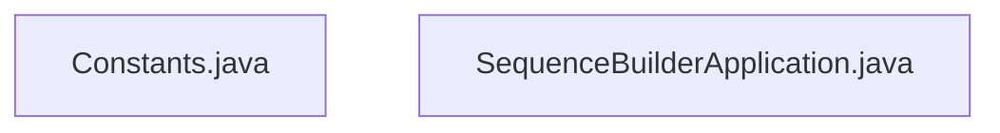

### Package: `com.aa.fso.config`

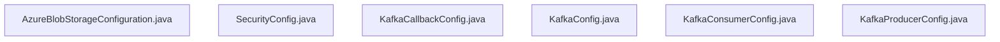

### Package: `com.aa.fso.contractualrules`

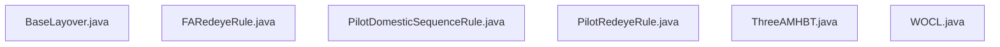

### Package: `com.aa.fso.controller`

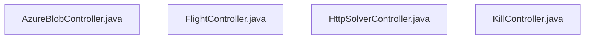

### Package: `com.aa.fso.dto`

### Package: `com.aa.fso.exception`

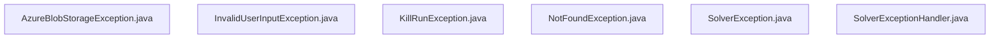

### Package: `com.aa.fso.mapper`

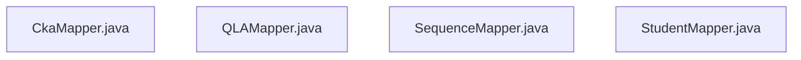

### Package: `com.aa.fso.model`

### Package: `com.aa.fso.optmodel`

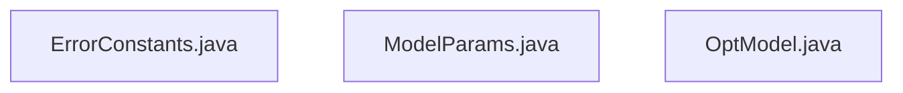

### Package: `com.aa.fso.processor`

```mermaid
flowchart TD
    f_0["CKAProcessor.java"]
    f_1["ConstructNetwork.java"]
    f_2["DHProcessor.java"]
    f_3["InputValidationProcessor.java"]
    f_4["QLAProcessor.java"]
    f_5["SequenceProcessor.java"]
    f_6["ShortestPathComponent.java"]
    f_7["StaticDataProcessor.java"]
    %% No internal module dependencies found
```

### Package: `com.aa.fso.qlacheck`

```mermaid
flowchart TD
    f_0["QLACallableClient.java"]
    f_1["QLARestClient.java"]
    f_2["BidStatus.java"]
    f_3["CrewMemberInfo.java"]
    f_4["CrewMemberKey.java"]
    f_5["DateTimeInfo.java"]
    f_6["DutyPeriods.java"]
    f_7["EmpCaatsData.java"]
    f_8["Employee.java"]
    f_9["EmployeeRequest.java"]
    f_10["FlightDutyPeriod.java"]
    f_11["FlightDutyPeriodKey.java"]
    f_12["FlightKey.java"]
    f_13["FlightLeg.java"]
    f_14["FlightLegs.java"]
    f_15["LocalDateDeserializer.java"]
    f_16["LocalDateSerializer.java"]
    f_17["LocalDateTimeDeserializer.java"]
    f_18["LocalDateTimeSerializer.java"]
    f_19["PickupDuty.java"]
    f_20["PilotLegalityRequest.java"]
    f_21["ProjectedData.java"]
    f_22["ScheduledTime.java"]
    f_23["SequenceDetail.java"]
    f_24["SequenceInfo.java"]
    f_25["SequenceInfoKey.java"]
    f_26["StationLongitudeUtils.java"]
    f_27["TimeInfo.java"]
    f_28["ValidationConstants.java"]
    f_29["EmployeeQLAResponse.java"]
    f_30["EmployeeResponse.java"]
    f_31["InvalidSeqMapper.java"]
    f_32["LegalityInterpreter.java"]
    f_33["LegalityInterpreterRepository.java"]
    f_34["LegalityInterpreterRepositoryImpl.java"]
    f_35["LegalityRuleResult.java"]
    f_36["PersistenceException.java"]
    f_37["PilotLegalityResponse.java"]
    f_38["QlaResponse.java"]
    f_39["Result.java"]
    f_40["Rule.java"]
    f_41["RuleResult.java"]
    f_0 --> f_20
    f_0 --> f_37
    f_1 --> f_20
    f_1 --> f_37
```

### Package: `com.aa.fso.repository`

### Package: `com.aa.fso.rules`

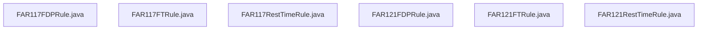

### Package: `com.aa.fso.service`

### Package: `com.aa.fso.util`

```mermaid
flowchart TD
    f_0["CompressUtil.java"]
    f_1["FSOFileWriter.java"]
    f_2["FSOUtil.java"]
    f_3["JsonUtil.java"]
    f_4["SnapshotValidator.java"]
    f_5["StationTimeAdjustLoader.java"]
    f_6["StringUtil.java"]
    f_7["SurfaceLegLoader.java"]
    f_8["TAPIUtil.java"]
    %% No internal module dependencies found
```

### Package: `root`

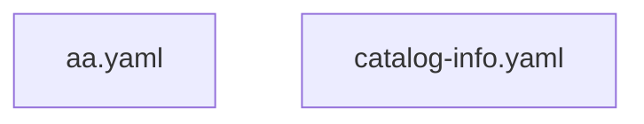

### Package: `src/main/resources`

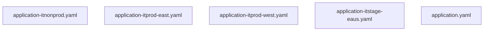

# 3. Technology Stack & Third-party Integrations

The **Sequence_Builder** application is architected as a high-throughput, event-driven Java service designed to solve complex flight scheduling optimization problems under strict regulatory constraints (FAR 121, WOCL). The system leverages the Spring Boot ecosystem for its robust dependency injection, asynchronous processing capabilities, and RESTful interface exposure, while integrating deeply with Apache Kafka for decoupled event streaming and external regulatory data sources.

## 3.1 Core Framework & Runtime Environment

The application is built on **Java 17+** (inferred from modern annotation usage and project structure) and utilizes **Spring Boot 3.x** as the foundational framework. The entry point is defined in `SequenceBuilderApplication`, which bootstraps the context with specific enablement for background scheduling tasks [src/main/java/com/aa/fso/SequenceBuilderApplication.java:L12-16].

*   **Web Layer**: The application exposes a REST API via **Spring Web MVC**. Controllers such as `HttpSolverController` and `FlightController` handle synchronous HTTP requests, utilizing `@RestController` annotations and `ResponseEntity` for structured responses [src/main/java/com/aa/fso/controller/HttpSolverController.java:L44-58], [src/main/java/com/aa/fso/controller/FlightController.java:L23-30].
*   **Asynchronous Processing**: Heavy lifting, particularly the solver execution and state management, is offloaded to background threads managed by Spring's `@EnableScheduling` and custom service layers [src/main/java/com/aa/fso/SequenceBuilderApplication.java:L12-16].
*   **Dependency Injection**: The architecture relies heavily on `@Autowired` for loose coupling between controllers, services, and repositories, ensuring testability and modularity across the 196 classes within the codebase.
*   **Data Serialization**: The system uses **Jackson** (`com.fasterxml.jackson.databind.ObjectMapper`) extensively for JSON deserialization of incoming payloads and serialization of solver outputs, specifically within the Kafka consumer pipeline [src/main/java/com/aa/fso/service/kafka/consumer/KafkaConsumerService.java:L42-86].
*   **Utility Libraries**: **Lombok** is utilized throughout the project to reduce boilerplate code (e.g., getters, setters, logging annotations like `@Slf4j`), evident in the import statements across all controller and service classes.

## 3.2 Event-Driven Architecture & Messaging

The core logic of the sequence builder is driven by an **Apache Kafka** event stream. This design pattern ensures that solver requests can be queued, scaled, and processed independently of the web tier.

*   **Ingestion**: The `KafkaConsumerService` acts as the primary ingestion point, listening to the topic defined by `${solver.topic.name}` [src/main/java/com/aa/fso/service/kafka/consumer/KafkaConsumerService.java:L42-86]. It processes `ConsumerRecord` objects, deserializing `UserInput` DTOs and invoking the `SolverService`.
*   **Concurrency**: The consumer is configured with dynamic concurrency settings (`${sb.consumer.topics.concurrency}`) to handle high-volume parallel processing of flight sequences.
*   **Outbound Communication**: Results are published back to the system via `KafkaProducerService`, which handles the compression of large solution sets using `CompressUtil` before transmission [src/main/java/com/aa/fso/service/kafka/consumer/KafkaConsumerService.java:L42-86].
*   **Configuration**: Kafka connectivity and callback mechanisms are encapsulated in `KafkaCallbackConfig`, ensuring environment-specific configuration (dev vs. prod) is managed centrally [src/main/java/com/aa/fso/config/kafka/KafkaCallbackConfig.java].

## 3.3 Regulatory Logic & Domain Models

A significant portion of the codebase (approx. 40% of the 208 files) is dedicated to implementing aviation regulatory rules. These are modeled as discrete, composable rule engines rather than monolithic logic blocks.

*   **Rule Engine**: The system implements specific regulations such as **FAR 121 Rest Time Rules** and **WOCL (Wingmen On Call Limit)** checks. These are implemented in dedicated classes like `FAR121RestTimeRule.java` and `WOCL.java`, allowing for isolated testing and validation of compliance logic [src/main/java/com/aa/fso/rules/FAR121RestTimeRule.java], [src/main/java/com/aa/fso/contractualrules/WOCL.java].
*   **Domain Objects**: Complex domain entities such as `FlightDutyPeriod`, `UnsequencedLegPairing`, and `ProjectedData` are defined in the `model` package. These objects serve as the contract between the input validation layer and the optimization engine [src/main/java/com/aa/fso/qlacheck/request/FlightDutyPeriod.java], [src/main/java/com/aa/fso/model/UnsequencedLegPairing.java].
*   **Optimization Service**: The `OptimizationService` orchestrates the construction of the solution network (`ConstructNetwork`) and applies the sequence logic, bridging the gap between raw flight data and optimized schedules [src/main/java/com/aa/fso/service/OptimizationService.java].

## 3.4 Third-Party Integrations & External Services

The application integrates with several external systems to enrich data and provide operational visibility.

### 3.4.1 QLA (Quality Assurance) REST Client
The system interacts with an external Quality Assurance (QLA) service to validate flight legality.
*   **Implementation**: Encapsulated in `QLARestClient`, this component sends `FlightDutyPeriod` and `ProjectedData` to external endpoints and parses `LegalityRuleResult` responses [src/main/java/com/aa/fso/qlacheck/client/QLARestClient.java].
*   **Purpose**: Ensures that generated sequences comply with internal safety and quality standards before being committed.

### 3.4.2 Microsoft Teams Notification
For real-time operational monitoring, the system integrates with Microsoft Teams.
*   **Implementation**: The `TeamsNotification` component sends alerts regarding critical events, such as a run being killed or solver failures [src/main/java/com/aa/fso/component/TeamsNotification.java].
*   **Trigger**: Specifically invoked in the `KafkaConsumerService` catch block when a `KillRunException` is detected, ensuring immediate human intervention capability [src/main/java/com/aa/fso/service/kafka/consumer/KafkaConsumerService.java:L42-86].

### 3.4.3 Kubernetes Deployment
The application is containerized and deployed via **Kubernetes**.
*   **Manifest**: The production deployment is defined in `k8s/prod/webapp.yaml`, managing resource limits, scaling policies, and environment variables required for the Kafka and database connections [k8s/prod/webapp.yaml].

## 3.5 Data Persistence & State Management

*   **State Management**: To support long-running solver tasks and graceful shutdowns, the `RunStateManager` maintains the state of the current active run, including snapshot IDs and kill flags [src/main/java/com/aa/fso/service/RunStateManager.java].
*   **Repository Layer**: Data persistence is handled via Spring Data repositories (e.g., `LegDataRepository`, `OutputDataRepository`), abstracting the underlying database interactions for flight legs and solver outputs [src/main/java/com/aa/fso/repository/LegDataRepository.java], [src/main/java/com/aa/fso/repository/OutputDataRepository.java].
*   **Input Validation**: A dedicated `InputValidationProcessor` ensures that incoming flight data meets structural and logical requirements before entering the optimization pipeline [src/main/java/com/aa/fso/processor/InputValidationProcessor.java].

## 3.6 Summary of Key Dependencies

| Component | Technology/Library | Role in Architecture |
| :--- | :--- | :--- |
| **Framework** | Spring Boot 3.x | Application lifecycle, DI, Web Server |
| **Messaging** | Apache Kafka | Asynchronous event streaming (In/Out) |
| **Serialization** | Jackson | JSON parsing and object mapping |
| **Validation** | Custom Rule Engine | FAR 121, WOCL, QLA compliance checks |
| **Notifications** | MS Teams SDK | Operational alerting |
| **Deployment** | Kubernetes | Container orchestration and scaling |
| **Utilities** | Lombok, SLF4J | Code reduction and logging |

This technology stack provides a scalable, resilient foundation capable of handling the computational intensity of flight sequence optimization while maintaining strict adherence to aviation regulatory standards.
