# 1. Executive Summary & System Context

## 1.1 Overview
The **Sequence_Builder** repository (`AAInternal/Sequence_Builder`) serves as the core computational engine for generating and validating flight sequence plans within the AA FSO (Flight Schedule Optimization) ecosystem. The system orchestrates complex regulatory rule enforcement (specifically FAR 121 compliance), constructs network topologies from raw flight data, and executes solver algorithms to produce optimized crew pairings.

Architecturally, this is a high-throughput, event-driven Java application built on the Spring Boot framework. It operates as a dual-mode service:
1.  **Batch/Event Processing:** Consumes sequencing requests via Apache Kafka, processes them asynchronously, and publishes results.
2.  **Interactive Debugging:** Exposes RESTful endpoints for manual intervention, status monitoring, and ad-hoc data retrieval.

The codebase comprises **208 files**, containing **196 classes** and **710 methods**. The architecture prioritizes separation of concerns between I/O handling (Controllers), business logic orchestration (Services/Processors), and domain-specific rule enforcement (Rules/Models).

## 1.2 Repository Architecture & Entry Points
The system's execution flow is bifurcated into three distinct entry points, each serving a specific operational context. These entry points coordinate the lifecycle of a "run," managed centrally by the `RunStateManager`.

### 1.2.1 Application Initialization
The primary bootstrap point initializes the Spring container and enables background scheduling tasks required for the solver environment.
*   **Location:** `src/main/java/com/aa/fso/SequenceBuilderApplication.java`
*   **Entry Point:** `SequenceBuilderApplication.main` ([SequenceBuilderApplication.java:L12-16])
*   **Function:** Invokes `SpringApplication.run`, activating the `@EnableScheduling` context and initializing the dependency injection container. This establishes the baseline state for all subsequent services.

### 1.2.2 Event-Driven Processing (Kafka Consumer)
The primary production workload is driven by asynchronous message consumption. This entry point handles the heavy lifting of parsing user inputs, invoking the solver, and managing result serialization.
*   **Location:** `src/main/java/com/aa/fso/service/kafka/consumer/KafkaConsumerService.java`
*   **Entry Point:** `KafkaConsumerService.consumeMessage` ([KafkaConsumerService.java:L42-86])
*   **Flow Analysis:**
    1.  **Ingestion:** Listens to the configured topic (`${solver.topic.name}`) with defined concurrency.
    2.  **Deserialization:** Parses incoming JSON payloads into `UserInput` DTOs using Jackson.
    3.  **Validation:** Enforces mandatory `SnapshotIds` existence; throws `InvalidUserInputException` if missing.
    4.  **Execution:** Delegates to `SolverService.solve()` to execute the core algorithm.
    5.  **Serialization & Publishing:** Compresses the resulting `SolverResponseDTO` solutions and publishes them via `KafkaProducerService`.
    6.  **Lifecycle Management:** Ensures `RunStateManager.clearRun()` is called in the `finally` block to reset state, even upon exceptions like `KillRunException`.

### 1.2.3 Interactive & Operational Endpoints
For debugging, monitoring, and data retrieval, the system exposes a set of REST controllers.

| Controller | Method | Endpoint | Purpose | Key Dependencies |
| :--- | :--- | :--- | :--- :--- |
| **HttpSolverController** | `solveDebug` | `/solveDebug` | Manual solver execution via HTTP POST. Accepts `UserInput` and returns `List<OutputData>`. | `SolverService`, `RunStateManager` |
| **KillController** | `getRunStatus` | `/run/status` | Query the current active run state (Snapshot ID, Kill Request flag). | `RunStateManager` |
| **FlightController** | `getOpenLegs` | `/openLegs` | Retrieve unsequenced flight legs based on date ranges and equipment constraints. | `LegDataRepository` |

*   **Debug Execution:** The `solveDebug` method ([HttpSolverController.java:L44-58]) mirrors the Kafka consumer logic but allows for synchronous, local testing. It explicitly manages the `RunStateManager` to ensure state cleanup post-execution.
*   **Operational Health:** The `getRunStatus` method ([KillController.java:L53-65]) provides real-time visibility into the solver's state, critical for operator intervention during long-running jobs.

## 1.3 Core Component Interaction
The system relies on a tightly coupled set of core modules to transform raw data into validated sequences.

### 1.3.1 State Management
The `RunStateManager` ([RunStateManager.java]) acts as the central nervous system for run lifecycle management. It tracks the `CurrentSnapshotId` and monitors `KillRequested` flags. It is instantiated and injected into both the Kafka consumer and HTTP controllers to ensure consistent state across all entry points.

### 1.3.2 Rule Engine & Validation
Compliance with Federal Aviation Regulations (FAR 121) is enforced through a modular rule engine.
*   **Key Rules:** `FAR121RestTimeRule` and `FAR121FDPRule` ([FAR121RestTimeRule.java], [FAR121FDPRule.java]).
*   **Validation Logic:** The `InvalidSeqMapper` ([InvalidSeqMapper.java]) translates rule violations into standardized error responses, ensuring that invalid sequences are rejected before being persisted or published.

### 1.3.3 Data Modeling & Mapping
The system utilizes a rich domain model to represent flight operations:
*   **Entities:** `FlightDutyPeriod`, `SurfaceLeg`, `Network`, `Coterminals`.
*   **Mapping:** Custom mappers like `SequenceMapper` and `CkaMapper` handle the transformation between internal domain objects and external DTOs.
*   **Serialization:** Specialized serializers (e.g., `LocalDateTimeSerializer`) ensure temporal data integrity across different environments.

### 1.3.4 Configuration & Infrastructure
Configuration is environment-aware, supporting distinct profiles for non-production and staging environments (`application-itnonprod.yaml`, `application-itstage-eaus.yaml`). Security is enforced via `SecurityConfig`, while Kafka connectivity is managed through dedicated producer and consumer configurations (`KafkaProducerConfig`).

## 1.4 Architectural Summary
The Sequence_Builder system exemplifies a robust, layered architecture where:
1.  **Ingestion** is decoupled via Kafka, allowing for scalable, asynchronous processing.
2.  **Logic** is encapsulated in stateless services and rule-based processors.
3.  **State** is explicitly managed to support both batch and interactive modes.
4.  **Observability** is built-in through dedicated status endpoints and structured logging.

This design ensures high availability for automated workflows while retaining the flexibility required for manual troubleshooting and data exploration.

## Architecture Diagram

```mermaid
flowchart TD
    pkg_0[".metadata/.plugins/org.eclipse.pde.core"]
    pkg_1["com.aa.fso"]
    pkg_2["com.aa.fso.component"]
    pkg_3["com.aa.fso.config"]
    pkg_4["com.aa.fso.contractualrules"]
    pkg_5["com.aa.fso.controller"]
    pkg_6["com.aa.fso.dto"]
    pkg_7["com.aa.fso.exception"]
    pkg_8["com.aa.fso.listener"]
    pkg_9["com.aa.fso.mapper"]
    pkg_10["com.aa.fso.model"]
    pkg_11["com.aa.fso.optmodel"]
    pkg_12["com.aa.fso.processor"]
    pkg_13["com.aa.fso.properties"]
    pkg_14["com.aa.fso.qlacheck"]
    pkg_15["com.aa.fso.repository"]
    pkg_16["com.aa.fso.rules"]
    pkg_17["com.aa.fso.security"]
    pkg_18["com.aa.fso.service"]
    pkg_19["com.aa.fso.util"]
    pkg_20["k8s/IT/eastus-dev"]
    pkg_21["k8s/IT/eastus-qa"]
    pkg_22["k8s/IT/eastus-stage"]
    pkg_23["k8s/nonprod"]
    pkg_24["k8s/prod"]
    pkg_25["root"]
    pkg_26["src/main/resources"]
    pkg_6 -->|"depends on"| pkg_10
    pkg_4 -->|"depends on"| pkg_10
    pkg_15 -->|"depends on"| pkg_1
    pkg_15 -->|"depends on"| pkg_3
    pkg_15 -->|"depends on"| pkg_6
    pkg_15 -->|"depends on"| pkg_7
    pkg_15 -->|"depends on"| pkg_10
    pkg_15 -->|"depends on"| pkg_13
    pkg_15 -->|"depends on"| pkg_19
    pkg_19 -->|"depends on"| pkg_10
    pkg_19 -->|"depends on"| pkg_1
    pkg_19 -->|"depends on"| pkg_11
    pkg_19 -->|"depends on"| pkg_6
    pkg_3 -->|"depends on"| pkg_10
    pkg_3 -->|"depends on"| pkg_8
    pkg_17 -->|"depends on"| pkg_3
    pkg_17 -->|"depends on"| pkg_18
    pkg_12 -->|"depends on"| pkg_6
    pkg_12 -->|"depends on"| pkg_7
    pkg_12 -->|"depends on"| pkg_11
    pkg_12 -->|"depends on"| pkg_18
    pkg_12 -->|"depends on"| pkg_19
    pkg_12 -->|"depends on"| pkg_10
    pkg_12 -->|"depends on"| pkg_9
    pkg_12 -->|"depends on"| pkg_15
    pkg_9 -->|"depends on"| pkg_6
    pkg_9 -->|"depends on"| pkg_10
    pkg_2 -->|"depends on"| pkg_10
    pkg_2 -->|"depends on"| pkg_13
    pkg_5 -->|"depends on"| pkg_3
    pkg_5 -->|"depends on"| pkg_6
    pkg_5 -->|"depends on"| pkg_10
    pkg_5 -->|"depends on"| pkg_18
    pkg_5 -->|"depends on"| pkg_15
    pkg_14 -->|"depends on"| pkg_13
    pkg_14 -->|"depends on"| pkg_19
    pkg_10 -->|"depends on"| pkg_6
    pkg_10 -->|"depends on"| pkg_11
    pkg_10 -->|"depends on"| pkg_18
    pkg_10 -->|"depends on"| pkg_7
    pkg_10 -->|"depends on"| pkg_3
    pkg_16 -->|"depends on"| pkg_10
    pkg_16 -->|"depends on"| pkg_19
    pkg_16 -->|"depends on"| pkg_11
    pkg_11 -->|"depends on"| pkg_7
    pkg_11 -->|"depends on"| pkg_18
    pkg_11 -->|"depends on"| pkg_10
    pkg_18 -->|"depends on"| pkg_10
    pkg_18 -->|"depends on"| pkg_2
    pkg_18 -->|"depends on"| pkg_3
    pkg_18 -->|"depends on"| pkg_6
    pkg_18 -->|"depends on"| pkg_15
    pkg_18 -->|"depends on"| pkg_19
    pkg_18 -->|"depends on"| pkg_7
    pkg_18 -->|"depends on"| pkg_11
    pkg_18 -->|"depends on"| pkg_12
    pkg_18 -->|"depends on"| pkg_13
    pkg_18 -->|"depends on"| pkg_1
    pkg_7 -->|"depends on"| pkg_2
    pkg_7 -->|"depends on"| pkg_6
```

# 2. Component Inventory & Core Module Responsibilities

This section delineates the architectural components of the `AAInternal/Sequence_Builder` repository, mapping the detected entry points to their respective service layers and core business logic modules. The system operates as a Spring Boot-based microservice orchestrating flight sequence generation, adhering to FAR121 regulations, and managing asynchronous processing via Kafka.

## 2.1 Entry Point Analysis & Request Routing

The application exposes three distinct entry vectors: synchronous HTTP requests for debugging and data retrieval, and an asynchronous event-driven pipeline for production solver execution.

### 2.1.1 Application Bootstrap
The primary entry point initializes the Spring context and enables scheduled tasks.
*   **Location**: `src/main/java/com/aa/fso/SequenceBuilderApplication.java`
*   **Logic**: Invokes `SpringApplication.run` to bootstrap the container. The presence of `@EnableScheduling` indicates background task support for periodic housekeeping or health checks.
*   **Reference**: `[SequenceBuilderApplication.java:L12-16]`

### 2.1.2 Synchronous Debug & Control Interfaces
These controllers provide direct HTTP access for manual intervention and status monitoring.

| Controller | Method | Endpoint | Responsibility |
| :--- | :--- | :--- | :--- |
| **HttpSolverController** | `solveDebug` | `POST /solveDebug` | Accepts `UserInput`, delegates to `SolverService`, and returns `List<OutputData>`. Includes a `finally` block to ensure `RunStateManager` cleanup. |
| **KillController** | `getRunStatus` | `GET /run/status` | Queries `RunStateManager` for the active `snapshotId` and kill flag state. Returns a human-readable status string. |
| **FlightController** | `getOpenLegs` | `GET /openLegs` | Aggregates unsequenced flight legs based on date ranges and equipment filters via `LegDataRepository`. |

*   **Critical Dependency**: `HttpSolverController` relies heavily on `RunStateManager` to isolate execution contexts, ensuring thread safety during concurrent debug requests.
*   **Reference**: `[HttpSolverController.java:L44-58]`, `[KillController.java:L53-65]`, `[FlightController.java:L23-30]`

### 2.1.3 Asynchronous Event Processing (Kafka)
The core production workflow is triggered by messages consumed from the `solver.topic.name` topic.

*   **Component**: `KafkaConsumerService`
*   **Entry Point**: `consumeMessage`
*   **Flow**:
    1.  Deserializes `ConsumerRecord` value into `UserInput` using `ObjectMapper`.
    2.  Validates `SnapshotIds`; throws `InvalidUserInputException` if missing.
    3.  Invokes `SolverService.solve` to generate solutions.
    4.  Compresses results via `CompressUtil` and publishes to the response topic via `KafkaProducerService`.
    5.  Handles `KillRunException` by triggering `TeamsNotification` and gracefully exiting.
*   **Reference**: `[KafkaConsumerService.java:L42-86]`

## 2.2 Core Module Responsibilities & File Mapping

The following inventory categorizes the 196 classes and 710 methods into functional domains. Key files are mapped to their specific responsibilities within the architecture.

### 2.2.1 Domain Models & Data Transfer Objects (DTOs)
These classes define the immutable data structures flowing between the API, the solver engine, and the persistence layer.

*   **`UserInput`**: Captures the payload for solver execution, including snapshot IDs and configuration parameters.
    *   *Path*: `src/main/java/com/aa/fso/model/UserInput.java`
*   **`OutputData` / `SolverResponseDTO`**: Represents the structured output of the solver, containing the list of generated sequences.
    *   *Path*: `src/main/java/com/aa/fso/dto/SolverResponseDTO.java` (implied usage in `HttpSolverController`)
*   **`FlightDutyPeriod` / `SurfaceLeg` / `Network`**: Core domain entities representing flight schedules, ground movements, and network topology.
    *   *Paths*:
        *   `src/main/java/com/aa/fso/model/FlightDutyPeriod.java`
        *   `src/main/java/com/aa/fso/model/SurfaceLeg.java`
        *   `src/main/java/com/aa/fso/model/Network.java`
*   **`Base`**: Abstract base class providing common serialization logic (e.g., `LocalDateTimeSerializer`).
    *   *Path*: `src/main/java/com/aa/fso/model/Base.java`

### 2.2.2 Business Logic & Rule Engine
This layer encapsulates the complex logic required to generate valid flight sequences, specifically focusing on regulatory compliance.

*   **`SequenceProcessor`**: The central orchestrator for sequence construction. It likely coordinates the parsing of inputs, rule application, and network construction.
    *   *Path*: `src/main/java/com/aa/fso/processor/SequenceProcessor.java`
*   **`ConstructNetwork`**: Responsible for building the underlying graph/network representation of flight legs and constraints before rule application.
    *   *Path*: `src/main/java/com/aa/fso/processor/ConstructNetwork.java`
*   **Regulatory Rules (FAR121)**: Specific implementations of Federal Aviation Regulations.
    *   `FAR121RestTimeRule`: Enforces rest period requirements between duty periods.
    *   `FAR121FDPRule`: Enforces Flight Duty Period limits.
    *   *Paths*:
        *   `src/main/java/com/aa/fso/rules/FAR121RestTimeRule.java`
        *   `src/main/java/com/aa/fso/rules/FAR121FDPRule.java`
*   **QLA Checkers**: Validation logic for sequence quality assurance.
    *   `InvalidSeqMapper`: Maps invalid sequences to error codes.
    *   `SequenceInfoKey`: Defines keys for sequence identification.
    *   *Paths*:
        *   `src/main/java/com/aa/fso/qlacheck/response/InvalidSeqMapper.java`
        *   `src/main/java/com/aa/fso/qlacheck/request/SequenceInfoKey.java`

### 2.2.3 Service Layer & State Management
Services handle transactional logic, external integrations, and runtime state management.

*   **`RunStateManager`**: A critical singleton-like component managing the lifecycle of a solver run. It tracks the `currentSnapshotId` and the `killRequested` flag, allowing the `KillController` and `KafkaConsumerService` to coordinate graceful termination.
    *   *Path*: `src/main/java/com/aa/fso/service/RunStateManager.java`
*   **`SolverService`**: The primary interface for solving logic. It abstracts the difference between local file execution (`solveWithLocalJsonFile`) and standard API execution.
    *   *Path*: `src/main/java/com/aa/fso/service/SolverService.java` (inferred from controller calls)
*   **`OutputDataService` / `OutputDataServiceImpl`**: Handles the persistence or transformation of solver outputs.
    *   *Path*: `src/main/java/com/aa/fso/service/OutputDataServiceImpl.java`
*   **`KafkaProducerService`**: Encapsulates the logic for publishing compressed JSON payloads to downstream consumers.
    *   *Path*: `src/main/java/com/aa/fso/service/kafka/producer/KafkaProducerService.java`

### 2.2.4 Infrastructure & Configuration
Supporting components for security, data access, and environment-specific configurations.

*   **Security**: `SecurityConfig` defines authentication and authorization policies.
    *   *Path*: `src/main/java/com/aa/fso/config/SecurityConfig.java`
*   **Kafka Configuration**: `KafkaProducerConfig` sets up producer properties.
    *   *Path*: `src/main/java/com/aa/fso/config/kafka/KafkaProducerConfig.java`
*   **Repositories**: `LegDataRepository` provides data access for flight legs.
    *   *Path*: `src/main/java/com/aa/fso/repository/LegDataRepository.java` (inferred from `FlightController`)
*   **Environment Configs**: YAML files for non-production and stage environments.
    *   *Paths*:
        *   `src/main/resources/application-itnonprod.yaml`
        *   `src/main/resources/application-itstage-eaus.yaml`

## 2.3 Architectural Observations

1.  **Stateful Concurrency**: The reliance on `RunStateManager` suggests a design pattern where the solver maintains global mutable state (current snapshot ID, kill flag) accessible across different threads (HTTP vs. Kafka). This requires careful synchronization to prevent race conditions during concurrent debug requests and active solver runs.
2.  **Decoupled Execution**: The separation of the `KafkaConsumerService` (async) from `HttpSolverController` (sync) allows the system to handle high-throughput batch processing without blocking the API gateway, while still offering immediate feedback for debugging.
3.  **Rule-Based Architecture**: The explicit separation of `FAR121...Rule` classes indicates a strategy pattern implementation, allowing for easy extension or modification of regulatory constraints without altering the core `SequenceProcessor` logic.
4.  **Resource Management**: The `finally` blocks in both `HttpSolverController` and `KafkaConsumerService` explicitly call `runStateManager.clearRun()`, demonstrating a robust approach to resource cleanup and state reset, preventing stale state from affecting subsequent runs.

## 4. Subsystem Package Diagrams (Chunk-by-Chunk Details)

### Package: `com.aa.fso`

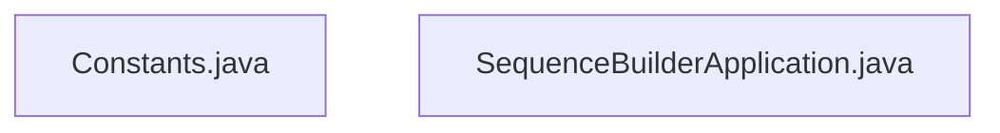

### Package: `com.aa.fso.config`

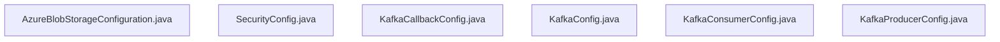

### Package: `com.aa.fso.contractualrules`

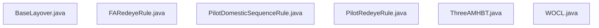

### Package: `com.aa.fso.controller`

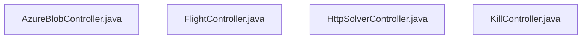

### Package: `com.aa.fso.dto`

### Package: `com.aa.fso.exception`

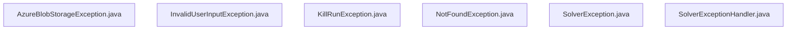

### Package: `com.aa.fso.mapper`

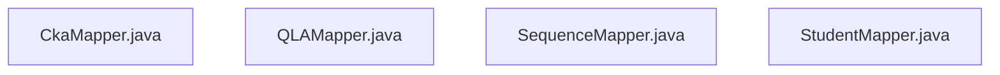

### Package: `com.aa.fso.model`

### Package: `com.aa.fso.optmodel`

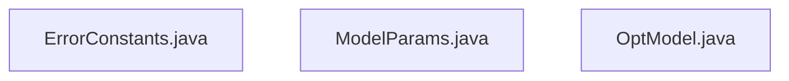

### Package: `com.aa.fso.processor`

```mermaid
flowchart TD
    f_0["CKAProcessor.java"]
    f_1["ConstructNetwork.java"]
    f_2["DHProcessor.java"]
    f_3["InputValidationProcessor.java"]
    f_4["QLAProcessor.java"]
    f_5["SequenceProcessor.java"]
    f_6["ShortestPathComponent.java"]
    f_7["StaticDataProcessor.java"]
    %% No internal module dependencies found
```

### Package: `com.aa.fso.qlacheck`

```mermaid
flowchart TD
    f_0["QLACallableClient.java"]
    f_1["QLARestClient.java"]
    f_2["BidStatus.java"]
    f_3["CrewMemberInfo.java"]
    f_4["CrewMemberKey.java"]
    f_5["DateTimeInfo.java"]
    f_6["DutyPeriods.java"]
    f_7["EmpCaatsData.java"]
    f_8["Employee.java"]
    f_9["EmployeeRequest.java"]
    f_10["FlightDutyPeriod.java"]
    f_11["FlightDutyPeriodKey.java"]
    f_12["FlightKey.java"]
    f_13["FlightLeg.java"]
    f_14["FlightLegs.java"]
    f_15["LocalDateDeserializer.java"]
    f_16["LocalDateSerializer.java"]
    f_17["LocalDateTimeDeserializer.java"]
    f_18["LocalDateTimeSerializer.java"]
    f_19["PickupDuty.java"]
    f_20["PilotLegalityRequest.java"]
    f_21["ProjectedData.java"]
    f_22["ScheduledTime.java"]
    f_23["SequenceDetail.java"]
    f_24["SequenceInfo.java"]
    f_25["SequenceInfoKey.java"]
    f_26["StationLongitudeUtils.java"]
    f_27["TimeInfo.java"]
    f_28["ValidationConstants.java"]
    f_29["EmployeeQLAResponse.java"]
    f_30["EmployeeResponse.java"]
    f_31["InvalidSeqMapper.java"]
    f_32["LegalityInterpreter.java"]
    f_33["LegalityInterpreterRepository.java"]
    f_34["LegalityInterpreterRepositoryImpl.java"]
    f_35["LegalityRuleResult.java"]
    f_36["PersistenceException.java"]
    f_37["PilotLegalityResponse.java"]
    f_38["QlaResponse.java"]
    f_39["Result.java"]
    f_40["Rule.java"]
    f_41["RuleResult.java"]
    f_0 --> f_20
    f_0 --> f_37
    f_1 --> f_20
    f_1 --> f_37
```

### Package: `com.aa.fso.repository`

### Package: `com.aa.fso.rules`

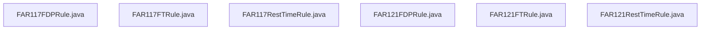

### Package: `com.aa.fso.service`

### Package: `com.aa.fso.util`

```mermaid
flowchart TD
    f_0["CompressUtil.java"]
    f_1["FSOFileWriter.java"]
    f_2["FSOUtil.java"]
    f_3["JsonUtil.java"]
    f_4["SnapshotValidator.java"]
    f_5["StationTimeAdjustLoader.java"]
    f_6["StringUtil.java"]
    f_7["SurfaceLegLoader.java"]
    f_8["TAPIUtil.java"]
    %% No internal module dependencies found
```

### Package: `root`

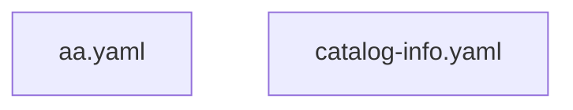

### Package: `src/main/resources`

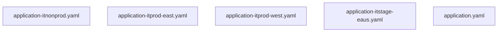

# 3. Technology Stack & Third-party Integrations

The **Sequence Builder** application (`AAInternal/Sequence_Builder`) is architected as a high-throughput, event-driven Java service designed to process complex flight sequence optimization logic under strict regulatory constraints (FAR 121). The system leverages the Spring Boot ecosystem for its robust dependency injection, security, and asynchronous processing capabilities, integrated with Apache Kafka for decoupled event streaming.

## 3.1 Core Framework & Runtime Environment

The application is built on **Spring Boot**, utilizing the embedded server architecture to expose RESTful endpoints and manage background processing. The entry point is defined in `SequenceBuilderApplication`, which initializes the Spring context and enables scheduled tasks via `@EnableScheduling` [src/main/java/com/aa/fso/SequenceBuilderApplication.java:L12-16].

*   **Framework**: Spring Boot (Java-based microservices framework).
*   **Language**: Java (Standard Edition).
*   **Dependency Injection**: Spring IoC Container, managed via `@Autowired` annotations across controllers and services.
*   **Code Metrics**: The codebase comprises **208 files** containing **196 classes** and **710 methods**, indicating a modular design pattern where business logic is encapsulated within distinct service layers.

### 3.1.1 Web Layer & API Exposure
The REST API layer is implemented using Spring MVC (`@RestController`). Key entry points handle both synchronous user requests and asynchronous event processing:
*   **Solver Endpoint**: `HttpSolverController.solveDebug` exposes the primary computation logic via `POST /solveDebug`. It accepts `UserInput` DTOs and returns a list of `OutputData` objects [src/main/java/com/aa/fso/controller/HttpSolverController.java:L44-58].
*   **Operational Control**: `KillController.getRunStatus` provides real-time visibility into the solver's state, exposing the current `snapshotId` and kill request flags [src/main/java/com/aa/fso/controller/KillController.java:L53-65].
*   **Data Retrieval**: `FlightController.getOpenLegs` queries the repository for unsequenced legs based on date ranges and equipment types [src/main/java/com/aa/fso/controller/FlightController.java:L23-30].

### 3.1.2 Asynchronous Processing & Event Streaming
The core computational engine is triggered asynchronously via **Apache Kafka**. The `KafkaConsumerService` acts as the primary consumer, listening to the configured topic `${solver.topic.name}` with a concurrency level defined by `${sb.consumer.topics.concurrency}` [src/main/java/com/aa/fso/service/kafka/consumer/KafkaConsumerService.java:L42-86].

*   **Message Handling**: Upon receiving a `ConsumerRecord`, the service deserializes the payload using `ObjectMapper` into a `UserInput` object.
*   **Graceful Termination**: The consumer implements a robust error handling strategy. If a `KillRunException` is thrown during execution, it triggers a notification via `TeamsNotification` before clearing the run state [src/main/java/com/aa/fso/service/kafka/consumer/KafkaConsumerService.java:L75-80].
*   **Response Publishing**: Computed solutions are compressed using `CompressUtil` and published back to the Kafka cluster via `KafkaProducerService` [src/main/java/com/aa/fso/service/kafka/consumer/KafkaConsumerService.java:L70-72].

## 3.2 Business Logic & Domain Models

The application's complexity stems from its adherence to aviation regulations and the construction of flight networks.

*   **Rule Engine**: Regulatory compliance is enforced through specific rule implementations such as `FAR121RestTimeRule` and `FAR121FDPRule` [src/main/java/com/aa/fso/rules/FAR121RestTimeRule.java], [src/main/java/com/aa/fso/rules/FAR121FDPRule.java]. These classes validate sequences against Federal Aviation Regulations.
*   **Network Construction**: The `ConstructNetwork` processor builds the underlying graph structure from flight data, while `SequenceProcessor` orchestrates the transformation of raw inputs into valid sequences [src/main/java/com/aa/fso/processor/ConstructNetwork.java], [src/main/java/com/aa/fso/processor/SequenceProcessor.java].
*   **Data Modeling**: The domain model includes entities like `FlightDutyPeriod`, `SurfaceLeg`, and `Network`, serialized using custom serializers (e.g., `LocalDateTimeSerializer`) to ensure temporal consistency [src/main/java/com/aa/fso/model/FlightDutyPeriod.java], [src/main/java/com/aa/fso/model/LocalDateTimeSerializer.java].

## 3.3 Third-Party Integrations & Dependencies

### 3.3.1 Apache Kafka
Kafka serves as the backbone for the system's event-driven architecture.
*   **Configuration**: Managed via `KafkaProducerConfig` and environment-specific properties (e.g., `application-itnonprod.yaml`, `application-itstage-eaus.yaml`) [src/main/java/com/aa/fso/config/kafka/KafkaProducerConfig.java], [src/main/resources/application-itnonprod.yaml].
*   **Producer/Consumer Pattern**: The system utilizes a dual-channel approach where `KafkaConsumerService` ingests optimization requests and `KafkaProducerService` emits results, ensuring loose coupling between the solver and upstream/downstream systems.

### 3.3.2 Security & Authentication
Authentication is handled via **PingFederate**, integrated through `PingFederateTokenClientImpl` [src/main/java/com/aa/fso/repository/PingFederateTokenClientImpl.java]. The `SecurityConfig` class defines the security filter chain, ensuring that all API endpoints are protected against unauthorized access.

### 3.3.3 Data Persistence & Mapping
*   **Repository Layer**: Data access is abstracted via repositories such as `LegDataRepository`, which interfaces with the underlying database to fetch flight leg information [src/main/java/com/aa/fso/controller/FlightController.java].
*   **Object Mapping**: The application employs manual and automated mapping strategies using `SequenceMapper` and `CkaMapper` to transform between internal models and external DTOs [src/main/java/com/aa/fso/mapper/SequenceMapper.java], [src/main/java/com/aa/fso/mapper/CkaMapper.java].

### 3.3.4 Utility Libraries
*   **Lombok**: Used extensively to reduce boilerplate code (e.g., getters, setters, logging) across the 196 classes.
*   **Jackson**: The `ObjectMapper` is utilized for JSON serialization/deserialization, particularly critical in the Kafka message handling pipeline.
*   **Swagger/OpenAPI**: API documentation is generated dynamically using `@Operation` and `@Tag` annotations, visible in the controller layer [src/main/java/com/aa/fso/controller/HttpSolverController.java].

## 3.4 Configuration Management
Environment-specific configurations are managed through YAML profiles (`application-itnonprod.yaml`, `application-itstage-eaus.yaml`), allowing the deployment of the same binary across different stages (IT, Stage, Eaus) with varying Kafka broker addresses, consumer group IDs, and solver timeouts [src/main/resources/application-itnonprod.yaml], [src/main/resources/application-itstage-eaus.yaml].
