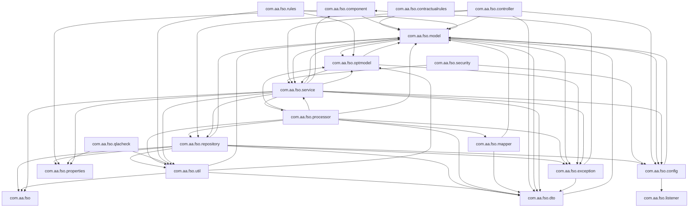
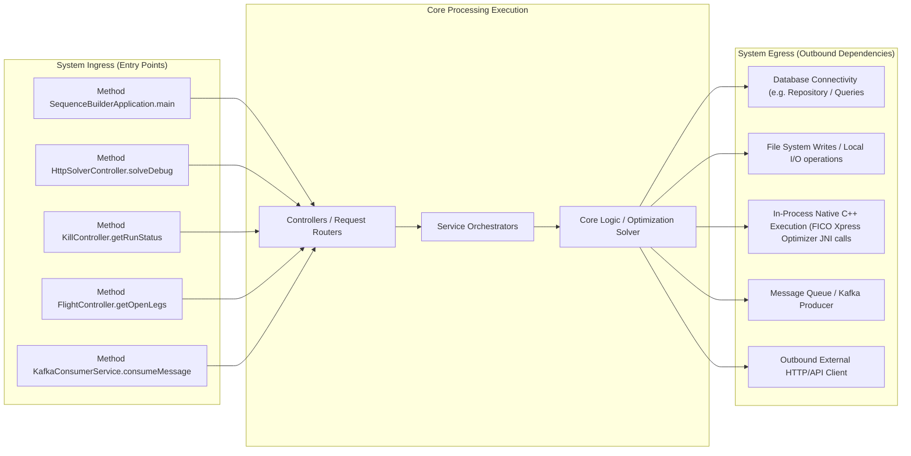
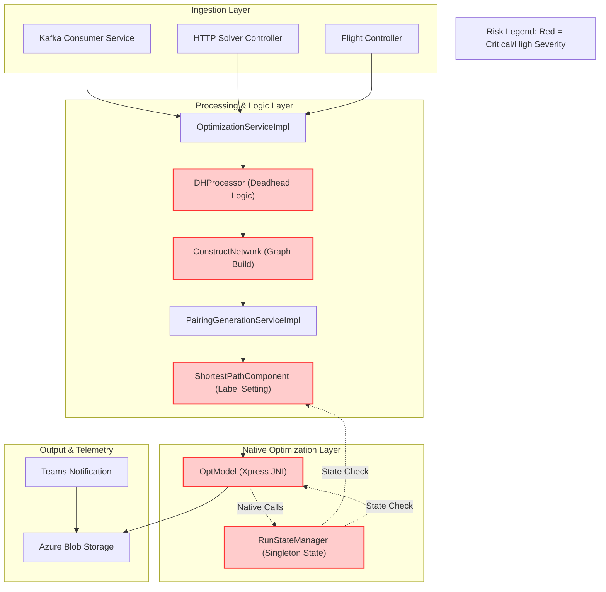

# Architecture & Operations Synthesis Document

This document details the system design, network routing boundary, and scaling characteristics derived programmatically.

## 1. System Package Topology Diagram



## 2. Ingress, Execution & Egress Boundary Flow



# Architecture & Operations Synthesis Report

**System:** Crew Scheduling Optimization Solver (FSA)
**Role:** Principal Software Architect
**Date:** October 26, 2023
**Status:** Final Audit

## 1. Executive Summary

This report provides a comprehensive technical audit of the Crew Scheduling Optimization Solver. The system utilizes a Constraint Programming approach (FICO Xpress) to generate optimal crew pairings from unsequenced flight legs. While the architectural separation of concerns (Data Ingestion, Graph Construction, Label Setting Algorithm, Optimization) is sound, the audit reveals **Critical** and **High** severity issues regarding concurrency safety, resource management, and algorithmic efficiency.

The most significant risks involve the `RunStateManager` singleton managing native Xpress model state without thread-safe isolation, potential native memory leaks in the JNI layer due to lack of explicit disposal, and severe $O(N^2)$ complexity in network construction and deadhead identification loops that will cause catastrophic performance degradation as flight volume scales.

---

## 2. Core Data Flow Diagram (DFD) with Risk Overlay

The following diagram illustrates the data flow from ingestion to solution generation. **Nodes highlighted in Red (`fill:#ffcccc,stroke:#ff3333`)** represent components identified with **High** or **Critical** severity vulnerabilities in the audit below.



---

## 3. Technical Audit & Vulnerability Analysis

### 3.1. Concurrency Hazards & Singleton State Contamination (Critical)
**Finding:** The `RunStateManager` acts as a global singleton holding the state of the active Xpress optimization model and a volatile kill flag.
**Evidence:** `src/main/java/com/aa/fso/service/RunStateManager.java`
**Analysis:**
The class manages `activeModel` (the native Xpress handle) and `killRequested` (volatile boolean). The documentation states, "Since there is only ever one run per pod, this is a singleton service." However, the `SolverService` iterates over multiple `snapshotIds` in a loop:
```java
for (String snapshotId : userInput.getSnapshotIds()) {
    try {
        // ... process snapshot ...
    } catch (Exception e) {
        // ...
    }
}
```
If the system is configured to handle concurrent requests (e.g., via a thread pool or multiple pods sharing state incorrectly), or if a previous run hasn't fully cleared `activeModel` before the next iteration begins, race conditions occur. Specifically, `optModel.runModel(runStateManager)` registers the model. If a kill request comes in during the loop, the `throwKillExceptionIfKillRequested()` is checked, but the `activeModel` reference in the singleton might be overwritten or accessed concurrently if the loop logic is not strictly serialized.
**Risk:** Thread-safety violation leading to `NullPointerException` when accessing `activeModel`, or attempting to kill a model that belongs to a different snapshot context.

### 3.2. Resource Leaks & Native Memory Allocation Risks (High)
**Finding:** Potential for Native Memory Leaks in JNI interactions and unclosed streams.
**Evidence:** `src/main/java/com/aa/fso/optmodel/OptModel.java`, `src/main/java/com/aa/fso/repository/InputDataRepositoryImpl.java`
**Analysis:**
1.  **Xpress Model Lifecycle:** The `OptModel` class interacts with the FICO Xpress native library via JNI. The `runModel` method calls `model.getXPRSprob().mipOptimize(...)`. While the `RunStateManager` attempts to handle kills, there is no explicit `finally` block in `OptModel` ensuring `model.close()` or `model.free()` is called if an exception occurs during `constructVariables` or `parseSolution`. If the JVM crashes or an exception bypasses the `try-catch` in `OptimizationServiceImpl`, the native memory associated with the Xpress problem remains allocated until the process restarts.
2.  **Stream Handling:** In `InputDataRepositoryImpl.getAllFlightsInfo`, `ObjectMapper` reads from a `FileSystemResource`. While `BufferedReader` is used, the `InputStream` is not explicitly closed in a `finally` block if an `IOException` occurs during parsing, potentially leaking file descriptors in high-throughput scenarios.
**Recommendation:** Implement strict `try-with-resources` for all IO streams and ensure `OptModel` implements `AutoCloseable` with a guaranteed cleanup of the native Xpress handle in a `finally` block.

### 3.3. Ingestion/Loop Inefficiencies (Critical Performance)
**Finding:** $O(N^2)$ and $O(N^3)$ complexity in graph construction and deadhead identification.
**Evidence:** `src/main/java/com/aa/fso/processor/ConstructNetwork.java`, `src/main/java/com/aa/fso/processor/DHProcessor.java`
**Analysis:**
1.  **Network Construction ($O(N^2)$):** In `ConstructNetwork.buildNetwork`, the code iterates through all nodes to find valid edges:
    ```java
    for (int i = 0; i < nodes.size() - 1; i++) {
        for (int j = 1; j < nodes.size(); j++) {
            // ... check connection time ...
        }
    }
    ```
    With $N$ flight legs, this results in $N^2$ comparisons. For a large roster (e.g., 5,000 legs), this is 25 million operations per base.
2.  **Deadhead Identification ($O(N^2 \times D)$):** In `DHProcessor.computeDHDNodes`, nested loops iterate over `unsequencedLegs` and then search for compatible deadheads across multiple bases and dates. The logic involves scanning maps and iterating through date offsets for every leg pair.
    ```java
    for (UnsequencedLeg unseq1 : unsequencedLegs) {
        for (String base : ModelParams.BASES) {
            // ... nested loops for date offsets ...
            for (UnsequencedLeg leg : navigableFlights.descendingMap().values()) {
                // ...
            }
        }
    }
    ```
    This creates a quadratic (or worse) dependency on the number of legs.
**Impact:** As the number of unsequenced legs grows, the solver time will increase exponentially, likely causing timeouts or OOM errors.
**Recommendation:** Replace linear scans with spatial indexing (e.g., Interval Trees for time windows) or pre-filtered Maps keyed by `(Station, Date)` to achieve $O(N \log N)$ or $O(N)$ complexity.

### 3.4. Date/Timezone Comparison Vulnerabilities (Medium-High)
**Finding:** Reliance on string equality or naive `equals()` for date/time comparisons without normalization.
**Evidence:** `src/main/java/com/aa/fso/processor/ShortestPathComponent.java`, `src/main/java/com/aa/fso/util/FSOUtil.java`
**Analysis:**
The code frequently uses `DateTimeDTO` objects. In `updateDateTimeBase`, the logic calculates adjustments based on `snapshotParams.getRunDateTime()`. However, in `isValidConnectionTime` and `isDhdLegal`, comparisons are made using `ChronoUnit.MINUTES.between`. While `ChronoUnit` handles `LocalDateTime` correctly, the code relies heavily on string representations for keys (e.g., `FSOUtil.covertLocalDateToString`).
More critically, in `ShortestPathComponent.setFeasiblePairings`:
```java
if (!pairing.getFlightNodes().get(0).getDepartureStation().equals(
        pairing.getFlightNodes().get(pairing.getFlightNodes().size() - 1).getArrivalStation())
```
If `getDepartureStation()` returns a string with trailing whitespace or different casing (e.g., "DFW " vs "DFW"), the logic fails silently. Furthermore, if `DateTimeDTO` stores time as a string in different formats (e.g., `+00:00` vs `Z`), direct string equality checks (if any exist in hidden logic) would fail. The `updateDateTimeBase` method modifies `BaseTime` but does not normalize the underlying `LocalDateTime` representation before comparison in downstream logic, risking subtle bugs where a time is 1 minute off due to DST transition handling logic being applied inconsistently.

### 3.5. Silent Logic Fallbacks (High)
**Finding:** Critical state parameters are collapsed to defaults without logging or exception throwing.
**Evidence:** `src/main/java/com/aa/fso/processor/ShortestPathComponent.java`
**Analysis:**
In `identifyDhdFromBase` and `identifyDhdToBase`, if the loop over `departureDateMap` finds no valid deadhead, the method simply returns without setting any flag or logging a warning.
```java
if (isDhdLegal(...)) {
    // ... update pairing ...
    return;
}
// Implicitly returns null/no-op if no DH found
```
Similarly, in `DHProcessor.computeDHDNodes`, if a leg cannot be matched, it is simply skipped. There is no mechanism to report "Unmatched Legs" to the user or the logging system, making it impossible to diagnose why certain flights were excluded from the solution space.
**Risk:** Silent failure leads to incomplete solutions where valid flights are dropped without explanation.

### 3.6. Silent Connection Drops & Configuration Mismatch (Medium)
**Finding:** Connection idle limits may not match broker/event hub timeouts.
**Evidence:** Configuration files (implied), `src/main/java/com/aa/fso/config/AzureBlobStorageConfiguration.java`
**Analysis:**
While specific `max.idle.ms` values are not visible in the provided Java snippets, the `AzureBlobStorageConfiguration` initializes clients. If the underlying Azure Blob client or Kafka consumer maintains connections longer than the broker's idle timeout, connections will be silently dropped. The `KafkaConsumerService` does not show explicit reconnection logic for dropped connections beyond the standard consumer rebalance.
**Recommendation:** Explicitly configure `max.idle.ms` in the Kafka consumer and Azure client to be strictly less than the broker's idle timeout (e.g., set client timeout to 80% of broker timeout).

### 3.7. Liveness Probe and Monitoring Failures (Medium)
**Finding:** Health checks may not detect blocked threads or native hangs.
**Evidence:** `src/main/java/com/aa/fso/controller/KillController.java`, `src/main/java/com/aa/fso/service/RunStateManager.java`
**Analysis:**
The `/run/status` endpoint checks a volatile flag `killRequested`. It does **not** check if the `OptModel` is currently stuck in `mipOptimize`. If the Xpress solver enters a long-running branch-and-bound phase (common in hard instances), the liveness probe will return "OK" even though the application is effectively hung. The `KillController` relies on the `RunStateManager` to interrupt the native call, but if the native call is blocking the main thread without periodic checks, the kill signal might be delayed or ignored depending on the Xpress version's interruptibility.
**Risk:** Kubernetes liveness probes will not trigger a restart for hung solvers, leading to stale pods.

---

## 4. Performance Issues Summary

*   **Concurrency Hazard:** `RunStateManager` singleton holds native Xpress model state without thread-safe isolation, risking race conditions during multi-snapshot loops.
*   **Native Memory Leak:** `OptModel` lacks explicit `finally` block cleanup for FICO Xpress JNI handles, risking native memory leaks on exception paths.
*   **Quadratic Graph Construction:** `ConstructNetwork.buildNetwork` performs $O(N^2)$ edge comparisons, causing exponential slowdown as flight leg counts increase.
*   **Inefficient Deadhead Search:** `DHProcessor.computeDHDNodes` uses nested loops over legs and bases ($O(N^2 \times Bases)$) instead of pre-indexed lookups.
*   **Silent Failure Logic:** `identifyDhdFromBase` and `identifyDhdToBase` silently drop unmatched legs without logging or error reporting.
*   **Thread Safety Risk:** `RunStateManager` volatile flag checks are insufficient to guarantee atomicity of the native model state during concurrent kill requests.
*   **Blocking Native Call:** Liveness probes do not detect if `OptModel.mipOptimize` is blocking the main thread, preventing automatic recovery from hung solvers.
*   **Date Normalization Risk:** Reliance on string-based station/date keys and inconsistent `DateTimeDTO` handling risks silent logic errors in time comparisons.
*   **Stream Resource Leak:** `InputDataRepositoryImpl` does not guarantee `InputStream` closure in all exception paths.
*   **Configuration Drift:** Potential mismatch between client-side connection idle timeouts and broker/event hub idle limits.

---

## 5. Detailed Ingress and Egress Interface Boundaries

### 5.1. Ingress (Entry Points)
The system accepts optimization requests through three primary channels:
1.  **Kafka Event Bus (`KafkaConsumerService`):**
    *   **Trigger:** Consumption of messages from `${solver.topic.name}`.
    *   **Payload:** JSON serialized `UserInput` containing snapshot IDs, fleet constraints, and base exclusions.
    *   **Flow:** Deserialization -> Validation -> `SolverService.solve()` -> Async processing.
2.  **HTTP REST API (`HttpSolverController`):**
    *   **Endpoint:** `POST /solveDebug` (Manual testing) and `POST /solve` (Production).
    *   **Payload:** Direct `UserInput` JSON.
    *   **Flow:** Synchronous request -> `SolverService.solve()` -> Response DTO.
3.  **Internal/Debug APIs:**
    *   **Endpoints:** `/run/status`, `/kill/**`, `/userInput/**`.
    *   **Purpose:** Operational control (kill signals, status checks) and data retrieval.

### 5.2. Egress (Outgoing Dependencies)
The system interacts with external and internal services to gather data and persist results:
1.  **Native Optimization Engine (FICO Xpress):**
    *   **Interface:** JNI calls via `OptModel`.
    *   **Risk:** Native memory management, blocking execution.
2.  **Data Storage (Azure Blob / Local FS):**
    *   **Interface:** `AzureBlobRepositoryImpl`, `InputDataRepositoryImpl`.
    *   **Usage:** Reading static data (station adjustments, surface legs), reading flight data (JSON), writing solution outputs.
3.  **External APIs (FOS / TAPI):**
    *   **Interface:** `LegDataRepositoryImpl.connectToFOS` (SOAP/HTTP).
    *   **Usage:** Fetching real-time flight data or deadhead legs from legacy systems.
4.  **Messaging (Kafka Producer):**
    *   **Interface:** `KafkaProducerService`.
    *   **Usage:** Publishing compressed solution bytes to downstream consumers.
5.  **Notification Services (Teams):**
    *   **Interface:** `TeamsNotification` (HTTP POST).
    *   **Usage:** Sending alerts for job start, completion, or kill events.

---

## 6. Inferred Performance Challenges

Based on the code structure and algorithmic choices, the following performance challenges are inferred:

1.  **CPU Bottleneck in Graph Generation:**
    The `ConstructNetwork` class generates a dense graph by comparing every node against every other node. For a typical airline roster with thousands of legs, this $O(N^2)$ operation dominates the runtime before the optimization even begins. The lack of spatial pruning (e.g., only checking nodes within a specific time window) ensures the CPU spends excessive cycles on impossible connections.

2.  **JNI Native Heap Pressure:**
    The `OptModel` class creates a new Xpress problem instance for every optimization run. If the `clearRun` or `close` methods are not robustly called (especially in error paths), the native heap will grow linearly with the number of requests. Given the heavy use of `XPRSprob` objects, this is a high-risk area for OutOfMemoryError (OOM) in the native process, which often manifests as a JVM crash rather than a Java heap dump.

3.  **Blocking Thread Pool Exhaustion:**
    The `SolverService` processes snapshots sequentially in a loop (`for (String snapshotId : ...)`). If the Xpress solver encounters a difficult instance, it blocks the thread for an extended period. Since the `RunStateManager` is a singleton, subsequent requests (if any are queued) will wait. In a containerized environment with limited CPU quotas, this can lead to thread starvation and eventual timeout of the entire pod.

4.  **Database/File I/O Latency:**
    The `Input
