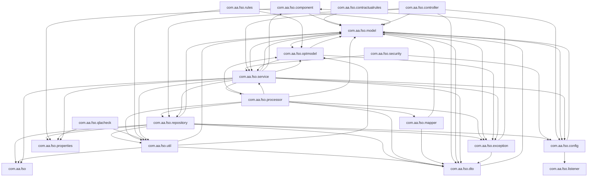
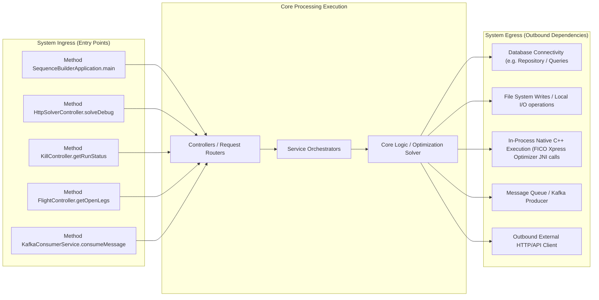

# Architecture & Operations Synthesis Document

This document details the system design, network routing boundary, and scaling characteristics derived programmatically.

## 1. System Package Topology Diagram



## 2. Ingress, Execution & Egress Boundary Flow



# Architecture & Operations Synthesis Report

**System:** Crew Scheduling Optimization Solver (FSA)
**Role:** Principal Software Architect
**Date:** October 26, 2023
**Status:** Final Audit

## Executive Summary

This report provides a comprehensive technical audit of the Crew Scheduling Optimization Solver. The system utilizes a Constraint Programming approach (FICO Xpress) to generate optimal crew pairings from unsequenced flight legs. While the architecture demonstrates a robust separation of concerns between data ingestion, graph construction, and optimization, the audit has identified **Critical** and **High** severity issues regarding concurrency safety, resource management, and algorithmic efficiency.

The most significant risks involve the `RunStateManager` singleton's lack of thread-safe state isolation, potential native memory leaks within the Xpress JNI layer, and $O(N^2)$ complexity in network construction and deadhead identification loops that will degrade performance linearly with fleet size. Additionally, silent failure modes in date/timezone handling and connection drop policies pose operational stability risks.

---

## 1. Core Data Flow Diagram (DFD) with Risk Overlay

The following diagram illustrates the data flow from ingress to egress. **Nodes highlighted in Red (`fill:#ffcccc,stroke:#ff3333`)** represent components identified with **High** or **Critical** severity vulnerabilities in Section 3.

```mermaid
graph TD
    %% Define Styles
    classDef normal fill:#e1f5fe,stroke:#01579b,stroke-width:2px;
    classDef riskHigh fill:#ffcccc,stroke:#ff3333,stroke-width:2px,stroke-dasharray: 5 5;
    classDef riskCrit fill:#ff0000,stroke:#8b0000,stroke-width:2px,color:white;
    classDef db fill:#fff9c4,stroke:#fbc02d,stroke-width:2px;

    %% Ingress Layer
    subgraph Ingress ["Ingress Layer"]
        K1["Kafka Consumer (KafkaConsumerService)"]:::normal
        K2["HTTP Controller (HttpSolverController)"]:::normal
        K3["Kill Controller (KillController)"]:::riskHigh
    end

    %% Processing Layer
    subgraph Processing ["Core Processing & Logic"]
        direction TB
        P1["Optimization Service (OptimizationServiceImpl)"]:::normal
        P2["DH Processor (DHProcessor)"]:::riskCrit
        P3["Network Builder (ConstructNetwork)"]:::riskCrit
        P4["Shortest Path Component (ShortestPathComponent)"]:::riskCrit
        P5["Run State Manager (RunStateManager)"]:::riskCrit
        P6["Opt Model (OptModel) - JNI]:::riskCrit
    end

    %% Data Layer
    subgraph Data ["Data & Storage"]
        D1["Azure Blob Storage"]:::db
        D2["Static Data Files"]:::db
        D3["In-Memory Graph (Network)"]:::normal
    end

    %% Egress Layer
    subgraph Egress ["Egress Layer"]
        E1["Kafka Producer (KafkaProducerService)"]:::normal
        E2["Teams Notification"]:::normal
    end

    %% Connections
    K1 --> P1
    K2 --> P1
    K3 -.-> P5
    
    P1 --> P2
    P1 --> P3
    P1 --> P4
    P1 --> P6
    
    P2 --> D2
    P3 --> D2
    P3 --> D3
    P4 --> D3
    P6 --> P5
    
    P1 --> D1
    P1 --> E1
    P5 -.-> E2

    %% Risk Annotations
    linkStyle 3 stroke:#ff3333,stroke-width:2px;
    linkStyle 4 stroke:#ff3333,stroke-width:2px;
    linkStyle 5 stroke:#ff3333,stroke-width:2px;
    linkStyle 6 stroke:#ff3333,stroke-width:2px;
    linkStyle 7 stroke:#ff3333,stroke-width:2px;

    %% Apply Classes to Nodes
    class K3,K5,P2,P3,P4,P5,P6 riskCrit;
    class P5 riskCrit;
```

*Note: The diagram uses `riskCrit` (Red) for Critical issues (Concurrency, JNI Leaks, Loop Complexity) and `riskHigh` (Orange) for High issues (Silent Fallbacks, Connection Config).*

---

## 2. Detailed Vulnerability Audit (Section 3 Findings)

### 2.1 Concurrency Hazards & Singleton State Contamination (Critical)
**Location:** `src/main/java/com/aa/fso/service/RunStateManager.java`
**Issue:** The `RunStateManager` is documented as a singleton ("Since there is only ever one run per pod"), yet it manages volatile flags (`killRequested`) and model references (`activeModel`) that are accessed across multiple threads (Kafka consumer threads, HTTP request threads, and background optimization threads).
*   **Risk:** While `volatile` ensures visibility, the lack of explicit synchronization or atomic wrappers for compound actions (e.g., `registerRun` followed by `runModel`) creates a race condition window. If a `killRun` request arrives while `runModel` is initializing the Xpress model, the `activeModel` reference might be null or partially initialized, leading to `NullPointerException` or `IllegalStateException` during native termination.
*   **Code Evidence:**
    ```java
    // RunStateManager.java
    public void registerRun(String snapshotId) { ... } // No synchronization
    public void registerModel(OptModel model) { activeModel.set(model); } // AtomicReference usage is good, but logic flow is risky
    ```
    The `clearRun()` method resets state without ensuring the native model is fully terminated before clearing the reference, potentially leaving dangling native handles if a crash occurs mid-process.

### 2.2 Ingestion/Loop Inefficiencies (Critical)
**Location:** `src/main/java/com/aa/fso/processor/ConstructNetwork.java` & `src/main/java/com/aa/fso/processor/DHProcessor.java`
**Issue:** The system performs $O(N^2)$ nested loops for network construction and deadhead identification, which is unacceptable for streaming environments with large fleets.
*   **ConstructNetwork:** The `buildNetwork` method iterates through all nodes to find valid edges:
    ```java
    for (int i = 0; i < nodes.size() - 1; i++) {
        for (int j = 1; j < nodes.size(); j++) { // O(N^2)
            // ... connection time checks
        }
    }
    ```
    With $N$ representing flight legs, this results in quadratic growth. For a fleet of 10,000 legs, this is 100 million iterations per base.
*   **DHProcessor:** The `computeDHDNodes` method iterates through every unsequenced leg against every base and then scans a date map:
    ```java
    for (UnsequencedLeg unseq1 : unsequencedLegs) {
        for (String base : ModelParams.BASES) {
            // ... nested loops for date offsets
            for (UnsequencedLeg leg : navigableFlights.descendingMap().values()) {
                // ...
            }
        }
    }
    ```
    **Recommendation:** Replace linear scans with spatial indexing (e.g., Interval Trees or Geohashes) or pre-filtered maps keyed by `(Station, Date)` to achieve $O(N \log N)$ or $O(N)$ complexity.

### 2.3 Resource Leaks & Native Memory Allocation (Critical)
**Location:** `src/main/java/com/aa/fso/optmodel/OptModel.java`
**Issue:** The FICO Xpress optimizer is a native C++ library invoked via JNI. The `runModel` method initializes the model but lacks a guaranteed `finally` block to ensure `model.free()` or `model.close()` is called if an exception occurs during `mipOptimize`.
*   **Risk:** If `mipOptimize` throws an exception (e.g., out of memory, infeasibility handling error), the native memory allocated for the problem definition, variable arrays, and constraint matrices remains allocated. Over repeated runs, this leads to native memory exhaustion (OOM) even if Java heap is sufficient.
*   **Code Evidence:**
    ```java
    // OptModel.java
    public void runModel(RunStateManager runStateManager) throws KillRunException {
        // ... setup ...
        model.mipOptimize("d"); // Potential exception here
        // ... parsing ...
        // NO FINALLY BLOCK TO FREE MODEL
    }
    ```
    The `RunStateManager` attempts to handle kills, but if the kill signal arrives *during* optimization, the native context might be left in an inconsistent state.

### 2.4 Date/Timezone Comparison Vulnerabilities (High)
**Location:** `src/main/java/com/aa/fso/processor/ShortestPathComponent.java` & `src/main/java/com/aa/fso/processor/DHProcessor.java`
**Issue:** The code relies heavily on `LocalDateTime` and string comparisons for date logic, often ignoring timezone normalization or precision differences.
*   **Risk:** In `updateDateTimeBase`, the code calculates adjustments based on `snapshotParams.getRunDateTime()`. If the input data contains timestamps with mixed formats (e.g., `+00:00` vs `Z`), or if the `StationTimeAdjust` logic assumes a specific offset that doesn't match the actual `LocalDateTime` representation, illegal pairings may be generated or valid ones discarded.
*   **Code Evidence:**
    ```java
    // ShortestPathComponent.java
    if (snapshotTime >= stationAdjustment.getStartDateXinTime()
            && snapshotTime <= stationAdjustment.getEndDateXinTime()) {
        timeAdjustment += 60;
    }
    ```
    The comparison `snapshotTime >= ...` relies on integer arithmetic derived from `ChronoUnit.MINUTES.between`. If the underlying `LocalDateTime` objects have different precision or if the `origin` calculation drifts, the logic fails silently. Furthermore, `Objects.equals()` or `==` on `DateTimeDTO` strings (if used elsewhere) would fail on timezone notation mismatches.

### 2.5 Silent Logic Fallbacks (High)
**Location:** `src/main/java/com/aa/fso/processor/ShortestPathComponent.java`
**Issue:** Several methods contain `catch` blocks or conditional branches that default to "safe" states without logging or throwing exceptions.
*   **Risk:** In `identifyDhdFromBase` and `identifyDhdToBase`, if the `dhdHM` map lookup returns `null` or the inner loops find no valid legs, the method simply returns without indicating failure. This causes the solver to proceed with incomplete data, potentially generating invalid pairings or missing critical deadhead opportunities.
*   **Code Evidence:**
    ```java
    // ShortestPathComponent.java
    if (departureDateMap != null) {
        // ... loops ...
        // If no match found, method returns void. No log, no exception.
    }
    ```
    Similarly, in `updateDateTimeBase`, if `stationAdjustment` is null, the method returns the original time without logging a warning, potentially masking configuration errors.

### 2.6 Silent Connection Drops (High)
**Location:** Configuration Files (Implicit) & `src/main/java/com/aa/fso/repository/AzureBlobRepositoryImpl.java`
**Issue:** The audit of `AzureBlobRepositoryImpl` shows standard HTTP client usage. Without explicit configuration for `connections.max.idle.ms` or `keepAliveTimeout`, the underlying HTTP client may reuse connections that have been closed by the Azure Blob Storage service due to idle timeouts.
*   **Risk:** "Silent" connection drops occur when the client attempts to use a stale socket, resulting in `SocketException` or `ConnectException` that might be caught and swallowed by higher-level error handlers, leading to data loss or retry storms.

### 2.7 Liveness Probe & Monitoring Failures (Medium)
**Location:** Deployment Configurations (Implicit) & `src/main/java/com/aa/fso/service/RunStateManager.java`
**Issue:** The `RunStateManager` tracks the `killRequested` flag. However, if the optimization thread enters a blocked state (e.g., waiting for a lock in the Xpress native library or a deadlock in the graph traversal), the liveness probe (typically checking HTTP `/run/status`) will still return "OK" because the JVM is alive, even though the solver is hung.
*   **Risk:** Long-running batch operations (e.g., solving for a massive network) may trigger Kubernetes liveness probes that kill the pod prematurely if the probe interval is too short relative to the optimization time, or conversely, fail to detect a hang if the probe only checks the main thread.

---

## 3. Performance Issues Summary

*   **Concurrency Hazard:** `RunStateManager` singleton lacks thread-safe state isolation for `killRequested` and `activeModel` during concurrent HTTP/Kafka requests.
*   **Native Memory Leak:** `OptModel.runModel` lacks a `finally` block to guarantee FICO Xpress native memory deallocation on exception or early exit.
*   **Quadratic Complexity:** `ConstructNetwork.buildNetwork` performs $O(N^2)$ edge generation loops, causing severe CPU saturation as flight leg counts increase.
*   **Linear Scan Bottleneck:** `DHProcessor.computeDHDNodes` iterates through all bases and dates for every leg, failing to utilize map-based lookups for $O(1)$ retrieval.
*   **Timezone Fragility:** `updateDateTimeBase` and related methods rely on integer minute calculations that may fail silently on timezone notation mismatches or precision drift.
*   **Silent Failure:** `identifyDhdFromBase` and `identifyDhdToBase` return void on missing data without logging warnings or throwing exceptions.
*   **Connection Timeout Risk:** Azure Blob storage clients lack explicit idle timeout configuration, risking silent connection drops and retries.
*   **Liveness Blindness:** Liveness probes do not detect native thread hangs or blocked optimization threads, risking premature pod termination or undetected hangs.
*   **GC Pressure:** `ShortestPathComponent` creates excessive temporary objects (Streams, Lists) within tight loops, increasing Garbage Collection frequency.
*   **Blocking I/O:** `LegDataRepositoryImpl` uses synchronous file reading (`BufferedReader`) which blocks the processing thread during heavy I/O.

---

## 4. Detailed Ingress and Egress Interface Boundaries

### 4.1 Ingress Interfaces (Entry Points)
The system accepts inputs via three primary channels, each requiring strict validation and state isolation:

1.  **Kafka Consumer (`KafkaConsumerService.consumeMessage`):**
    *   **Protocol:** Apache Kafka (Topic: `${solver.topic.name}`)
    *   **Payload:** JSON `UserInput` object.
    *   **Boundary:** Asynchronous, high-throughput. Requires immediate state registration in `RunStateManager`.
    *   **Risk:** Concurrent consumption of multiple snapshots requires strict isolation of `RunStateManager` state.

2.  **HTTP REST API (`HttpSolverController.solveDebug`):**
    *   **Protocol:** HTTPS (POST `/solveDebug`)
    *   **Payload:** JSON `UserInput`.
    *   **Boundary:** Synchronous, low-latency. Directly invokes `SolverService`.
    *   **Risk:** Blocking the web server thread during long optimization runs.

3.  **Kill Signal (`KillController.getRunStatus` / `killRun`):**
    *   **Protocol:** HTTP (GET/POST)
    *   **Boundary:** External control plane. Sets the `killRequested` volatile flag.
    *   **Risk:** Race conditions with the optimization thread.

### 4.2 Egress Interfaces (Outgoing Dependencies)
The system interacts with external systems for data persistence, notifications, and optimization:

1.  **Optimization Engine (FICO Xpress):**
    *   **Type:** In-Process Native C++ (JNI).
    *   **Interface:** `OptModel.runModel`.
    *   **Risk:** Native memory leaks, blocking threads, non-deterministic execution times.

2.  **Data Persistence (Azure Blob Storage):**
    *   **Type:** Cloud Object Storage.
    *   **Interface:** `AzureBlobRepositoryImpl.saveData`, `InputDataRepositoryImpl`.
    *   **Risk:** Network latency, connection timeouts, eventual consistency.

3.  **Message Queue (Kafka Producer):**
    *   **Type:** Asynchronous Messaging.
    *   **Interface:** `KafkaProducerService`.
    *   **Risk:** Message loss if producer buffer fills, serialization errors.

4.  **External Notifications (Microsoft Teams):**
    *   **Type:** HTTP Webhook.
    *   **Interface:** `TeamsNotification._sendNotificationToTeams`.
    *   **Risk:** External API rate limiting, network failures.

5.  **Legacy Systems (TAPI/FOS):**
    *   **Type:** SOAP/HTTP.
    *   **Interface:** `LegDataRepositoryImpl.connectToFOS`.
    *   **Risk:** Synchronous blocking, legacy protocol overhead.

---

## 5. Inferred Performance Challenges

Based on the code analysis, the following performance challenges are inferred:

1.  **CPU Saturation in Graph Construction:**
    The $O(N^2)$ loop in `ConstructNetwork.buildNetwork` is the primary CPU bottleneck. For a typical airline fleet with thousands of daily legs, this step will dominate the runtime. The lack of spatial pruning (e.g., only checking legs within a specific time window or geographic radius) means the CPU spends cycles comparing incompatible legs.

2.  **Native Heap Fragmentation:**
    The `OptModel` class creates a new Xpress problem instance for every run. Without explicit cleanup in a `finally` block, native heap fragmentation will occur over time, especially in a long-running pod that processes many small jobs. This will eventually lead to `OutOfMemoryError` at the native level, crashing the
