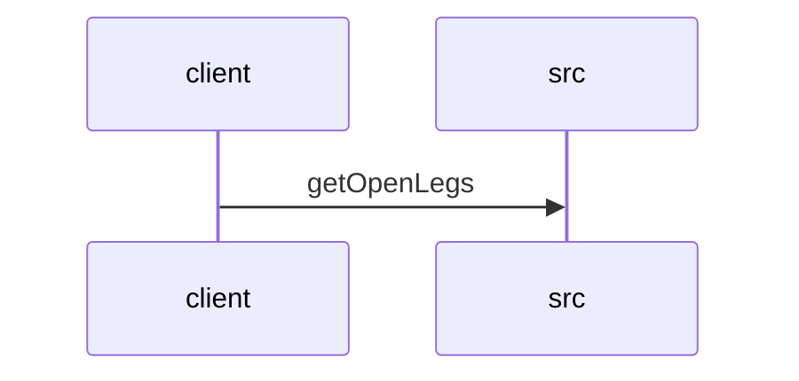

# Feature Walkthrough: Method `FlightController.getOpenLegs`

This document provides a detailed execution walk of the feature flow.

## 1. Sequence Execution Diagram

## 2. Walkthrough Explanation & Narrative

### Execution Trace Narration: FlightController.getOpenLegs

**Overview**
The execution begins at the `FlightController` entry point, specifically the `getOpenLegs` method located in `src/main/java/com/aa/fso/controller/FlightController.java`. This endpoint is designed to retrieve a list of unsequenced flight legs based on a specified date range and filtering criteria for positions and equipment.

**Execution Path and Data Mutations**
Upon receiving the HTTP GET request to `/openLegs`, the controller extracts four query parameters: `sDate_start`, `sDate_end`, `positions`, and `equipment` [src/main/java/com/aa/fso/controller/FlightController.java:10-13]. The method first logs an informational message indicating the initiation of the "Open Legs API" operation [src/main/java/com/aa/fso/controller/FlightController.java:14].

Subsequently, the raw string inputs representing the start and end dates (`sDate_start` and `sDate_end`) undergo a critical transformation. They are parsed from their string representation into `LocalDate` objects using `LocalDate.parse()`. This step ensures that the subsequent repository logic operates on standardized temporal data types rather than raw strings [src/main/java/com/aa/fso/controller/FlightController.java:15-16]. No conditional branching occurs within this specific snippet; the flow proceeds linearly to the data retrieval phase.

**Data Retrieval and Return Logic**
With the parameters prepared, the controller delegates the core business logic to the `legDataRepository`. It invokes the `getOpenLegs` method on the repository instance, passing the parsed `date_start`, `date_end`, and the original lists for `positions` and `equipment` as arguments [src/main/java/com/aa/fso/controller/FlightController.java:17].

The repository processes these filters and returns a `List<UnsequencedLeg>` containing the matching flight legs. The controller then wraps this result in a standard Spring `ResponseEntity`. The response is constructed with the retrieved list as the body and the HTTP status code set to `OK` (200) [src/main/java/com/aa/fso/controller/FlightController.java:18]. Finally, this `ResponseEntity` is returned to the client, concluding the execution trace.

**Final Output**
The method returns a `ResponseEntity` object containing:
*   **Body**: A `List<UnsequencedLeg>` filtered by the provided date range, positions, and equipment.
*   **Status**: `200 OK`.
