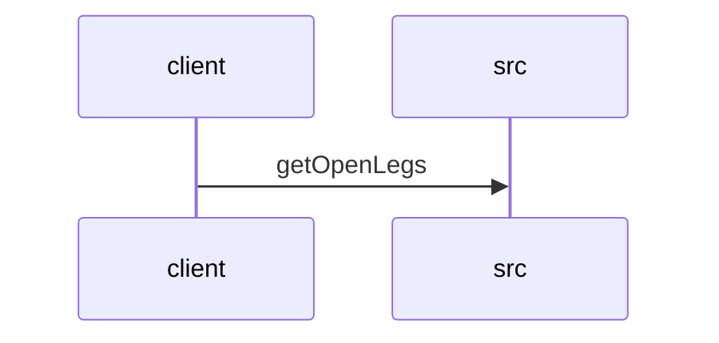

# Feature Walkthrough: Method `FlightController.getOpenLegs`

This document provides a detailed execution walk of the feature flow.

## 1. Sequence Execution Diagram

## 2. Walkthrough Explanation & Narrative

### Execution Trace Narration: FlightController.getOpenLegs

**Overview**
The execution begins at the `FlightController` entry point, specifically the `getOpenLegs` method located in `src/main/java/com/aa/fso/controller/FlightController.java`. This endpoint is mapped to the HTTP GET path `/openLegs` and serves as the interface for retrieving unsequenced flight legs based on specific temporal and operational criteria.

**Execution Path and Data Mutations**
Upon receiving the request, the controller first logs the initiation of the operation via `log.info("Started Open Legs API")`, establishing an audit trail for the API invocation. The method then processes the incoming query parameters to ensure type safety and domain validity. Specifically, the string-based date inputs (`sDate_start` and `sDate_end`) are parsed into `LocalDate` objects using `LocalDate.parse()`. This transformation is critical, as it converts raw HTTP strings into structured Java time objects required by the underlying data layer. The `positions` and `equipment` lists are passed directly as `List<String>` without modification, preserving the filtering criteria provided by the client.

**Conditional Logic and Data Retrieval**
No explicit conditional branching (e.g., `if/else` statements) is present within the controller logic itself; the flow proceeds linearly to the data access layer. The core business logic is delegated to the `legDataRepository`. The controller invokes `legDataRepository.getOpenLegs()`, passing the parsed `date_start`, `date_end`, `positions`, and `equipment` arguments. This repository method acts as the gatekeeper, executing the necessary database queries to filter legs that match the specified date range and equipment constraints.

**Final Return Output**
Once the repository returns the list of `UnsequencedLeg` objects, the controller encapsulates this result within a `ResponseEntity`. The response is constructed with an HTTP status code of `OK` (200) and the retrieved list as the body. This object is immediately returned to the client, concluding the execution trace.

**Source Reference**
The implementation details described above correspond to the following code segment:
[src/main/java/com/aa/fso/controller/FlightController.java:1-13]
