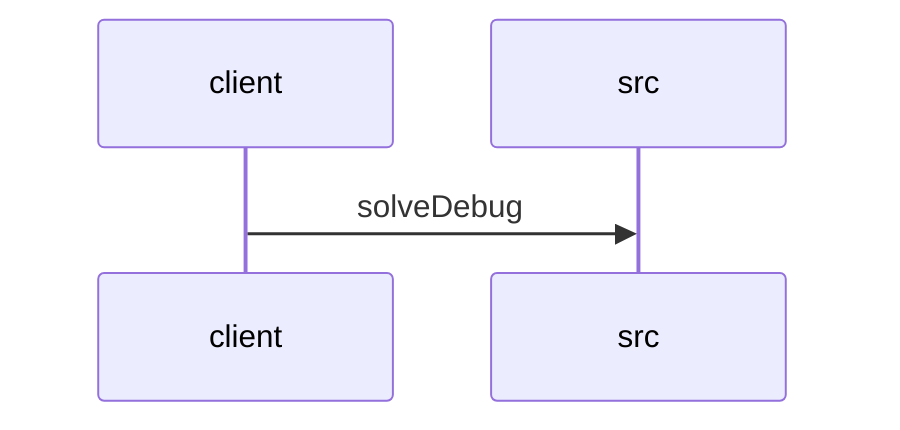

# Feature Walkthrough: Method `HttpSolverController.solveDebug`

This document provides a detailed execution walk of the feature flow.

## 1. Sequence Execution Diagram

## 2. Walkthrough Explanation & Narrative

### Execution Trace Narration: Debug Solver Endpoint

**Overview**
The execution begins at the entry point `HttpSolverController.solveDebug`, located in `src/main/java/com/aa/fso/controller/HttpSolverController.java`. This endpoint is designed to expose a debug interface that triggers the core solver logic using manually provided `UserInput` data, mimicking the behavior of the standard event-driven solver pipeline.

**Execution Path and Data Flow**
Upon receiving an HTTP POST request at the `/solveDebug` path, the controller extracts the `UserInput` object from the request body. The method then enters a `try` block to ensure robust error handling and resource cleanup.

Inside the `try` block, the primary business logic is invoked via `solverService.solve(userInput)` on line 14. This call delegates the computational heavy lifting to the `SolverService`, which processes the input and returns a `SolverResponseDTO` containing the solver's results. The controller subsequently extracts the solution list from this response object using `.getSolutions()` and wraps it in a successful `ResponseEntity` with an HTTP 200 OK status before returning it to the client.

**Conditionals and Exception Handling**
While the provided snippet does not contain explicit `if` or `else` conditionals within the visible scope, the control flow relies on the implicit exception handling mechanism of the `try-finally` construct. If any exception occurs during the execution of `solverService.solve()`, the normal return path is bypassed, but the `finally` block ensures that cleanup operations are still performed.

**State Mutations and Cleanup**
A critical side effect of this execution is the state management handled in the `finally` block (lines 17-18). Regardless of whether the solver execution succeeds or throws an exception, the method guarantees the execution of `runStateManager.clearRun()`. This mutation ensures that any transient runtime state associated with the current solver session is cleared immediately after the request processing concludes, preventing state leakage between requests.

**Final Return Output**
The method ultimately returns a `ResponseEntity<List<OutputData>>`. On success, this object contains the list of `OutputData` objects generated by the solver. If an unhandled exception occurs prior to the return statement, the framework will handle the error response, though the `finally` block will still execute the state clear operation.

**Citations**
*   **Endpoint Definition & Logic**: `src/main/java/com/aa/fso/controller/HttpSolverController.java:L10-25`
*   **Service Invocation**: `src/main/java/com/aa/fso/controller/HttpSolverController.java:L14`
*   **Response Construction**: `src/main/java/com/aa/fso/controller/HttpSolverController.java:L15`
*   **State Cleanup**: `src/main/java/com/aa/fso/controller/HttpSolverController.java:L17-18`
