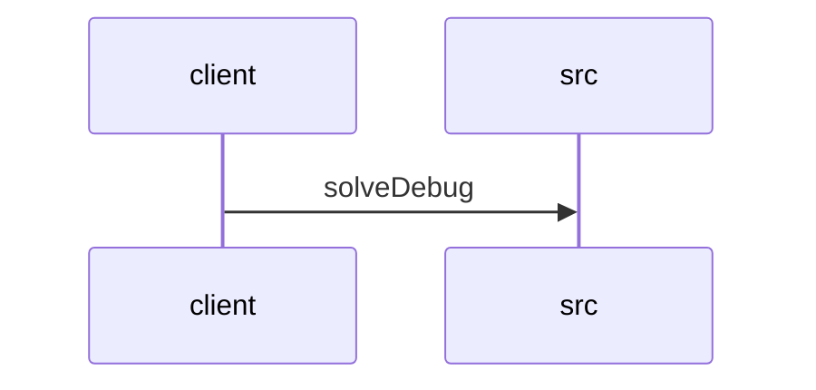

# Feature Walkthrough: Method `HttpSolverController.solveDebug`

This document provides a detailed execution walk of the feature flow.

## 1. Sequence Execution Diagram

## 2. Walkthrough Explanation & Narrative

### Execution Trace Narration: Debug Solver Endpoint

**Overview**
The execution begins at the entry point `HttpSolverController.solveDebug`, located in `src/main/java/com/aa/fso/controller/HttpSolverController.java`. This endpoint is designed to invoke the solver logic using manually provided `UserInput` data, mimicking the behavior of the standard event-driven solver trigger. The method is mapped to the POST path `/solveDebug` and is annotated with OpenAPI documentation to describe its purpose.

**Execution Path and Data Flow**
Upon receiving a request, the controller extracts the `UserInput` object from the request body. The control flow immediately enters the `try` block defined in lines 14–19 [src/main/java/com/aa/fso/controller/HttpSolverController.java:L14-19]. Inside this block, the primary business logic is delegated to the `solverService` via the `solve` method. This service call processes the input and returns a `SolverResponseDTO` object, which encapsulates the solver's results.

**Conditional Logic and Mutations**
The code snippet does not contain explicit conditional branching (e.g., `if` statements) within the active execution path; instead, it relies on the internal logic of the `solverService` to determine success or failure. A commented-out line (line 16) indicates an alternative implementation path using a local JSON file (`solveWithLocalJsonFile`), but this branch is currently inactive and does not affect the current execution state.

The critical mutation occurs within the `finally` block (lines 20–22). Regardless of whether the `solve` operation succeeds or throws an exception, the `runStateManager.clearRun()` method is invoked. This ensures that any transient state associated with the current solver run is reset, maintaining system cleanliness and preventing state leakage between requests.

**Final Return Output**
If the `solverService.solve` call completes successfully, the method extracts the list of solutions from the `SolverResponseDTO` by calling `getSolutions()`. This list is then wrapped in a `ResponseEntity` with an HTTP 200 OK status and returned to the client. If an exception were to occur during the service call, the `finally` block would still execute to clear the state before the exception propagates up the stack, resulting in an error response rather than a successful data payload.

**Summary of Execution**
1.  **Request Ingestion**: `POST /solveDebug` receives `UserInput`.
2.  **Processing**: `solverService.solve()` executes, generating `SolverResponseDTO`.
3.  **Cleanup**: `runStateManager.clearRun()` executes unconditionally in the `finally` block.
4.  **Response**: Returns `List<OutputData>` containing the solver solutions.
