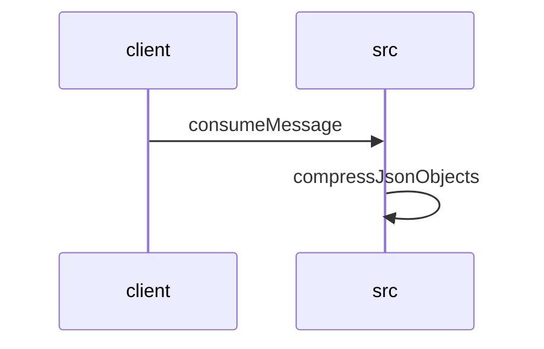

# Feature Walkthrough: Method `KafkaConsumerService.consumeMessage`

This document provides a detailed execution walk of the feature flow.

## 1. Sequence Execution Diagram

## 2. Walkthrough Explanation & Narrative

### Execution Trace Narration: `KafkaConsumerService.consumeMessage`

The following analysis details the execution flow, data transformations, and conditional logic within the `consumeMessage` method of `KafkaConsumerService`, including its downstream interaction with `CompressUtil`.

#### 1. Message Ingestion and Initialization
The process initiates at **`src/main/java/com/aa/fso/service/kafka/consumer/KafkaConsumerService.java:10-15`**. Upon receiving a `ConsumerRecord`, the system immediately acknowledges the message via `ack.acknowledge()` to ensure at-least-once delivery semantics are handled correctly by the Kafka consumer group. The payload (`record.value()`) is extracted and logged with context regarding the source topic and message key.

#### 2. Deserialization and Input Validation
At **`src/main/java/com/aa/fso/service/kafka/consumer/KafkaConsumerService.java:17-24`**, the raw object payload is deserialized into a strongly typed `UserInput` object using Jackson's `ObjectMapper`. A critical validation step follows immediately:
*   The code checks if `userInput.getSnapshotIds()` is neither null nor empty.
*   **Condition Met**: If valid, the first element of the list is assigned to `itSnapshotID`.
*   **Condition Failed**: If the list is empty or null, an `InvalidUserInputException` is thrown with the message "SnapshotIds is empty," halting further processing for that specific record.

#### 3. Core Logic and Compression Pipeline
Once validation passes, the system proceeds to **`src/main/java/com/aa/fso/service/kafka/consumer/KafkaConsumerService.java:26-35`**:
1.  **Solver Invocation**: The `solverService.solve(userInput)` method is called, returning a `SolverResponseDTO`.
2.  **Data Extraction**: The solutions list is retrieved from the response and copied into a local `ArrayList` named `solutions`.
3.  **Compression Trigger**: The `CompressUtil.compressJsonObjects` utility is invoked with the solutions list.

**Deep Dive: Compression Logic**
Inside **`src/main/java/com/aa/fso/util/CompressUtil.java:10-22`**, the following transformations occur:
*   The list of solution objects is serialized into a single JSON string representation.
*   This string is converted to a UTF-8 byte array.
*   A `GZIPOutputStream` wraps a `ByteArrayOutputStream` to perform on-the-fly compression.
*   The resulting compressed byte array is returned to the caller.

#### 4. Event Publishing and Resource Management
Returning to the main service flow at **`src/main/java/com/aa/fso/service/kafka/consumer/KafkaConsumerService.java:36-39`**:
*   The compressed byte array is published as an event via `publishSolverByteResponseEvent`, tagged with the `itSnapshotID`.
*   To optimize memory usage and prepare for Garbage Collection (GC), the local `solutions` list is explicitly cleared.

#### 5. Exception Handling and Cleanup
The execution path includes robust error handling:
*   **Graceful Termination**: If a `KillRunException` is caught (**`src/main/java/com/aa/fso/service/kafka/consumer/KafkaConsumerService.java:41-44`**), the system logs the termination reason and triggers a notification to the team via `teamsNotification.sendApplicationKilledNotification`.
*   **General Errors**: Any other exception triggers an error log entry without interrupting the flow further than logging.
*   **Finalization**: Regardless of success or failure, the `finally` block at **`src/main/java/com/aa/fso/service/kafka/consumer/KafkaConsumerService.java:46-48`** ensures `runStateManager.clearRun()` is executed, resetting the state machine for the next incoming message.

### Final Output Summary
The feature successfully consumes a Kafka message, validates the presence of a snapshot ID, processes the request through the solver engine, compresses the resulting solution set using GZIP, and publishes the binary payload. The method concludes by ensuring all transient states are cleared and notifications are sent in the event of a forced kill.
