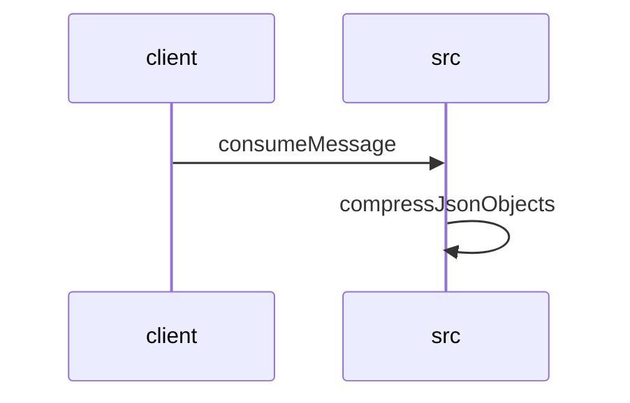

# Feature Walkthrough: Method `KafkaConsumerService.consumeMessage`

This document provides a detailed execution walk of the feature flow.

## 1. Sequence Execution Diagram

## 2. Walkthrough Explanation & Narrative

### Execution Trace Narration: Kafka Message Consumption and Solver Response Compression

The following analysis details the execution flow initiated by the `KafkaConsumerService.consumeMessage` method, tracing the processing of incoming messages, validation logic, solver invocation, and the subsequent compression of results.

#### 1. Message Ingestion and Initialization
The process begins at **`src/main/java/com/aa/fso/service/kafka/consumer/KafkaConsumerService.java:10-15`**, where the `consumeMessage` method is triggered by the Kafka listener container. Upon receipt of a `ConsumerRecord`, the system immediately acknowledges the message via `ack.acknowledge()` to ensure at-least-once delivery semantics are handled correctly before any business logic executes. The raw payload (`record.value()`) is extracted and logged with metadata including the topic name, request content, and message key.

#### 2. Deserialization and Snapshot Validation
At **`src/main/java/com/aa/fso/service/kafka/consumer/KafkaConsumerService.java:17-23`**, an `ObjectMapper` instance is instantiated to deserialize the raw object into a strongly typed `UserInput` DTO. A critical validation step follows immediately. The code checks if the `snapshotIds` list within the `UserInput` object is neither null nor empty.
*   **Condition Check**: If `userInput.getSnapshotIds()` contains elements, the first element is assigned to the variable `itSnapshotID`.
*   **Failure Path**: If the list is empty or null, an `InvalidUserInputException` is thrown with the specific error message "SnapshotIds is empty". This ensures downstream processes only proceed with valid identifiers.

#### 3. Solver Invocation and Solution Processing
Once validation passes, the system logs the parsed `userInput` and invokes the `solverService.solve(userInput)` method at **`src/main/java/com/aa/fso/service/kafka/consumer/KafkaConsumerService.java:29`**. This returns a `SolverResponseDTO` containing a list of potential solutions.
*   The solutions are copied into a new `ArrayList` named `solutions` to facilitate logging and further manipulation.
*   The system logs the count of generated solutions relative to the `itSnapshotID`.

#### 4. Data Compression and Event Publishing
Before publishing, the raw solution objects undergo compression to optimize network transmission.
*   **Compression Logic**: The `CompressUtil.compressJsonObjects` method is called at **`src/main/java/com/aa/fso/service/kafka/consumer/KafkaConsumerService.java:33`**.
    *   Inside **`src/main/java/com/aa/fso/util/CompressUtil.java:6-14`**, the list of objects is serialized into a single JSON string using `ObjectMapper.writeValueAsString`.
    *   This JSON string is then written to a `ByteArrayOutputStream` wrapped in a `GZIPOutputStream` (**`src/main/java/com/aa/fso/util/CompressUtil.java:10-12`**).
    *   The resulting compressed byte array is returned.
*   **Publishing**: The compressed byte array is passed to `publishSolverByteResponseEvent` along with the `itSnapshotID`. The length of the compressed payload is logged for performance monitoring.

#### 5. Resource Management and Error Handling
The execution flow includes robust error handling and resource cleanup:
*   **Graceful Termination**: If a `KillRunException` occurs, the system logs the event, sends a notification via `teamsNotification`, and prevents further processing.
*   **General Errors**: Any other exception triggers an error-level log entry without interrupting the flow immediately, allowing the `finally` block to execute.
*   **Cleanup**: Regardless of success or failure, the `finally` block at **`src/main/java/com/aa/fso/service/kafka/consumer/KafkaConsumerService.java:48`** calls `runStateManager.clearRun()` to reset the state. Additionally, the local `solutions` list is explicitly cleared at **`src/main/java/com/aa/fso/service/kafka/consumer/KafkaConsumerService.java:36`** to assist the Garbage Collector in reclaiming memory for large datasets.

#### Final Output
The method concludes by returning `void` after successfully publishing the compressed solver response event or handling exceptions gracefully. The primary side effect is the persistence of the compressed solution data via the `publishSolverByteResponseEvent` mechanism, ready for downstream consumption.
