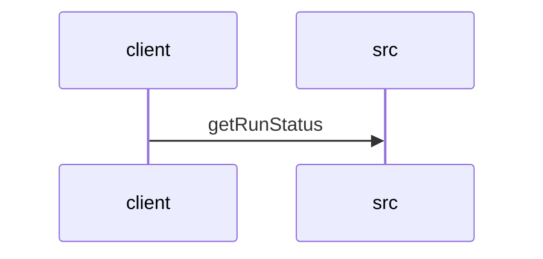

# Feature Walkthrough: Method `KillController.getRunStatus`

This document provides a detailed execution walk of the feature flow.

## 1. Sequence Execution Diagram

## 2. Walkthrough Explanation & Narrative

### Execution Trace Narration: `KillController.getRunStatus`

**Overview**
The execution begins at the entry point `KillController.getRunStatus`, located in `src/main/java/com/aa/fso/controller/KillController.java`. This endpoint is mapped to the HTTP GET request `/run/status` and serves as the primary interface for retrieving the current state of the active solver run. The method's logic hinges on the existence of a valid snapshot ID within the `runStateManager`.

**Execution Path & Data Flow**
Upon invocation, the controller first queries the `runStateManager` to retrieve the identifier of the currently active snapshot by calling `runStateManager.getCurrentSnapshotId()` [KillController.java:18]. The result of this call is assigned to the local variable `currentId`.

The control flow then proceeds to a conditional check to determine if `currentId` is non-null [KillController.java:19]. This branch dictates the subsequent data retrieval and response construction:

1.  **Active Run Scenario (`currentId != null`)**:
    If a valid snapshot ID exists, the system confirms an active run is in progress. The method immediately invokes `runStateManager.isKillRequested()` to ascertain the kill status [KillController.java:20]. It then constructs a composite string containing both the active snapshot ID and the boolean result of the kill request. This string is wrapped in a `ResponseEntity` with an HTTP 200 OK status and returned to the client [KillController.java:21].

2.  **Inactive Run Scenario (`currentId == null`)**:
    If `currentId` evaluates to null, indicating no active solver instance is running, the conditional block is skipped. The execution flows directly to the fallback return statement [KillController.java:23], which returns a `ResponseEntity` with an HTTP 200 OK status and the message "No active run".

**Final Output**
The method concludes by returning a JSON-compatible string payload within an HTTP 200 response. The specific output depends entirely on the state of the `runStateManager`:
*   **Format A**: `"Active run: <snapshot_id>, Kill requested: <true|false>"` when a run is active.
*   **Format B**: `"No active run"` when no run is currently tracked.

This design ensures the API provides immediate, deterministic feedback regarding the solver's lifecycle status without requiring additional database lookups or complex error handling for missing states.
