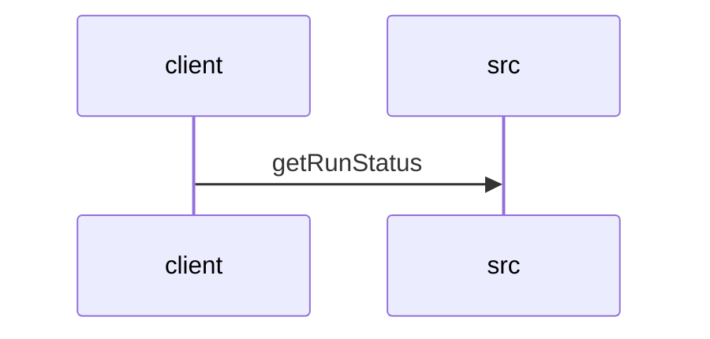

# Feature Walkthrough: Method `KillController.getRunStatus`

This document provides a detailed execution walk of the feature flow.

## 1. Sequence Execution Diagram

## 2. Walkthrough Explanation & Narrative

### Execution Trace Narration: `KillController.getRunStatus`

**Overview**
The execution begins at the entry point `KillController.getRunStatus`, located in `src/main/java/com/aa/fso/controller/KillController.java`. This endpoint is mapped to the HTTP GET request `/run/status` and serves as the primary interface for retrieving the current state of an active solver run. The method orchestrates a check against the `runStateManager` to determine if a run is currently active and whether a termination signal has been issued.

**Execution Path and Logic Flow**

1.  **State Retrieval**:
    Upon invocation, the method immediately queries the `runStateManager` instance by calling `getCurrentSnapshotId()` [KillController.java:13]. This operation attempts to fetch the unique identifier associated with the currently executing solver process. The result is assigned to the local variable `currentId`.

2.  **Conditional Evaluation**:
    The control flow proceeds to a conditional check evaluating the nullity of `currentId` [KillController.java:14].
    *   **Branch A (Active Run)**: If `currentId` is not null, the system confirms an active session exists. The method constructs a response string concatenating the snapshot ID and the result of `runStateManager.isKillRequested()`. This boolean check determines if a kill signal has been queued for the active process. The method then returns an HTTP 200 OK response containing this composite status message [KillController.java:15].
    *   **Branch B (Inactive State)**: If `currentId` evaluates to null, indicating no solver is currently running, the conditional block is bypassed. The execution falls through to the subsequent return statement [KillController.java:17], which generates a standardized response indicating "No active run".

**Data Mutations and Final Outputs**
Throughout this sequence, no persistent data mutations occur within the controller itself; the logic is strictly read-only, relying on the state exposed by `runStateManager`. The final output is a `ResponseEntity<String>` object. Depending on the runtime state, the payload will be either:
*   `"Active run: <snapshot_id>, Kill requested: <true/false>"` (if a run is active).
*   `"No active run"` (if no run is active).

This ensures the client receives a deterministic status update regarding both the existence of a run and its termination status.
