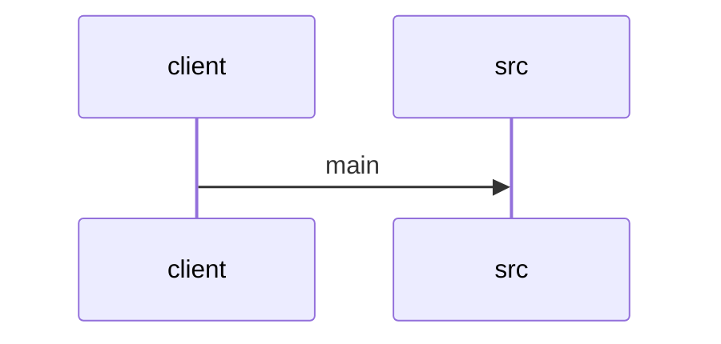

# Feature Walkthrough: Method `SequenceBuilderApplication.main`

This document provides a detailed execution walk of the feature flow.

## 1. Sequence Execution Diagram

## 2. Walkthrough Explanation & Narrative

### Execution Trace Narration: SequenceBuilderApplication Initialization

**Overview**
The execution flow initiates at the standard Java entry point, `main`, within the `SequenceBuilderApplication` class. This method serves as the bootstrap mechanism for the Spring Boot application, delegating the core initialization logic to the Spring framework's runtime engine.

**Execution Path Analysis**
1.  **Entry Point Invocation**: The JVM invokes `SequenceBuilderApplication.main` with the provided command-line arguments (`String[] args`).
2.  **Spring Context Bootstrapping**: Inside the method body, the static method `SpringApplication.run()` is called. This is the primary driver for the application lifecycle. It performs the following critical operations:
    *   Instantiates the `ApplicationContext`.
    *   Scans the classpath for component scans, configuration classes, and auto-configurations.
    *   Initializes the embedded web server (if applicable).
    *   Registers the application context as a singleton bean.
3.  **Argument Propagation**: The `args` array is passed directly to `SpringApplication.run()`, allowing the application to process command-line flags or environment-specific configurations during startup.

**Data Mutations & Conditionals**
*   **No Local Mutations**: The `main` method itself contains no local variable declarations or state mutations. It acts purely as a pass-through delegate.
*   **Conditional Logic**: While the `main` method does not contain explicit `if/else` statements, the `SpringApplication.run()` method internally executes complex conditional logic to determine:
    *   Whether to run as a web application or a non-web application.
    *   Which specific auto-configuration classes to load based on available dependencies.
    *   How to handle startup errors or shutdown hooks.

**Final Return Output**
The `main` method returns `void`. However, the `SpringApplication.run()` call returns a `ConfigurableApplicationContext` object. In a standard Spring Boot application, this return value is typically ignored by the caller unless custom post-initialization logic is required immediately after startup. The application proceeds to run indefinitely until a termination signal is received or an unhandled exception occurs.

**Reference**
*   `src/main/java/com/aa/fso/SequenceBuilderApplication.java:4-7`
