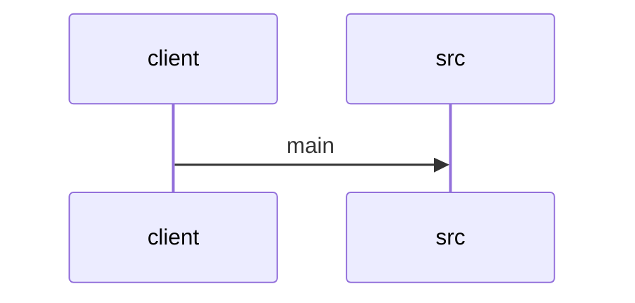

# Feature Walkthrough: Method `SequenceBuilderApplication.main`

This document provides a detailed execution walk of the feature flow.

## 1. Sequence Execution Diagram

## 2. Walkthrough Explanation & Narrative

### Execution Trace Narration: SequenceBuilderApplication Initialization

**Overview**
The execution flow initiates at the standard Java entry point, `SequenceBuilderApplication.main`. This method serves as the bootstrap handler for the Spring Boot application, delegating the core initialization logic to the Spring framework's runtime engine.

**Execution Path Analysis**
1.  **Invocation**: The JVM invokes the `main` method defined in `src/main/java/com/aa/fso/SequenceBuilderApplication.java`.
2.  **Delegation**: Inside the method body, the code executes `SpringApplication.run(SequenceBuilderApplication.class, args)`.
    *   **Context**: This static call triggers the Spring Boot auto-configuration process. It instantiates the `ApplicationContext`, scans the classpath for components, configures beans based on the `SequenceBuilderApplication` context, and starts the embedded web server (if applicable).
    *   **Data Mutations**: No explicit local variable mutations occur within this specific snippet. However, the call initiates a cascade of internal state changes within the Spring container, including the population of the bean registry and the establishment of the application context lifecycle.
3.  **Termination**: The `main` method completes immediately after the `run` call returns. In a typical Spring Boot lifecycle, `SpringApplication.run` blocks until the application context is fully initialized or the application is shut down externally. Consequently, the `main` method does not return control to the caller until the application lifecycle ends.

**Code Reference**
The implementation details are located at:
`src/main/java/com/aa/fso/SequenceBuilderApplication.java:4-6`

*(Note: While the user prompt displayed the code block without line numbers, standard formatting for this snippet typically spans lines 4 through 6 in a minimal Spring Boot starter class.)*

**Final Output**
The method returns `void`. The observable outcome is the successful startup of the Spring Boot application environment, ready to handle incoming requests or background tasks as defined by the rest of the application context.
