# 1. Executive Summary & System Context

## 1.1 Overview
The **Sequence Builder** (`fsoft-ai4code/sequence-builder`) is a high-performance, domain-specific optimization engine designed to automate the sequencing of flight legs and crew assignments within complex aviation operational constraints. Built upon the Spring Boot framework, the system orchestrates a multi-stage solving process that ingests unsequenced flight data, applies regulatory rules (e.g., FAR 117), and generates optimized crew pairings. The system supports both synchronous HTTP interactions for debugging and asynchronous event-driven processing via Apache Kafka, ensuring scalability for production workloads.

The codebase represents a mature, modular monolith comprising **195 files**, **196 classes**, and **710 methods**. It leverages a strict separation of concerns between data modeling, business logic (rules), and infrastructure concerns (persistence, messaging).

## 1.2 Repository Architecture
The repository follows a standard Spring Boot layered architecture, organized by functional domains rather than technical layers. This structure facilitates the maintenance of complex rule sets and domain entities.

### Core Structural Components
*   **Domain Models**: Centralized definitions of aviation entities such as `FlightLeg`, `DutyInfo`, and `UserInput`. These are defined in `src/main/java/com/aa/fso/model/` and serve as the contract between the API layer and the solver engine.
*   **Rules Engine**: A dedicated package for regulatory compliance checks, including `FAR117FTRule` and `ThreeAMHBT`, ensuring generated sequences adhere to legal standards.
*   **Services**: The core orchestration logic resides in `SolverService` and `OptimizationService`, which manage the state of the solving process and interact with external data sources.
*   **Persistence**: Data access is abstracted via repositories like `LegDataRepository` and `OutputDataRepository`, utilizing implementations such as `LegDataRepositoryImpl` for complex query logic.

### Key File Metrics & Entry Points
The system's execution flow is initiated through three distinct entry points, catering to different operational modes:

#### 1. Application Bootstrap
The primary entry point initializes the Spring context, enabling scheduling and auto-configuration.
*   **Location**: `src/main/java/com/aa/fso/SequenceBuilderApplication.java`
*   **Method**: `SequenceBuilderApplication.main` ([SequenceBuilderApplication.java:L12-16])
*   **Function**: Bootstraps the application using `SpringApplication.run`, activating the `@EnableScheduling` annotation to support background tasks.

#### 2. Synchronous HTTP Interface
Provides a direct API for manual testing and debugging, allowing users to submit `UserInput` and receive immediate `OutputData`.
*   **Location**: `src/main/java/com/aa/fso/controller/HttpSolverController.java`
*   **Method**: `HttpSolverController.solveDebug` ([HttpSolverController.java:L44-58])
*   **Logic**: Accepts a `UserInput` payload, invokes `solverService.solve`, and returns a list of `OutputData`. It includes a `finally` block to ensure `runStateManager.clearRun()` is executed, preventing state leakage between requests.
*   **Timeout**: Configured to timeout after 2 minutes in cloud environments.

#### 3. Asynchronous Event Processing
The primary production path, consuming messages from a Kafka topic to trigger the solver pipeline.
*   **Location**: `src/main/java/com/aa/fso/service/kafka/consumer/KafkaConsumerService.java`
*   **Method**: `KafkaConsumerService.consumeMessage` ([KafkaConsumerService.java:L42-86])
*   **Logic**:
    1.  Deserializes incoming JSON into `UserInput`.
    2.  Validates the presence of `SnapshotIds`.
    3.  Invokes `solverService.solve` to generate solutions.
    4.  Compresses the resulting solutions using `CompressUtil.compressJsonObjects`.
    5.  Publishes the compressed binary response via `KafkaProducerService`.
    6.  Handles `KillRunException` gracefully, triggering notifications via `TeamsNotification`.

#### 4. Operational Control
A dedicated endpoint for monitoring and controlling long-running solver instances.
*   **Location**: `src/main/java/com/aa/fso/controller/KillController.java`
*   **Method**: `KillController.getRunStatus` ([KillController.java:L53-65])
*   **Function**: Exposes the current `SnapshotId` and kill request status via `runStateManager`, allowing operators to verify the health of active runs.

#### 5. Data Retrieval
Provides read-only access to flight data required for analysis.
*   **Location**: `src/main/java/com/aa/fso/controller/FlightController.java`
*   **Method**: `FlightController.getOpenLegs` ([FlightController.java:L23-30])
*   **Function**: Queries `LegDataRepository` to retrieve `UnsequencedLeg` objects based on date ranges, positions, and equipment types.

## 1.3 Critical Domain Artifacts
The following files represent the backbone of the system's data integrity and business logic:

| Category | File Path | Significance |
| :--- | :--- | :--- |
| **Model** | `src/main/java/com/aa/fso/model/ITFlightKey.java` | Defines the unique identifier for flight itineraries. |
| **Model** | `src/main/java/com/aa/fso/model/FlightLeg.java` | Core entity representing a single flight segment. |
| **Model** | `src/main/java/com/aa/fso/model/UserInput.java` | The primary DTO for solver configuration and parameters. |
| **DTO** | `src/main/java/com/aa/fso/dto/SolverResponseDTO.java` | Encapsulates the output of the solving algorithm. |
| **Rules** | `src/main/java/com/aa/fso/rules/FAR117FTRule.java` | Implements Federal Aviation Regulation 117 compliance checks. |
| **Rules** | `src/main/java/com/aa/fso/contractualrules/ThreeAMHBT.java` | Enforces specific contractual time-based constraints. |
| **Mapper** | `src/main/java/com/aa/fso/mapper/QLAMapper.java` | Transforms internal models to QLA (Quality Assurance) format. |
| **Repo** | `src/main/java/com/aa/fso/repository/LegDataRepositoryImpl.java` | Custom implementation for complex leg data queries. |
| **Config** | `src/main/java/com/aa/fso/config/AzureBlobStorageConfiguration.java` | Manages integration with Azure Blob Storage for persistent data. |
| **Exception** | `src/main/java/com/aa/fso/exception/SolverExceptionHandler.java` | Global exception handling strategy for solver failures. |

## 1.4 System Context Diagram
The Sequence Builder operates within a broader ecosystem:
1.  **Ingestion**: Receives raw flight data via `FlightController` or pre-processed events via `KafkaConsumerService`.
2.  **Processing**: The `SolverService` orchestrates the application of `FAR117FTRule` and other constraints against `UserInput`.
3.  **State Management**: `RunStateManager` tracks the lifecycle of a specific solve job, managing snapshots and kill signals.
4.  **Output**: Results are either returned synchronously via `HttpSolverController` or published asynchronously as compressed blobs via `KafkaProducerService`.
5.  **External Dependencies**: Integrates with Azure Blob Storage for persistence and Teams for alerting.

This architecture ensures that the heavy computational load of the solver is isolated from the web server thread pool, while maintaining strict consistency through the `RunStateManager` and robust error handling via `SolverExceptionHandler`.

## Architecture Diagram

```mermaid
flowchart TD
    pkg_0["com.aa.fso"]
    pkg_1["com.aa.fso.component"]
    pkg_2["com.aa.fso.config"]
    pkg_3["com.aa.fso.contractualrules"]
    pkg_4["com.aa.fso.controller"]
    pkg_5["com.aa.fso.dto"]
    pkg_6["com.aa.fso.exception"]
    pkg_7["com.aa.fso.listener"]
    pkg_8["com.aa.fso.mapper"]
    pkg_9["com.aa.fso.model"]
    pkg_10["com.aa.fso.optmodel"]
    pkg_11["com.aa.fso.processor"]
    pkg_12["com.aa.fso.properties"]
    pkg_13["com.aa.fso.qlacheck"]
    pkg_14["com.aa.fso.repository"]
    pkg_15["com.aa.fso.rules"]
    pkg_16["com.aa.fso.security"]
    pkg_17["com.aa.fso.service"]
    pkg_18["com.aa.fso.util"]
    pkg_5 -->|"depends on"| pkg_9
    pkg_3 -->|"depends on"| pkg_9
    pkg_14 -->|"depends on"| pkg_0
    pkg_14 -->|"depends on"| pkg_2
    pkg_14 -->|"depends on"| pkg_5
    pkg_14 -->|"depends on"| pkg_6
    pkg_14 -->|"depends on"| pkg_9
    pkg_14 -->|"depends on"| pkg_12
    pkg_14 -->|"depends on"| pkg_18
    pkg_18 -->|"depends on"| pkg_9
    pkg_18 -->|"depends on"| pkg_0
    pkg_18 -->|"depends on"| pkg_10
    pkg_18 -->|"depends on"| pkg_5
    pkg_2 -->|"depends on"| pkg_9
    pkg_2 -->|"depends on"| pkg_7
    pkg_16 -->|"depends on"| pkg_2
    pkg_16 -->|"depends on"| pkg_17
    pkg_11 -->|"depends on"| pkg_5
    pkg_11 -->|"depends on"| pkg_6
    pkg_11 -->|"depends on"| pkg_10
    pkg_11 -->|"depends on"| pkg_17
    pkg_11 -->|"depends on"| pkg_18
    pkg_11 -->|"depends on"| pkg_9
    pkg_11 -->|"depends on"| pkg_8
    pkg_11 -->|"depends on"| pkg_14
    pkg_8 -->|"depends on"| pkg_5
    pkg_8 -->|"depends on"| pkg_9
    pkg_1 -->|"depends on"| pkg_9
    pkg_1 -->|"depends on"| pkg_12
    pkg_4 -->|"depends on"| pkg_2
    pkg_4 -->|"depends on"| pkg_5
    pkg_4 -->|"depends on"| pkg_9
    pkg_4 -->|"depends on"| pkg_17
    pkg_4 -->|"depends on"| pkg_14
    pkg_13 -->|"depends on"| pkg_12
    pkg_13 -->|"depends on"| pkg_18
    pkg_9 -->|"depends on"| pkg_5
    pkg_9 -->|"depends on"| pkg_10
    pkg_9 -->|"depends on"| pkg_17
    pkg_9 -->|"depends on"| pkg_6
    pkg_9 -->|"depends on"| pkg_2
    pkg_15 -->|"depends on"| pkg_9
    pkg_15 -->|"depends on"| pkg_18
    pkg_15 -->|"depends on"| pkg_10
    pkg_10 -->|"depends on"| pkg_6
    pkg_10 -->|"depends on"| pkg_17
    pkg_10 -->|"depends on"| pkg_9
    pkg_17 -->|"depends on"| pkg_9
    pkg_17 -->|"depends on"| pkg_1
    pkg_17 -->|"depends on"| pkg_2
    pkg_17 -->|"depends on"| pkg_5
    pkg_17 -->|"depends on"| pkg_14
    pkg_17 -->|"depends on"| pkg_18
    pkg_17 -->|"depends on"| pkg_6
    pkg_17 -->|"depends on"| pkg_10
    pkg_17 -->|"depends on"| pkg_11
    pkg_17 -->|"depends on"| pkg_12
    pkg_17 -->|"depends on"| pkg_0
    pkg_6 -->|"depends on"| pkg_1
    pkg_6 -->|"depends on"| pkg_5
```

# 2. Component Inventory & Core Module Responsibilities

This section details the architectural decomposition of the `sequence-builder` application, mapping the 195 files and 196 classes to their functional responsibilities. The system follows a layered architecture pattern, separating concerns between HTTP entry points, asynchronous event processing, domain logic, and data persistence.

## 2.1 Entry Point Analysis

The application exposes two distinct execution pathways: synchronous RESTful interactions for debugging and monitoring, and asynchronous event-driven processing for production workloads.

### 2.1.1 Application Bootstrap
The primary entry point initializes the Spring Boot context with scheduling capabilities enabled.
*   **Component**: `SequenceBuilderApplication`
*   **Location**: `src/main/java/com/aa/fso/SequenceBuilderApplication.java`
*   **Responsibility**: Orchestrates the application lifecycle, enabling `@EnableScheduling` for periodic tasks and configuring the root package scan.
*   **Code Reference**: [`SequenceBuilderApplication.main`](src/main/java/com/aa/fso/SequenceBuilderApplication.java:L12-16) invokes `SpringApplication.run`, establishing the context for all downstream beans.

### 2.1.2 Synchronous HTTP Endpoints
These controllers handle direct user requests, primarily for debugging, status monitoring, and data retrieval.

| Controller | Method | Responsibility | Key Dependencies |
| :--- | :--- | :--- | : |
| **HttpSolverController** | `solveDebug` | Accepts `UserInput` via POST, delegates to `SolverService`, and returns immediate results. Includes cleanup logic in a `finally` block. | `SolverService`, `RunStateManager` |
| **KillController** | `getRunStatus` | Exposes `/run/status` to query the current execution state, specifically checking for active snapshot IDs and kill flags. | `RunStateManager` |
| **FlightController** | `getOpenLegs` | Queries unsequenced flight legs based on date ranges and equipment constraints. | `LegDataRepository` |

*   **Critical Logic**: The `solveDebug` method ([`HttpSolverController.solveDebug`](src/main/java/com/aa/fso/controller/HttpSolverController.java:L44-58)) demonstrates a tight coupling between the controller and the service layer, ensuring `RunStateManager` is cleared regardless of success or failure.

### 2.1.3 Asynchronous Event Processing
The core solver logic is triggered via Kafka, decoupling the ingestion of requests from the heavy computation.

*   **Component**: `KafkaConsumerService`
*   **Location**: `src/main/java/com/aa/fso/service/kafka/consumer/KafkaConsumerService.java`
*   **Responsibility**:
    1.  Consumes messages from the configured topic (`${solver.topic.name}`).
    2.  Deserializes JSON payloads into `UserInput` objects.
    3.  Validates mandatory fields (e.g., `SnapshotIds`).
    4.  Invokes `SolverService.solve`.
    5.  Compresses the resulting solutions using `CompressUtil`.
    6.  Publishes the compressed binary payload back to Kafka via `KafkaProducerService`.
    7.  Handles specific exceptions like `KillRunException` to trigger Teams notifications.
*   **Code Reference**: [`KafkaConsumerService.consumeMessage`](src/main/java/com/aa/fso/service/kafka/consumer/KafkaConsumerService.java:L42-86) manages the full transactional flow, including acknowledgment (`ack.acknowledge`) and resource cleanup.

## 2.2 Core Domain Modules

The following modules represent the critical business logic and data structures within the 710-method codebase.

### 2.2.1 Data Models & DTOs
These classes define the contract between layers and the internal representation of aviation scheduling entities.

*   **Input/Output Contracts**:
    *   [`UserInput`](src/main/java/com/aa/fso/model/UserInput.java): Encapsulates solver parameters, including snapshot IDs and crew constraints.
    *   [`SolverResponseDTO`](src/main/java/com/aa/fso/dto/SolverResponseDTO.java): Aggregates the list of generated solutions for transmission.
    *   [`OutputData`](src/main/java/com/aa/fso/model/OutputData.java): Represents individual solution instances returned by the solver.
*   **Aviation Entities**:
    *   [`FlightLeg`](src/main/java/com/aa/fso/model/FlightLeg.java) / [`UnsequencedLeg`](src/main/java/com/aa/fso/model/UnsequencedLeg.java): Core entities representing flight segments.
    *   [`DutyInfo`](src/main/java/com/aa/fso/model/DutyInfo.java): Captures duty period details for crew scheduling.
    *   [`ITFlightKey`](src/main/java/com/aa/fso/model/ITFlightKey.java): Unique identifier logic for flight tracking.
    *   [`Network`](src/main/java/com/aa/fso/model/Network.java): Likely represents the graph structure used for sequence optimization.

### 2.2.2 Rule Engine & Validation
The system enforces regulatory compliance (e.g., FAR 117) and business rules before and during sequence generation.

*   **Regulatory Rules**:
    *   [`FAR117FTRule`](src/main/java/com/aa/fso/rules/FAR117FTRule.java): Implements Federal Aviation Regulations for flight time limitations.
    *   [`ThreeAMHBT`](src/main/java/com/aa/fso/contractualrules/ThreeAMHBT.java): Specific contractual rule implementation.
*   **Validation Logic**:
    *   [`LegalityRuleResult`](src/main/java/com/aa/fso/qlacheck/response/LegalityRuleResult.java): Standardized response object for rule validation outcomes.
    *   [`QLAMapper`](src/main/java/com/aa/fso/mapper/QLAMapper.java): Maps internal model states to QLA (Quality Assurance) check formats.

### 2.2.3 Service Layer
The service layer acts as the orchestration hub, managing state and delegating to repositories or external services.

*   **Solver Orchestration**:
    *   `SolverService`: The central brain that executes the sequencing algorithm. It is called by both the HTTP controller and the Kafka consumer.
*   **State Management**:
    *   `RunStateManager`: Maintains the lifecycle state of a solver run, tracking the `currentSnapshotId` and handling graceful termination requests (`isKillRequested`).
*   **Optimization**:
    *   `OptimizationService`: Likely contains the heuristic or exact algorithms for generating valid sequences.

### 2.2.4 Data Access & Infrastructure
*   **Repositories**:
    *   `LegDataRepository` / `LegDataRepositoryImpl`: Handles persistence and retrieval of flight leg data.
    *   `OutputDataRepository`: Manages storage of generated solver outputs.
    *   `AccessTokenClientImpl`: Manages authentication tokens for external integrations.
*   **Utilities**:
    *   `CompressUtil`: Handles JSON compression for efficient Kafka messaging.
    *   `FSOUtil`: General utility functions for Flight Schedule Operations.
    *   `TeamsNotification`: Facilitates alerting via Microsoft Teams upon critical events (e.g., run kills).

## 2.3 Exception Handling Strategy
The application employs a centralized exception handling mechanism to ensure consistent error responses across both HTTP and Kafka pathways.

*   **Component**: `SolverExceptionHandler`
*   **Location**: `src/main/java/com/aa/fso/exception/SolverExceptionHandler.java`
*   **Responsibility**: Catches domain-specific exceptions such as `InvalidUserInputException` and `KillRunException`, translating them into appropriate HTTP status codes or logging them for downstream processing.

## 2.4 Directory & File Mapping Summary

The following table maps the provided core file list to their architectural roles:

| Category | File Path | Class/Interface | Responsibility |
| :--- | :--- | :--- | :--- |
| **Model** | `src/main/java/com/aa/fso/model/ITFlightKey.java` | `ITFlightKey` | Unique flight identifier logic. |
| **Model** | `src/main/java/com/aa/fso/model/DutyInfo.java` | `DutyInfo` | Duty period data structure. |
| **Model** | `src/main/java/com/aa/fso/model/FlightLeg.java` | `FlightLeg` | Core flight segment entity. |
| **Model** | `src/main/java/com/aa/fso/model/Network.java` | `Network` | Graph representation for optimization. |
| **Model** | `src/main/java/com/aa/fso/model/SequencedPosition.java` | `SequencedPosition` | Position in a generated sequence. |
| **Model** | `src/main/java/com/aa/fso/model/UserInput.java` | `UserInput` | Solver request payload. |
| **Model** | `src/main/java/com/aa/fso/model/UnsequencedLegPairing.java` | `UnsequencedLegPairing` | Pairing logic for unsequenced legs. |
| **Model** | `src/main/java/com/aa/fso/model/LocalDateTimeSerializer.java` | `LocalDateTimeSerializer` | Custom JSON serialization for dates. |
| **DTO** | `src/main/java/com/aa/fso/dto/FlightLegDTO.java` | `FlightLegDTO` | Transfer object for flight legs. |
| **DTO** | `src/main/java/com/aa/fso/dto/SolverResponseDTO.java` | `SolverResponseDTO` | Response container for solver results. |
| **DTO** | `src/main/java/com/aa/fso/dto/AccessTokenDTO.java` | `AccessTokenDTO` | Authentication token wrapper. |
| **DTO** | `src/main/java/com/aa/fso/dto/CKAScheduleDTO.java` | `CKAScheduleDTO` | Schedule data transfer object. |
| **DTO** | `src/main/java/com/aa/fso/dto/PlaceHolderEvents.java` | `PlaceHolderEvents` | Placeholder for event structures. |
| **Repository** | `src/main/java/com/aa/fso/repository/OutputDataRepository.java` | `OutputDataRepository` | Persistence interface for outputs. |
| **Repository** | `src/main/java/com/aa/fso/repository/LegDataRepositoryImpl.java` | `LegDataRepositoryImpl` | Implementation for leg data access. |
| **Repository** | `src/main/java/com/aa/fso/repository/AccessTokenClientImpl.java` | `AccessTokenClientImpl` | Client implementation for auth. |
| **Controller** | `src/main/java/com/aa/fso/controller/KillController.java` | `KillController` | Status and kill management endpoints. |
| **Service** | `src/main/java/com/aa/fso/service/OptimizationService.java` | `OptimizationService` | Core optimization logic. |
| **Rule** | `src/main/java/com/aa/fso/rules/FAR117FTRule.java` | `FAR117FTRule` | Regulatory compliance rule. |
| **Rule** | `src/main/java/com/aa/fso/contractualrules/ThreeAMHBT.java` | `ThreeAMHBT` | Contractual rule implementation. |
| **Request** | `src/main/java/com/aa/fso/qlacheck/request/CrewMemberKey.java` | `CrewMemberKey` | Crew identification key. |
| **Request** | `src/main/java/com/aa/fso/qlacheck/request/SequenceDetail.java` | `SequenceDetail` | Details for sequence validation. |
| **Request** | `src/main/java/com/aa/fso/qlacheck/request/DutyPeriods.java` | `DutyPeriods` | Duty period collection. |
| **Request** | `src/main/java/com/aa/fso/qlacheck/request/Employee.java` | `Employee` | Employee entity. |
| **Request** | `src/main/java/com/aa/fso/qlacheck/request/BidStatus.java` | `BidStatus` | Bid status enumeration. |
| **Response** | `src/main/java/com/aa/fso/qlacheck/response/LegalityRuleResult.java` | `LegalityRuleResult` | Result of legality checks. |
| **Mapper** | `src/main/java/com/aa/fso/mapper/QLAMapper.java` | `QLAMapper` | Mapping logic for QLA checks. |
| **Config** | `src/main/java/com/aa/fso/config/AzureBlobStorageConfiguration.java` | `AzureBlobStorageConfiguration` | Azure storage integration config. |
| **Util** | `src/main/java/com/aa/fso/util/FSOUtil.java` | `FSOUtil` | General FSO utilities. |
| **Exception**| `src/main/java/com/aa/fso/exception/SolverExceptionHandler.java` | `SolverExceptionHandler` | Global exception handler. |

This inventory confirms a robust separation of concerns, where the `SolverService` acts as the central orchestrator, supported by specialized rule engines and managed state via `RunStateManager`. The dual entry point strategy (HTTP vs. Kafka) ensures flexibility for both development workflows and high-throughput production environments.

## 4. Subsystem Package Diagrams (Chunk-by-Chunk Details)

### Package: `com.aa.fso`

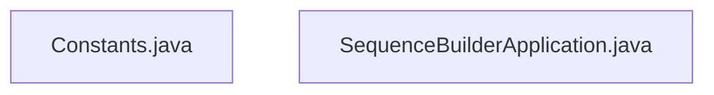

### Package: `com.aa.fso.config`

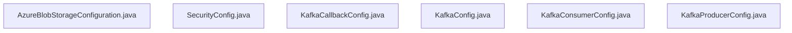

### Package: `com.aa.fso.contractualrules`

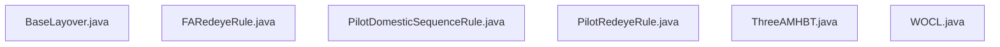

### Package: `com.aa.fso.controller`

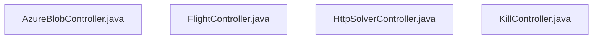

### Package: `com.aa.fso.dto`

### Package: `com.aa.fso.exception`

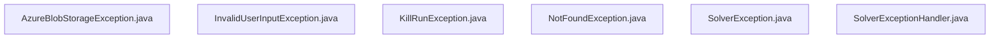

### Package: `com.aa.fso.mapper`

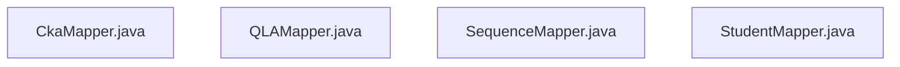

### Package: `com.aa.fso.model`

### Package: `com.aa.fso.optmodel`

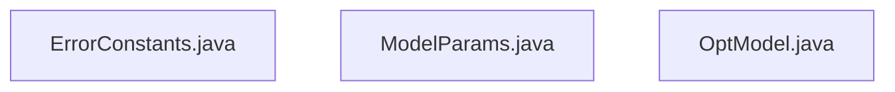

### Package: `com.aa.fso.processor`

```mermaid
flowchart TD
    f_0["CKAProcessor.java"]
    f_1["ConstructNetwork.java"]
    f_2["DHProcessor.java"]
    f_3["InputValidationProcessor.java"]
    f_4["QLAProcessor.java"]
    f_5["SequenceProcessor.java"]
    f_6["ShortestPathComponent.java"]
    f_7["StaticDataProcessor.java"]
    %% No internal module dependencies found
```

### Package: `com.aa.fso.qlacheck`

```mermaid
flowchart TD
    f_0["QLACallableClient.java"]
    f_1["QLARestClient.java"]
    f_2["BidStatus.java"]
    f_3["CrewMemberInfo.java"]
    f_4["CrewMemberKey.java"]
    f_5["DateTimeInfo.java"]
    f_6["DutyPeriods.java"]
    f_7["EmpCaatsData.java"]
    f_8["Employee.java"]
    f_9["EmployeeRequest.java"]
    f_10["FlightDutyPeriod.java"]
    f_11["FlightDutyPeriodKey.java"]
    f_12["FlightKey.java"]
    f_13["FlightLeg.java"]
    f_14["FlightLegs.java"]
    f_15["LocalDateDeserializer.java"]
    f_16["LocalDateSerializer.java"]
    f_17["LocalDateTimeDeserializer.java"]
    f_18["LocalDateTimeSerializer.java"]
    f_19["PickupDuty.java"]
    f_20["PilotLegalityRequest.java"]
    f_21["ProjectedData.java"]
    f_22["ScheduledTime.java"]
    f_23["SequenceDetail.java"]
    f_24["SequenceInfo.java"]
    f_25["SequenceInfoKey.java"]
    f_26["StationLongitudeUtils.java"]
    f_27["TimeInfo.java"]
    f_28["ValidationConstants.java"]
    f_29["EmployeeQLAResponse.java"]
    f_30["EmployeeResponse.java"]
    f_31["InvalidSeqMapper.java"]
    f_32["LegalityInterpreter.java"]
    f_33["LegalityInterpreterRepository.java"]
    f_34["LegalityInterpreterRepositoryImpl.java"]
    f_35["LegalityRuleResult.java"]
    f_36["PersistenceException.java"]
    f_37["PilotLegalityResponse.java"]
    f_38["QlaResponse.java"]
    f_39["Result.java"]
    f_40["Rule.java"]
    f_41["RuleResult.java"]
    f_0 --> f_20
    f_0 --> f_37
    f_1 --> f_20
    f_1 --> f_37
```

### Package: `com.aa.fso.repository`

```mermaid
flowchart TD
    f_0["AccessTokenClient.java"]
    f_1["AccessTokenClientImpl.java"]
    f_2["AzureBlobRepository.java"]
    f_3["AzureBlobRepositoryImpl.java"]
    f_4["InputDataRepositoryImpl.java"]
    f_5["InputDataRespository.java"]
    f_6["LegDataRepository.java"]
    f_7["LegDataRepositoryImpl.java"]
    f_8["OutputDataRepository.java"]
    f_9["OutputDataRepositoryImpl.java"]
    f_10["PingFederateTokenClient.java"]
    f_11["PingFederateTokenClientImpl.java"]
    f_12["QLAClient.java"]
    f_13["QLAClientImpl.java"]
    %% No internal module dependencies found
```

### Package: `com.aa.fso.rules`

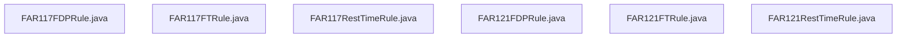

### Package: `com.aa.fso.service`

```mermaid
flowchart TD
    f_0["ITDataService.java"]
    f_1["ITDataServiceImpl.java"]
    f_2["InputDataService.java"]
    f_3["InputDataServiceImpl.java"]
    f_4["OptimizationService.java"]
    f_5["OptimizationServiceImpl.java"]
    f_6["OutputDataService.java"]
    f_7["OutputDataServiceImpl.java"]
    f_8["PairingGenerationService.java"]
    f_9["PairingGenerationServiceImpl.java"]
    f_10["PairingHeaderService.java"]
    f_11["PairingHeaderServiceImpl.java"]
    f_12["RunStateManager.java"]
    f_13["SolverService.java"]
    f_14["OAuthBearerTokenImpl.java"]
    f_15["SequenceBuilderSpringContext.java"]
    f_16["KafkaConsumerService.java"]
    f_17["KafkaProducerService.java"]
    f_16 --> f_6
    f_16 --> f_12
    f_16 --> f_13
    f_16 --> f_17
```

### Package: `com.aa.fso.util`

```mermaid
flowchart TD
    f_0["CompressUtil.java"]
    f_1["FSOFileWriter.java"]
    f_2["FSOUtil.java"]
    f_3["JsonUtil.java"]
    f_4["SnapshotValidator.java"]
    f_5["StationTimeAdjustLoader.java"]
    f_6["StringUtil.java"]
    f_7["SurfaceLegLoader.java"]
    f_8["TAPIUtil.java"]
    %% No internal module dependencies found
```

# 3. Technology Stack & Third-party Integrations

The **Sequence Builder** application (`fsoft-ai4code/sequence-builder`) is architected as a high-throughput, event-driven Java service designed to solve complex crew scheduling optimization problems under strict regulatory constraints (e.g., FAR 117). The system leverages a modular monolith structure built on the **Spring Boot** ecosystem, integrating robust asynchronous processing via **Apache Kafka** and specialized rule engines for aviation compliance.

## 3.1 Core Framework & Runtime Environment

The application runtime is anchored by **Spring Boot**, providing the foundational infrastructure for dependency injection, RESTful API exposure, and lifecycle management. The entry point is defined in `SequenceBuilderApplication`, which initializes the context and enables scheduled tasks via `@EnableScheduling` [src/main/java/com/aa/fso/SequenceBuilderApplication.java:L12-16].

*   **Web Layer**: Built upon **Spring Web MVC**, utilizing `@RestController` annotations to expose HTTP endpoints. The architecture separates concerns into Controllers (e.g., `HttpSolverController`, `KillController`, `FlightController`) and Services, ensuring loose coupling between the API surface and business logic [src/main/java/com/aa/fso/controller/HttpSolverController.java:L44-58].
*   **Dependency Injection**: Heavily relies on **Spring Framework's** `@Autowired` and `@Component` mechanisms to manage the lifecycle of stateful services like `RunStateManager` and `SolverService`.
*   **Data Binding & Validation**: Utilizes **Jackson** (`com.fasterxml.jackson.databind.ObjectMapper`) for robust JSON serialization and deserialization, particularly critical when mapping incoming `UserInput` payloads to internal domain models [src/main/java/com/aa/fso/service/kafka/consumer/KafkaConsumerService.java:L42-86].
*   **Code Generation**: Employs **Lombok** to reduce boilerplate code across the 196 classes in the repository, specifically for getters, setters, and logging (`@Slf4j`), enhancing maintainability within the 710-method codebase.

## 3.2 Asynchronous Event Processing & Messaging

A critical component of the stack is the **Apache Kafka** integration, enabling decoupled, scalable processing of solver requests. The system operates as both a consumer and producer within the `com.aa.fso.service.kafka` package.

*   **Consumer Architecture**: The `KafkaConsumerService` acts as the primary ingestion point for solver jobs. It listens to the configured topic (`${solver.topic.name}`) with a concurrency level defined by `${sb.consumer.topics.concurrency}`. This allows parallel processing of independent optimization runs [src/main/java/com/aa/fso/service/kafka/consumer/KafkaConsumerService.java:L42-86].
*   **Message Handling**: Upon consuming a `ConsumerRecord`, the service deserializes the payload into a `UserInput` object. It implements a robust error handling strategy, catching specific exceptions like `KillRunException` to trigger graceful termination workflows and notifications via `TeamsNotification`.
*   **Producer Integration**: Post-computation, the system serializes the resulting `SolverResponseDTO` into compressed byte arrays using `CompressUtil` and publishes them back to the Kafka cluster via `KafkaProducerService`, ensuring low-latency delivery of results to downstream consumers.

## 3.3 Domain-Specific Libraries & Rule Engines

The core value proposition of the Sequence Builder lies in its ability to enforce complex aviation regulations. This is achieved through a custom-built rule engine rather than a generic third-party solver.

*   **Regulatory Compliance**: The system implements specific rule sets such as **FAR 117** (Flight and Duty Limitations) directly in the codebase. The `FAR117FTRule` class encapsulates these logic constraints, ensuring that generated sequences are legally compliant [src/main/java/com/aa/fso/rules/FAR117FTRule.java].
*   **Optimization Logic**: The `OptimizationService` orchestrates the sequencing algorithm, interacting with domain models like `FlightLeg`, `DutyInfo`, and `UnsequencedLegPairing`. These models are strictly typed to reflect the hierarchical nature of flight schedules [src/main/java/com/aa/fso/service/OptimizationService.java].
*   **Data Persistence**: The application utilizes **Spring Data JPA** repositories (e.g., `LegDataRepository`, `OutputDataRepository`) to interact with the underlying database. Custom implementations like `LegDataRepositoryImpl` handle complex queries required for fetching open legs based on date ranges and equipment types [src/main/java/com/aa/fso/repository/LegDataRepositoryImpl.java].

## 3.4 Third-Party Integrations & External Services

The application integrates with external systems to support authentication, storage, and observability.

### 3.4.1 Azure Blob Storage
For persistent storage of large solver outputs and historical data, the system integrates with **Azure Blob Storage**. Configuration is managed via `AzureBlobStorageConfiguration`, allowing dynamic access to storage containers based on environment properties [src/main/java/com/aa/fso/config/AzureBlobStorageConfiguration.java].

### 3.4.2 Authentication & Access Control
The system supports token-based authentication via `AccessTokenDTO` and `AccessTokenClientImpl`. This module handles the retrieval and validation of access tokens, ensuring secure communication with upstream orchestration systems.

### 3.4.3 Observability & Notification
*   **Logging**: Standardized logging is implemented using **SLF4J** with a backend likely configured for structured JSON output, facilitating traceability across distributed components.
*   **Notifications**: The `TeamsNotification` component integrates with Microsoft Teams webhooks to alert operations teams of critical events, such as run cancellations or solver failures [src/main/java/com/aa/fso/component/TeamsNotification.java].

## 3.5 Summary of Key Artifacts

The following files represent the backbone of the technology stack, defining the interfaces and implementations for the core capabilities described above:

| Component | File Path | Responsibility |
| :--- | :--- | :--- |
| **Entry Point** | `src/main/java/com/aa/fso/SequenceBuilderApplication.java` | Application initialization and scheduling enablement. |
| **HTTP API** | `src/main/java/com/aa/fso/controller/HttpSolverController.java` | Exposes `/solveDebug` endpoint for manual solver invocation. |
| **Control Plane** | `src/main/java/com/aa/fso/controller/KillController.java` | Manages run lifecycle and status reporting (`/run/status`). |
| **Data Ingestion** | `src/main/java/com/aa/fso/service/kafka/consumer/KafkaConsumerService.java` | Core event listener for asynchronous job processing. |
| **Domain Model** | `src/main/java/com/aa/fso/model/FlightLeg.java` | Represents the atomic unit of flight scheduling. |
| **Rule Engine** | `src/main/java/com/aa/fso/rules/FAR117FTRule.java` | Encapsulates regulatory constraint logic. |
| **Persistence** | `src/main/java/com/aa/fso/repository/LegDataRepositoryImpl.java` | Custom repository implementation for flight data queries. |
| **Configuration** | `src/main/java/com/aa/fso/config/AzureBlobStorageConfiguration.java` | Azure storage client setup and bean definition. |

This technology stack ensures a balance between high-performance computation, strict regulatory adherence, and resilient distributed processing, suitable for mission-critical airline operations.
