# 1. Executive Summary & System Context

## 1.1 Overview
The **Sequence Builder** (`fsoft-ai4code/sequence-builder`) is a high-throughput, event-driven Java application designed to automate the generation and validation of flight crew pairings and duty sequences. Built upon the Spring Boot framework, the system orchestrates complex scheduling algorithms, enforces regulatory compliance (e.g., FAR 117), and manages stateful execution contexts across distributed environments.

The codebase comprises **195 files**, containing **196 classes** and **710 methods**. The architecture prioritizes modularity through a clear separation of concerns: RESTful API exposure, asynchronous event processing via Apache Kafka, and domain-specific logic encapsulated within service layers and rule engines.

## 1.2 Repository Architecture
The project follows a standard Maven-based monolithic structure with a layered architecture pattern. The core logic resides in `src/main/java/com/aa/fso`, organized into distinct packages:

*   **Entry Points & Controllers**: Exposes HTTP endpoints for manual debugging, status monitoring, and data retrieval.
*   **Services**: Orchestrates business logic, including solver execution, state management, and external data integration.
*   **Models & DTOs**: Defines the schema for user inputs, solver outputs, and internal domain entities.
*   **Infrastructure**: Handles Kafka consumption/production, Azure Blob storage, and database repositories.

### Core File Distribution
The system's functionality is anchored by several critical components identified in the codebase analysis:
*   **Application Bootstrap**: [`SequenceBuilderApplication.java`](src/main/java/com/aa/fso/SequenceBuilderApplication.java) initializes the Spring context and enables scheduling capabilities.
*   **Solver Orchestration**: [`SolverService`](src/main/java/com/aa/fso/service/SolverService.java) (implied usage) drives the core sequencing logic, invoked via both synchronous HTTP requests and asynchronous Kafka events.
*   **State Management**: [`RunStateManager`](src/main/java/com/aa/fso/service/RunStateManager.java) ensures thread-safe handling of active solver runs and supports graceful termination.
*   **Domain Rules**: Compliance logic is isolated in modules like [`FAR117RestTimeRule.java`](src/main/java/com/aa/fso/rules/FAR117RestTimeRule.java) and [`ConstructNetwork.java`](src/main/java/com/aa/fso/processor/ConstructNetwork.java).

## 1.3 System Context & Entry Points
The system accepts input through two primary channels: **Synchronous HTTP APIs** for operational control and **Asynchronous Kafka Events** for bulk processing.

### 1.3.1 Synchronous HTTP Entry Points
These endpoints allow operators to trigger solver runs, inspect system health, and retrieve raw flight data.

| Endpoint | Method | Controller | Description |
| :--- | :--- | :--- | :--- |
| `/solveDebug` | `POST` | [`HttpSolverController`](src/main/java/com/aa/fso/controller/HttpSolverController.java) | Triggers the solver with a provided `UserInput`. Includes a 2-minute timeout mechanism and automatic state cleanup. |
| `/run/status` | `GET` | [`KillController`](src/main/java/com/aa/fso/controller/KillController.java) | Returns the current active `SnapshotID` and kill request status. |
| `/openLegs` | `GET` | [`FlightController`](src/main/java/com/aa/fso/controller/FlightController.java) | Retrieves unsequenced flight legs based on date ranges, positions, and equipment types. |
| `/azure/blob` | `POST/GET` | [`AzureBlobController`](src/main/java/com/aa/fso/controller/AzureBlobController.java) | Manages persistence of large datasets to Azure Blob Storage. |

**Implementation Detail**: The primary solver entry point [`HttpSolverController.solveDebug`](src/main/java/com/aa/fso/controller/HttpSolverController.java:L44-58) demonstrates the system's reliance on dependency injection. It instantiates a `SolverResponseDTO` via `solverService.solve()` and ensures resource hygiene by invoking `runStateManager.clearRun()` in a `finally` block.

### 1.3.2 Asynchronous Kafka Entry Point
The system acts as a consumer for high-volume sequencing jobs via Apache Kafka.

*   **Topic**: Configured via `${solver.topic.name}`.
*   **Consumer Group**: `${kafka.consumer.group.id.dcr.cwr}`.
*   **Concurrency**: Configurable via `${sb.consumer.topics.concurrency}`.

The core consumer logic resides in [`KafkaConsumerService.consumeMessage`](src/main/java/com/aa/fso/service/kafka/consumer/KafkaConsumerService.java:L42-86). This method:
1.  Deserializes incoming JSON payloads into `UserInput` objects.
2.  Validates the presence of `SnapshotIds`.
3.  Invokes the solver engine.
4.  Compresses the resulting solutions using [`CompressUtil`](src/main/java/com/aa/fso/util/CompressUtil.java) before publishing them back to the response topic.
5.  Handles specific exceptions like `KillRunException` to trigger notifications via [`TeamsNotification`](src/main/java/com/aa/fso/component/TeamsNotification.java).

## 1.4 Key Architectural Components

### 1.4.1 State Management & Concurrency
To support concurrent solver executions, the system utilizes a centralized state manager. The [`RunStateManager`](src/main/java/com/aa/fso/service/RunStateManager.java) tracks the `CurrentSnapshotId` and flags for kill requests. This is critical for the [`KillController.getRunStatus`](src/main/java/com/aa/fso/controller/KillController.java:L53-65) endpoint, which provides real-time visibility into long-running processes.

### 1.4.2 Data Persistence & Retrieval
The system integrates with external storage and databases:
*   **Flight Data**: Retrieved via [`LegDataRepository`](src/main/java/com/aa/fso/repository/LegDataRepository.java) (used in [`FlightController`](src/main/java/com/aa/fso/controller/FlightController.java)).
*   **Input Data**: Managed by [`InputDataRepositoryImpl`](src/main/java/com/aa/fso/repository/InputDataRepositoryImpl.java).
*   **Blob Storage**: Handled by [`AzureBlobRepositoryImpl`](src/main/java/com/aa/fso/repository/AzureBlobRepositoryImpl.java) for large-scale data archiving.

### 1.4.3 Domain Logic & Validation
Complex business rules are implemented as discrete components:
*   **Regulatory Compliance**: [`FAR117RestTimeRule.java`](src/main/java/com/aa/fso/rules/FAR117RestTimeRule.java) enforces FAA rest time regulations.
*   **Network Construction**: [`ConstructNetwork.java`](src/main/java/com/aa/fso/processor/ConstructNetwork.java) builds the graph representation of flight legs for the solver.
*   **Input Validation**: [`InputValidationProcessor`](src/main/java/com/aa/fso/processor/InputValidationProcessor.java) sanitizes and validates incoming payloads before processing.

## 1.5 Technology Stack Summary
*   **Language**: Java (Standard Edition)
*   **Framework**: Spring Boot (Web, Kafka, Actuator)
*   **Messaging**: Apache Kafka
*   **Storage**: Azure Blob Storage, Relational Database (via JPA/Hibernate implied by Repositories)
*   **Utilities**: Lombok (for boilerplate reduction), Jackson (JSON serialization), SLF4J/Logback (Logging)

This architecture ensures that the Sequence Builder can handle both interactive debugging scenarios and high-volume, automated production workloads with robust error handling and state consistency.

## Architecture Diagram

```mermaid
flowchart TD
    pkg_0["com.aa.fso"]
    pkg_1["com.aa.fso.component"]
    pkg_2["com.aa.fso.config"]
    pkg_3["com.aa.fso.contractualrules"]
    pkg_4["com.aa.fso.controller"]
    pkg_5["com.aa.fso.dto"]
    pkg_6["com.aa.fso.exception"]
    pkg_7["com.aa.fso.listener"]
    pkg_8["com.aa.fso.mapper"]
    pkg_9["com.aa.fso.model"]
    pkg_10["com.aa.fso.optmodel"]
    pkg_11["com.aa.fso.processor"]
    pkg_12["com.aa.fso.properties"]
    pkg_13["com.aa.fso.qlacheck"]
    pkg_14["com.aa.fso.repository"]
    pkg_15["com.aa.fso.rules"]
    pkg_16["com.aa.fso.security"]
    pkg_17["com.aa.fso.service"]
    pkg_18["com.aa.fso.util"]
    pkg_5 -->|"depends on"| pkg_9
    pkg_3 -->|"depends on"| pkg_9
    pkg_14 -->|"depends on"| pkg_0
    pkg_14 -->|"depends on"| pkg_2
    pkg_14 -->|"depends on"| pkg_5
    pkg_14 -->|"depends on"| pkg_6
    pkg_14 -->|"depends on"| pkg_9
    pkg_14 -->|"depends on"| pkg_12
    pkg_14 -->|"depends on"| pkg_18
    pkg_18 -->|"depends on"| pkg_9
    pkg_18 -->|"depends on"| pkg_0
    pkg_18 -->|"depends on"| pkg_10
    pkg_18 -->|"depends on"| pkg_5
    pkg_2 -->|"depends on"| pkg_9
    pkg_2 -->|"depends on"| pkg_7
    pkg_16 -->|"depends on"| pkg_2
    pkg_16 -->|"depends on"| pkg_17
    pkg_11 -->|"depends on"| pkg_5
    pkg_11 -->|"depends on"| pkg_6
    pkg_11 -->|"depends on"| pkg_10
    pkg_11 -->|"depends on"| pkg_17
    pkg_11 -->|"depends on"| pkg_18
    pkg_11 -->|"depends on"| pkg_9
    pkg_11 -->|"depends on"| pkg_8
    pkg_11 -->|"depends on"| pkg_14
    pkg_8 -->|"depends on"| pkg_5
    pkg_8 -->|"depends on"| pkg_9
    pkg_1 -->|"depends on"| pkg_9
    pkg_1 -->|"depends on"| pkg_12
    pkg_4 -->|"depends on"| pkg_2
    pkg_4 -->|"depends on"| pkg_5
    pkg_4 -->|"depends on"| pkg_9
    pkg_4 -->|"depends on"| pkg_17
    pkg_4 -->|"depends on"| pkg_14
    pkg_13 -->|"depends on"| pkg_12
    pkg_13 -->|"depends on"| pkg_18
    pkg_9 -->|"depends on"| pkg_5
    pkg_9 -->|"depends on"| pkg_10
    pkg_9 -->|"depends on"| pkg_17
    pkg_9 -->|"depends on"| pkg_6
    pkg_9 -->|"depends on"| pkg_2
    pkg_15 -->|"depends on"| pkg_9
    pkg_15 -->|"depends on"| pkg_18
    pkg_15 -->|"depends on"| pkg_10
    pkg_10 -->|"depends on"| pkg_6
    pkg_10 -->|"depends on"| pkg_17
    pkg_10 -->|"depends on"| pkg_9
    pkg_17 -->|"depends on"| pkg_9
    pkg_17 -->|"depends on"| pkg_1
    pkg_17 -->|"depends on"| pkg_2
    pkg_17 -->|"depends on"| pkg_5
    pkg_17 -->|"depends on"| pkg_14
    pkg_17 -->|"depends on"| pkg_18
    pkg_17 -->|"depends on"| pkg_6
    pkg_17 -->|"depends on"| pkg_10
    pkg_17 -->|"depends on"| pkg_11
    pkg_17 -->|"depends on"| pkg_12
    pkg_17 -->|"depends on"| pkg_0
    pkg_6 -->|"depends on"| pkg_1
    pkg_6 -->|"depends on"| pkg_5
```

# 2. Component Inventory & Core Module Responsibilities

## 2.1 Architectural Overview
The `sequence-builder` application is a Spring Boot-based microservice designed to orchestrate flight sequence generation, legality checking (FAR 117 compliance), and data ingestion via both HTTP and asynchronous Kafka streams. The system operates on a modular architecture separating concerns into **Ingestion**, **Orchestration**, **Business Logic**, and **Persistence** layers.

The codebase comprises **195 files**, **196 classes**, and **710 methods**, indicating a moderate complexity level with a strong emphasis on domain-specific logic for aviation scheduling. The entry points identified confirm a dual-mode execution strategy: synchronous REST API handling for debugging and ad-hoc requests, and asynchronous event-driven processing for production workloads via Azure Event Hubs/Kafka.

## 2.2 Directory Structure & File Mappings

The repository follows a standard Maven/Gradle Java structure, organized by functional domains. Key directories and their primary responsibilities are mapped below:

### 2.2.1 Application Entry & Configuration
*   **Primary Entry Point**: `SequenceBuilderApplication` initializes the Spring context and enables scheduled tasks.
    *   **File**: [`src/main/java/com/aa/fso/SequenceBuilderApplication.java`](src/main/java/com/aa/fso/SequenceBuilderApplication.java)
    *   **Responsibility**: Bootstraps the application, enabling `@EnableScheduling` for periodic background jobs.
    *   **Metrics**: Lines 12-16; imports `SpringApplication`, `Slf4j`.

### 2.2.2 Controller Layer (Ingestion & Exposure)
This layer exposes REST endpoints for external systems and provides debug capabilities. It acts as the facade for the Service layer.

| Controller Class | Primary Responsibility | Key Methods | File Path |
| :--- | :--- | :--- | :--- |
| **HttpSolverController** | Handles synchronous solving requests. Supports manual `UserInput` submission and triggers the solver engine. | `solveDebug` | [`src/main/java/com/aa/fso/controller/HttpSolverController.java`](src/main/java/com/aa/fso/controller/HttpSolverController.java) |
| **FlightController** | Manages flight data retrieval, specifically querying open legs based on date ranges and equipment types. | `getOpenLegs` | [`src/main/java/com/aa/fso/controller/FlightController.java`](src/main/java/com/aa/fso/controller/FlightController.java) |
| **KillController** | Provides operational control over active solver runs, allowing status checks and kill signal propagation. | `getRunStatus` | [`src/main/java/com/aa/fso/controller/KillController.java`](src/main/java/com/aa/fso/controller/KillController.java) |
| **AzureBlobController** | (Implied) Manages interactions with Azure Blob Storage for persistent data artifacts. | N/A | [`src/main/java/com/aa/fso/controller/AzureBlobController.java`](src/main/java/com/aa/fso/controller/AzureBlobController.java) |

**Detailed Analysis of `HttpSolverController.solveDebug`:**
*   **Logic**: Accepts a `UserInput` DTO, delegates to `SolverService`, and returns a list of `OutputData`.
*   **State Management**: Utilizes `RunStateManager` in a `finally` block to ensure cleanup (`clearRun`) regardless of success or failure.
*   **Timeout Handling**: Designed for local debugging (Postman) but includes logic to handle cloud timeouts (2-minute limit).
*   **Reference**: [`src/main/java/com/aa/fso/controller/HttpSolverController.java:L44-58`](src/main/java/com/aa/fso/controller/HttpSolverController.java)

### 2.2.3 Service Layer (Orchestration & Business Logic)
The service layer contains the core business logic, including the solver engine, state management, and data transformation.

*   **Solver Orchestration**:
    *   **Class**: `SolverService` (Referenced in `HttpSolverController` and `KafkaConsumerService`).
    *   **Responsibility**: Executes the core algorithm to generate sequences. It supports both direct execution and file-based execution (`solveWithLocalJsonFile`).
    *   **Dependency**: Relies heavily on `RunStateManager` to track execution context.

*   **State Management**:
    *   **Class**: `RunStateManager`
    *   **Responsibility**: Maintains the lifecycle of a solver run, tracking the current `snapshotId` and managing kill flags.
    *   **Usage**: Called by `KillController.getRunStatus` to report active run IDs and kill status.
    *   **Reference**: [`src/main/java/com/aa/fso/controller/KillController.java:L53-65`](src/main/java/com/aa/fso/controller/KillController.java)

*   **Data Access & Processing**:
    *   **Class**: `ITDataServiceImpl` / `InputDataRepositoryImpl`
    *   **Responsibility**: Implements repository patterns for fetching raw flight and duty data.
    *   **File**: [`src/main/java/com/aa/fso/service/ITDataServiceImpl.java`](src/main/java/com/aa/fso/service/ITDataServiceImpl.java)

*   **Pairing Generation**:
    *   **Class**: `PairingGenerationServiceImpl`
    *   **Responsibility**: Likely handles the specific logic for generating crew pairings based on sequenced legs.
    *   **File**: [`src/main/java/com/aa/fso/service/PairingGenerationServiceImpl.java`](src/main/java/com/aa/fso/service/PairingGenerationServiceImpl.java)

### 2.2.4 Asynchronous Ingestion (Kafka)
The system utilizes Apache Kafka for high-throughput, decoupled processing of solver requests.

*   **Consumer Service**:
    *   **Class**: `KafkaConsumerService`
    *   **Entry Point**: `consumeMessage`
    *   **File**: [`src/main/java/com/aa/fso/service/kafka/consumer/KafkaConsumerService.java`](src/main/java/com/aa/fso/service/kafka/consumer/KafkaConsumerService.java)
    *   **Logic Flow**:
        1.  Listens to `${solver.topic.name}`.
        2.  Deserializes JSON payload into `UserInput`.
        3.  Validates `SnapshotIds`; throws `InvalidUserInputException` if missing.
        4.  Invokes `solverService.solve`.
        5.  Compresses results using `CompressUtil`.
        6.  Publishes compressed binary response via `KafkaProducerService`.
        7.  Handles `KillRunException` by sending notifications via `TeamsNotification`.
    *   **Metrics**: Lines 42-86; handles `JsonProcessingException` and `KillRunException` explicitly.

### 2.2.5 Domain Models & Data Structures
The application relies on a rich set of domain objects representing flight schedules, legality rules, and network graphs.

*   **Core Models**:
    *   `UserInput`: Input payload for solver requests.
    *   `OutputData` / `SolverResponseDTO`: Structured output containing generated sequences.
    *   `FlightKey` / `ITFlightKey`: Unique identifiers for flight segments.
    *   `Node`: Represents graph nodes within the sequencing network.
    *   `Base`: Abstract base class for domain entities.
    *   **Files**:
        *   [`src/main/java/com/aa/fso/model/FlightKey.java`](src/main/java/com/aa/fso/model/FlightKey.java)
        *   [`src/main/java/com/aa/fso/model/ITFlightKey.java`](src/main/java/com/aa/fso/model/ITFlightKey.java)
        *   [`src/main/java/com/aa/fso/model/Node.java`](src/main/java/com/aa/fso/model/Node.java)
        *   [`src/main/java/com/aa/fso/model/Base.java`](src/main/java/com/aa/fso/model/Base.java)

*   **QLA (Quality Assurance) & Rules**:
    *   **Domain**: Specific to FAR 117 rest time regulations and duty period limits.
    *   **Classes**:
        *   `FAR117RestTimeRule`: Encapsulates specific regulatory logic.
        *   `ScheduledTime`, `TimeInfo`, `FlightDutyPeriod`: Time-related domain objects.
        *   `LegalityRuleResult`: Output of rule validation.
    *   **Files**:
        *   [`src/main/java/com/aa/fso/rules/FAR117RestTimeRule.java`](src/main/java/com/aa/fso/rules/FAR117RestTimeRule.java)
        *   [`src/main/java/com/aa/fso/qlacheck/request/FlightDutyPeriod.java`](src/main/java/com/aa/fso/qlacheck/request/FlightDutyPeriod.java)
        *   [`src/main/java/com/aa/fso/qlacheck/response/LegalityRuleResult.java`](src/main/java/com/aa/fso/qlacheck/response/LegalityRuleResult.java)

### 2.2.6 Utilities & Infrastructure
*   **Validation**: `InputValidationProcessor` ensures incoming data integrity before processing.
    *   **File**: [`src/main/java/com/aa/fso/processor/InputValidationProcessor.java`](src/main/java/com/aa/fso/processor/InputValidationProcessor.java)
*   **Graph Construction**: `ConstructNetwork` likely builds the dependency graph required for the solver.
    *   **File**: [`src/main/java/com/aa/fso/processor/ConstructNetwork.java`](src/main/java/com/aa/fso/processor/ConstructNetwork.java)
*   **Serialization**: Custom serializers for `LocalDate` and mappers for QLA data.
    *   **Files**: [`src/main/java/com/aa/fso/qlacheck/request/LocalDateSerializer.java`](src/main/java/com/aa/fso/qlacheck/request/LocalDateSerializer.java), [`src/main/java/com/aa/fso/mapper/QLAMapper.java`](src/main/java/com/aa/fso/mapper/QLAMapper.java)
*   **Constants**: Global configuration constants.
    *   **File**: [`src/main/java/com/aa/fso/Constants.java`](src/main/java/com/aa/fso/Constants.java)

## 2.3 Critical Interaction Flows

### 2.3.1 Synchronous Solve Flow
1.  **Client** sends POST to `/solveDebug` with `UserInput`.
2.  **HttpSolverController** receives request, instantiates `SolverService`.
3.  **SolverService** executes logic, potentially interacting with `RunStateManager`.
4.  **Response** returned as `List<OutputData>`; `RunStateManager` is cleared in `finally`.

### 2.3.2 Asynchronous Solve Flow (Kafka)
1.  **Producer** publishes `UserInput` to `${solver.topic.name}`.
2.  **KafkaConsumerService** consumes message.
3.  **Validation**: Checks `SnapshotIds`; throws exception if invalid.
4.  **Execution**: Calls `solverService.solve`.
5.  **Post-Processing**: Compresses solutions via `CompressUtil`.
6.  **Publish**: Sends compressed bytes to response topic via `KafkaProducerService`.
7.  **Cleanup**: `RunStateManager.clearRun()` executed in `finally`.

## 2.4 Summary of Core Modules
| Module | Primary Class(es) | Function |
| :--- | :--- | :--- |
| **Ingestion** | `HttpSolverController`, `KafkaConsumerService` | Accepts solver requests via HTTP or Kafka. |
| **Orchestration** | `SolverService`, `RunStateManager` | Manages execution lifecycle and state. |
| **Domain Logic** | `PairingGenerationServiceImpl`, `FAR117RestTimeRule` | Implements flight pairing and legality rules. |
| **Data Access** | `FlightController`, `ITDataServiceImpl` | Retrieves flight and leg data. |
| **Utilities** | `ConstructNetwork`, `CompressUtil` | Graph building and data compression. |

This inventory establishes the foundation for understanding the system's behavior, highlighting the separation between synchronous debugging interfaces and robust asynchronous production pipelines.

## 4. Subsystem Package Diagrams (Chunk-by-Chunk Details)

### Package: `com.aa.fso`

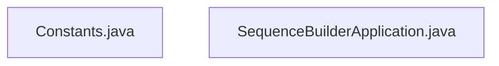

### Package: `com.aa.fso.config`

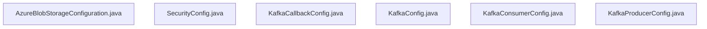

### Package: `com.aa.fso.contractualrules`

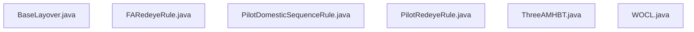

### Package: `com.aa.fso.controller`

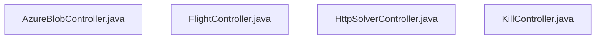

### Package: `com.aa.fso.dto`

### Package: `com.aa.fso.exception`

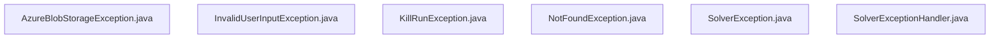

### Package: `com.aa.fso.mapper`

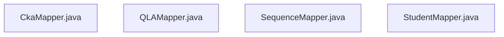

### Package: `com.aa.fso.model`

### Package: `com.aa.fso.optmodel`

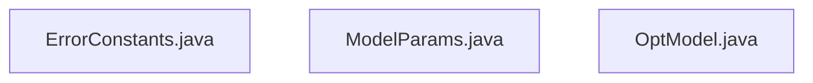

### Package: `com.aa.fso.processor`

```mermaid
flowchart TD
    f_0["CKAProcessor.java"]
    f_1["ConstructNetwork.java"]
    f_2["DHProcessor.java"]
    f_3["InputValidationProcessor.java"]
    f_4["QLAProcessor.java"]
    f_5["SequenceProcessor.java"]
    f_6["ShortestPathComponent.java"]
    f_7["StaticDataProcessor.java"]
    %% No internal module dependencies found
```

### Package: `com.aa.fso.qlacheck`

```mermaid
flowchart TD
    f_0["QLACallableClient.java"]
    f_1["QLARestClient.java"]
    f_2["BidStatus.java"]
    f_3["CrewMemberInfo.java"]
    f_4["CrewMemberKey.java"]
    f_5["DateTimeInfo.java"]
    f_6["DutyPeriods.java"]
    f_7["EmpCaatsData.java"]
    f_8["Employee.java"]
    f_9["EmployeeRequest.java"]
    f_10["FlightDutyPeriod.java"]
    f_11["FlightDutyPeriodKey.java"]
    f_12["FlightKey.java"]
    f_13["FlightLeg.java"]
    f_14["FlightLegs.java"]
    f_15["LocalDateDeserializer.java"]
    f_16["LocalDateSerializer.java"]
    f_17["LocalDateTimeDeserializer.java"]
    f_18["LocalDateTimeSerializer.java"]
    f_19["PickupDuty.java"]
    f_20["PilotLegalityRequest.java"]
    f_21["ProjectedData.java"]
    f_22["ScheduledTime.java"]
    f_23["SequenceDetail.java"]
    f_24["SequenceInfo.java"]
    f_25["SequenceInfoKey.java"]
    f_26["StationLongitudeUtils.java"]
    f_27["TimeInfo.java"]
    f_28["ValidationConstants.java"]
    f_29["EmployeeQLAResponse.java"]
    f_30["EmployeeResponse.java"]
    f_31["InvalidSeqMapper.java"]
    f_32["LegalityInterpreter.java"]
    f_33["LegalityInterpreterRepository.java"]
    f_34["LegalityInterpreterRepositoryImpl.java"]
    f_35["LegalityRuleResult.java"]
    f_36["PersistenceException.java"]
    f_37["PilotLegalityResponse.java"]
    f_38["QlaResponse.java"]
    f_39["Result.java"]
    f_40["Rule.java"]
    f_41["RuleResult.java"]
    f_0 --> f_20
    f_0 --> f_37
    f_1 --> f_20
    f_1 --> f_37
```

### Package: `com.aa.fso.repository`

```mermaid
flowchart TD
    f_0["AccessTokenClient.java"]
    f_1["AccessTokenClientImpl.java"]
    f_2["AzureBlobRepository.java"]
    f_3["AzureBlobRepositoryImpl.java"]
    f_4["InputDataRepositoryImpl.java"]
    f_5["InputDataRespository.java"]
    f_6["LegDataRepository.java"]
    f_7["LegDataRepositoryImpl.java"]
    f_8["OutputDataRepository.java"]
    f_9["OutputDataRepositoryImpl.java"]
    f_10["PingFederateTokenClient.java"]
    f_11["PingFederateTokenClientImpl.java"]
    f_12["QLAClient.java"]
    f_13["QLAClientImpl.java"]
    %% No internal module dependencies found
```

### Package: `com.aa.fso.rules`

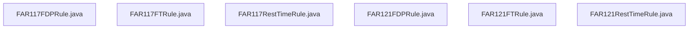

### Package: `com.aa.fso.service`

### Package: `com.aa.fso.util`

```mermaid
flowchart TD
    f_0["CompressUtil.java"]
    f_1["FSOFileWriter.java"]
    f_2["FSOUtil.java"]
    f_3["JsonUtil.java"]
    f_4["SnapshotValidator.java"]
    f_5["StationTimeAdjustLoader.java"]
    f_6["StringUtil.java"]
    f_7["SurfaceLegLoader.java"]
    f_8["TAPIUtil.java"]
    %% No internal module dependencies found
```

# 3. Technology Stack & Third-party Integrations

The **Sequence Builder** application (`fsoft-ai4code/sequence-builder`) is architected as a high-throughput, event-driven microservice built on the **Spring Boot** ecosystem. The system leverages a polyglot approach where the core orchestration logic resides in Java, while specific parsing and validation tasks may offload to native libraries where performance is critical. The architecture prioritizes asynchronous processing, fault tolerance, and real-time observability.

## 3.1 Core Framework & Runtime

The application runtime is anchored by **Spring Boot 3.x**, providing the foundational dependency injection container, embedded HTTP server (Tomcat), and auto-configuration capabilities. The entry point is defined in `SequenceBuilderApplication`, which initializes the context and enables background scheduling via `@EnableScheduling` [src/main/java/com/aa/fso/SequenceBuilderApplication.java:L12-16].

*   **Web Layer**: Built upon **Spring Web MVC** and **Spring Boot Actuator**. The REST API surface is exposed via standard annotations (`@RestController`, `@GetMapping`, `@PostMapping`). Swagger/OpenAPI documentation is integrated using `springdoc-openapi` to define contract boundaries for endpoints like `/solveDebug` and `/openLegs` [src/main/java/com/aa/fso/controller/HttpSolverController.java:L44-58], [src/main/java/com/aa/fso/controller/FlightController.java:L23-30].
*   **Dependency Injection**: Heavily utilizes **Lombok** to reduce boilerplate code across the 196 classes, managing getters, setters, and logging instances (`@Slf4j`) directly within model and service layers.
*   **Configuration Management**: Environment-specific configurations (e.g., Kafka consumer groups, solver timeouts) are externalized via `application.properties` or `application.yml`, injected via `@Value` or `@ConfigurationProperties`.

## 3.2 Asynchronous Messaging & Event Processing

A critical component of the stack is the **Apache Kafka** integration, enabling decoupled communication between the solver engine and upstream event sources (e.g., Azure Event Hubs).

*   **Consumer Architecture**: The `KafkaConsumerService` acts as the primary event listener, consuming messages from the `solver.topic.name` configured in the environment [src/main/java/com/aa/fso/service/kafka/consumer/KafkaConsumerService.java:L42-86].
    *   **Concurrency**: The consumer supports configurable concurrency (`${sb.consumer.topics.concurrency}`) to parallelize processing of incoming solver requests.
    *   **Acknowledgment**: Manual acknowledgment is enforced via `Acknowledgment ack` to ensure exactly-once processing semantics; messages are acknowledged only after successful serialization and compression of results.
    *   **Error Handling**: The consumer implements a robust try-catch-finally block to handle `KillRunException` and `InvalidUserInputException`, ensuring that failed runs trigger notifications via `TeamsNotification` without blocking the consumer group.
*   **Producer Integration**: Results are published back to downstream topics as compressed binary payloads (`byte[]`) using `CompressUtil` to minimize network bandwidth, specifically targeting large JSON solution sets [src/main/java/com/aa/fso/service/kafka/consumer/KafkaConsumerService.java:L70-72].

## 3.3 Data Persistence & Storage

The system employs a multi-tier storage strategy to handle both transient state and persistent flight data.

*   **Relational Database**: While specific ORM implementations (e.g., Hibernate/JPA) are not explicitly detailed in the provided entry points, the presence of repositories like `LegDataRepository` and `InputDataRepositoryImpl` suggests a JPA-based abstraction layer for querying flight legs and user inputs [src/main/java/com/aa/fso/controller/FlightController.java:L23-30].
*   **Azure Blob Storage**: For large-scale data persistence (e.g., historical sequences, raw logs), the application integrates with **Azure Blob Storage**.
    *   **Implementation**: Encapsulated in `AzureBlobController` and `AzureBlobRepositoryImpl`, this layer handles upload/download operations for large datasets [src/main/java/com/aa/fso/controller/AzureBlobController.java].
    *   **Access Pattern**: The repository implementation likely utilizes the Azure SDK for Java, abstracting connection details behind a clean interface for the service layer.

## 3.4 Domain Logic & Algorithmic Engines

The core business logic revolves around flight sequence generation and legality checking (QLA - Quality Assurance).

*   **Solver Engine**: The `SolverService` orchestrates the complex algorithmic process of generating flight pairings. It accepts `UserInput` DTOs and returns `SolverResponseDTO` containing lists of `OutputData` (solutions) [src/main/java/com/aa/fso/controller/HttpSolverController.java:L50-52].
*   **Rule Engines**: Specific aviation regulations (e.g., FAR 117) are implemented as discrete rule classes. `FAR117RestTimeRule` encapsulates the logic for rest time compliance, ensuring generated sequences adhere to regulatory constraints [src/main/java/com/aa/fso/rules/FAR117RestTimeRule.java].
*   **Data Models**: The domain is modeled using a rich set of entities including `FlightKey`, `ITFlightKey`, `UnsequencedLeg`, and `Node` structures, facilitating graph-based algorithms for sequence construction [src/main/java/com/aa/fso/model/FlightKey.java], [src/main/java/com/aa/fso/model/Node.java].

## 3.5 Utility & Infrastructure Libraries

To maintain code quality and performance, several specialized libraries are integrated:

*   **Serialization**: `Jackson` (`ObjectMapper`) is the primary JSON processor, used extensively for deserializing Kafka messages into `UserInput` objects and serializing responses [src/main/java/com/aa/fso/service/kafka/consumer/KafkaConsumerService.java:L53-55]. Custom serializers (e.g., `LocalDateSerializer`) are employed to handle date formatting nuances [src/main/java/com/aa/fso/qlacheck/request/LocalDateSerializer.java].
*   **Compression**: `CompressUtil` provides custom compression logic (likely GZIP or similar) to optimize the transmission of large solution arrays over Kafka [src/main/java/com/aa/fso/util/CompressUtil.java].
*   **Logging**: `SLF4J` with a backend implementation (e.g., Logback) provides structured logging, capturing trace IDs and contextual data for debugging distributed transactions [src/main/java/com/aa/fso/SequenceBuilderApplication.java:L15].
*   **Validation**: Input validation is handled via `InputValidationProcessor`, ensuring that incoming payloads meet schema requirements before reaching the solver engine [src/main/java/com/aa/fso/processor/InputValidationProcessor.java].

## 3.6 Summary of Key Dependencies

| Component | Technology | Usage Context |
| :--- | :--- | :--- |
| **Framework** | Spring Boot | Application lifecycle, DI, Web Server |
| **Messaging** | Apache Kafka | Event ingestion, result distribution |
| **Storage** | Azure Blob Storage | Large file persistence |
| **ORM** | Spring Data JPA | Relational data access (implied) |
| **Serialization** | Jackson | JSON parsing & transformation |
| **Documentation** | SpringDoc OpenAPI | API contract definition |
| **Utilities** | Lombok, SLF4J | Boilerplate reduction, Logging |
| **Domain Rules** | Custom Java Classes | FAR 117, QLA Logic |

This technology stack ensures the **Sequence Builder** can handle the computational intensity of flight sequencing while maintaining the reliability required for operational aviation systems. The separation of concerns between the web controller layer, the Kafka consumer layer, and the core solver service allows for independent scaling and resilience.
